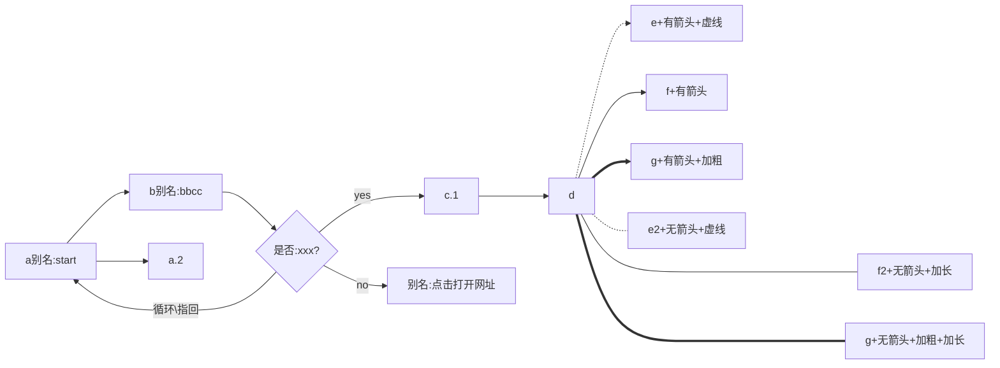
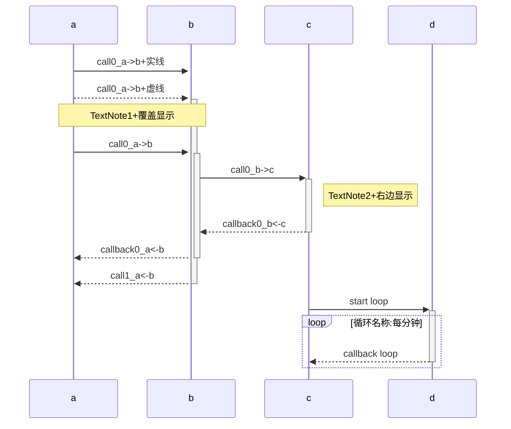
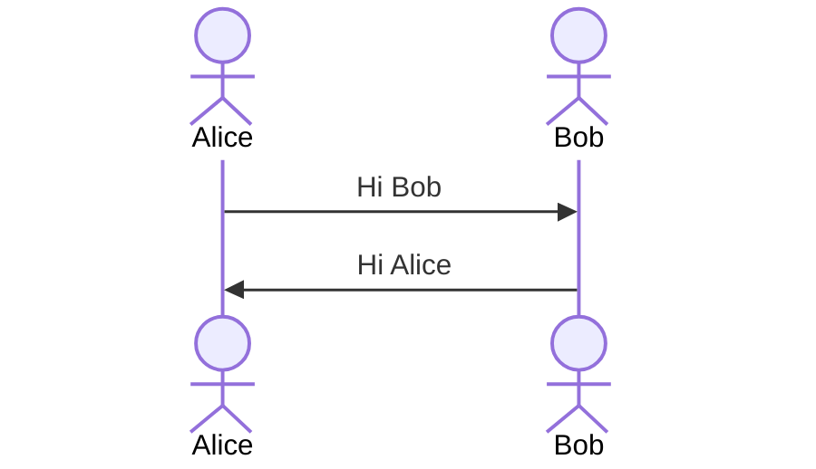

#学习

## 一、mermaid 流程图
官方文档： https://mermaid-js.github.io/mermaid/#/

### 流程图
#### 左右布局
- 关键字：`flowchart LR`

```mermaid
flowchart LR
	a[a别名:start]
	a-->b
	a-->a.2

	b[b别名:bbcc]
	b-->c{是否:xxx?}

	c
	c-->|循环\指回|a
	c-->|yes|c.1
	c-->|no|c.2

	c.2[别名:点击打开网址]
	click c.2 "https://github.com/norven63/MyObsidian/blob/main/13%E6%B2%89%E6%B7%80%E7%AC%94%E8%AE%B0/MarkDown%E7%BB%98%E5%9B%BE%E7%A4%BA%E4%BE%8B.md"

	c.1
	c.1-->d

	d
	d-.->e+有箭头+虚线
	d-->f+有箭头
	d==>g+有箭头+加粗
	d-.-e2+无箭头+虚线
	d------f2+无箭头+加长
	d======g+无箭头+加粗+加长
```

  

### 时序图

```mermaid
sequenceDiagram

participant a
participant b

a->>+b:call0_a->b+实线
a-->>+b:call0_a->b+虚线
Note over a,b: TextNote1+覆盖显示

a->>+b:call0_a->b
b->>+c:call0_b->c
Note right of c: TextNote2+右边显示
c-->>-b:callback0_b<-c

b-->>-a:callback0_a<-b
b-->>-a:call1_a<-b

c->>+d:start loop
loop 循环名称:每分钟
	d-->>-c:callback loop
end
```

 

```mermaid
sequenceDiagram
	actor Alice
	actor Bob
	Alice->>Bob:Hi Bob
	Bob->>Alice:Hi Alice
```

