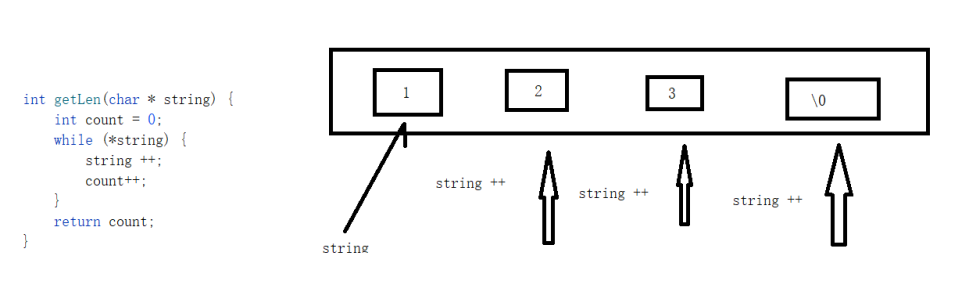

日期： 2022-04-18

标签： #学习笔记 #技术 #Android 

学习资料： 
腾讯课堂 - https://ke.qq.com/webcourse/3060320/105200059#taid=13820977128321632&vid=387702298740034439

百度网盘 - https://pan.baidu.com/disk/main?from=homeFlow#/index?category=all&path=%2F%E5%AD%A6%E4%B9%A0%2F%E4%BA%AB%E5%AD%A6VIP%E8%AF%BE%E7%A8%8B%2F2%E6%9C%9F%2F%E3%80%9007%E3%80%91NDK%2F%EF%BC%8804%EF%BC%892021.3.2%E6%8C%87%E9%92%88%E5%AE%9E%E6%88%98%E8%BF%90%E7%94%A8%E8%BF%9B%E9%98%B6%E4%B9%8B%E5%AD%97%E7%AC%A6%E4%B8%B2%E6%93%8D%E4%BD%9C%EF%BC%88NDK%E7%AC%AC%E5%9B%9B%E8%8A%82%E8%AF%BE%EF%BC%89

---
<br>

### 一、字符串两种声明方式
1. `char str[] = {'a','b','c','\0'};` ：声明一个char数组，里面的元素能够被修改。末尾是 `\0` 可以保证 `printf()` 不打印后续的系统值
2. `char* str = "abc";` : 这种声明方式，"abc" 会到 "全局区/静态区" 中，并且不可修改。

```C
#include <stdio.h>

// 字符串声明
int mainT2() {
	char str[] = { 'D', 'e', 'r', 'r', 'y', '\0' };
	str[2] = 'z';
	printf("第一种方式：%s\n", str); // printf()必须遇到 \0 才结束打印

	char* str2 = "Derry"; // 隐式添加 \0，即 Derry+\0
	str2[2] = 'z'; // 会奔溃，这里str2指向的，是 "全局区/静态区" 里的 "Derry" 字符串地址，这个字符串是不允许修改的
	printf("第二种方式：%s\n", str2);

	return 0;
}
```


<br><br>

### 二、指针挪动获取字符串长度
```C
// 3.指针挪动获取字符串信息(手写API)。

#include <stdio.h>

// C/C++编译器：数组作为参数传递时，会把数组优化成指针（为了高效率）
void getLenWithP(int* resultLen, int intarr[]) {

	// 因为数组被转成指针，导致 sizeof(intarr) 返回的是指针长度=4，所以就不能这样方式计算字符串长度
	/*
		// sizeof(intarr)28 / sizeof(int)4 = 7
		int len = sizeof(intarr) / sizeof(int);
		printf("getLen len长度是:%d\n", len);
	*/

	// 手动计算长度
	int count = 0;
	while (*intarr) { // 等价于 *intarr != '\0'
		intarr++; // 指针挪动
		count++;
	}

	*resultLen = count; //通过指针赋值的方式，将结果返回出去
}

int mainT3() {

	int intarr[] = { 1,2,3,0,5,6,7 }; // 0   \0  其他函数 for 其他调用判断的时候，这个有冲突 【int类型数组】

	// int类型使用这种方式【第一种方式】
	// sizeof(intarr)28 / sizeof(int)4 = 7
	int len = sizeof(intarr) / sizeof(int);
	printf("len长度是: %d\n", len);

	int result; // 传入指针&result，之后通过&result返回
	getLenWithP(&result, intarr);
	printf("getLenWithP 返回的长度是: %d\n", result);

	return 0;
}
```


