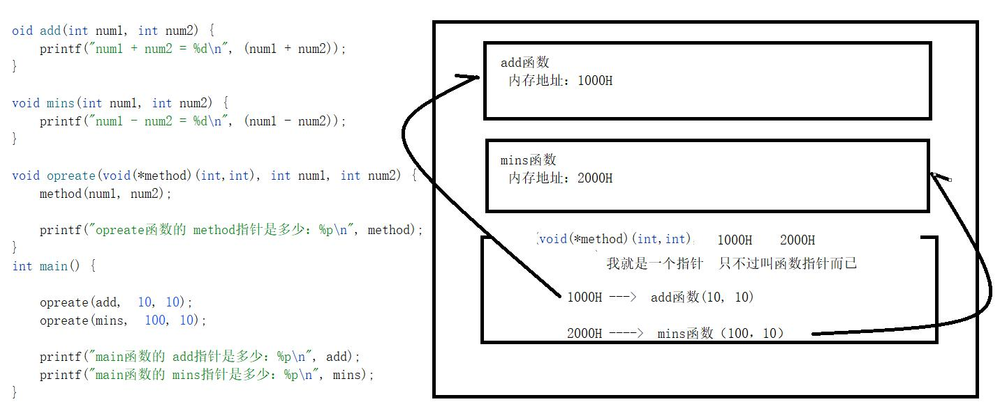

日期： 2022-04-13

标签： #学习笔记 #技术 #Android 

学习资料： 
腾讯课堂 - https://ke.qq.com/webcourse/3060320/105200059#taid=13820912703812192&vid=387702298740004975

百度网盘 - https://pan.baidu.com/disk/main?from=homeFlow#/index?category=all&path=%2F%E5%AD%A6%E4%B9%A0%2F%E4%BA%AB%E5%AD%A6VIP%E8%AF%BE%E7%A8%8B%2F2%E6%9C%9F%2F%E3%80%9007%E3%80%91NDK%2F%EF%BC%8802%EF%BC%892021.2.25%20%E5%87%BD%E6%95%B0%E6%8C%87%E9%92%88%E4%B8%8E%E6%8C%87%E9%92%88%E8%BF%90%E7%AE%97%EF%BC%88NDK%E7%AC%AC%E4%BA%8C%E8%8A%82%E8%AF%BE%EF%BC%89%20---derry%E8%80%81%E5%B8%88

---
<br>

### 多级指针
```c
#include <stdio.h>

/**
   在真实开发过程中，最多三级指针  int ***
 */
int main() {

    int num = 999;

    int * num_p = &num; // 取出num的内存地址（假设1000H）赋给num_p，一级指针

    int ** num_p_p = &num_p; // 取出num_p的内存地址（假设2000H）赋给num_p_p，二级指针

    int *** num_ppp = &num_p_p; // 取出num_p_p的内存地址（假设3000H）赋给num_ppp，三级指针

	// 取出num_p指向的地址（即1000H）所存的值，得到999
    printf("*num_p获取的值：%d\n", *num_p); // 输出 999

	// 右起第一个*，取出num_p_p指向的地址（即2000H）所存的值，得到1000H；右起第二个*，取出地址1000H所存的值，得到999
    printf("**num_p_p获取的值：%d\n", **num_p_p);  // 输出 999

	// "右右右"起第一个*，取出num_ppp指向的地址（即3000H）所存的值，得到2000H；"右右右"起第二个*，取出num_p_p指向的地址（即2000H）所存的值，得到1000H；"右右右"起第三个*，取出地址1000H所存的值，得到999
    printf("***num_ppp获取的值：%d\n", ***num_ppp); // 输出 999

    return 0;
}
```

![[20220413231654.png|650]]

<br><br>

### 数组与数组指针
- 数组本身就是一个内存地址，并指向**第一个**元素的内存地址，即 `aar = &aar[0]`
- 数组的内存地址 = **第一个**元素的内存地址，即 `&aar = &aar[0]`
- 综上述， `aar = &aar = &aar[0]`
```c
#include <stdio.h>

// 数组与数组指针。
int mainT3() {

	/**
	   数组与指针基本概念
     */
    // 定义数组
    // int[] arr = {1,2,3,4}; 错误的写法
    int arr[] = {1,2,3,4};

    // 遍历数组
    // 其他平台不能用 Clion能用， Linux上报错
    /*for (int i = 0; i < 4; ++i) {

    }*/

    // Linux上没有问题，Clion没有问题，Mac没有问题
    int i = 0;
    for (i = 0; i < 4; ++i) {
        printf("%d\n", arr[i]); // 取值
    }
    
    // 数组的内存地址 == 第一个元素的内存地址
    printf("arr = %d\n", arr);
    printf("&arr = %d\n", &arr);
    printf("&arr[0] = %d\n", &arr[0]);


	/**
	   指针位移运算
     */
    // 数组指针arr_p
    int * arr_p = arr; // 将数组指向的地址赋给 数组指针arr_p
    printf("*arr_p = %d\n", *arr_p); // 取出arr_p所指向内存地址上存的值，即元素一，输出 1

    arr_p ++; // 指针位移+1，指向了元素二的内存地址
    printf("*arr_p++ = %d\n", *arr_p); // 取出arr_p所指向内存地址上存的值，即元素二，输出 2

    arr_p += 2; // 指针位移+2，指向了元素四的内存地址
    printf("*arr_p+=2 = %d\n", *arr_p); // 输出4

    arr_p -= 3; // 指针位移-3，指向到元素一的内存地址
    printf("*arr_p-=3 = %d\n", *arr_p); // 输出 1

    arr_p += 2000; // 指针位移，指向了一个未知野值的内存地址
    printf("*arr_p+=2000 = %d\n", *arr_p); // 系统值 572662306

    return 0;
}
```

![[20220414001404.png|800]]

<br><br>

### 指针遍历数组
- 数组是**连续**的内存空间
```c
#include <stdio.h>

// 采用指针遍历数组。
int mainT4() {

    // 数组是连续的内存空间，没有断层、有规律。每次挪动4个字节（因为int型数组）

    int arr[]  = {1,2,3,4};

    int * arr_p = arr;

    int i = 0;
    /**
       sizeof arr == sizeof(arr)
	   sizeof arr = 16：因为是int型数组并且有4个元素，而每个int占位4个字节，所以是16字节
	   sizeof(int) = 4：每个int占4个字节
	 */
    for (i = 0; i < sizeof arr / sizeof(int); ++i) {
        printf("位置%d的值是: %d\n", i, * (arr_p + i));

        // 04    08   12    16
        printf("位置%d（arr_p + %d）的内存地址是: %p\n\n", i, i, (arr_p + i));
    }

    return 0;
}
```

<br><br>

### 循环给数组赋值
```c
#include <stdio.h>

// 4.循环时给数组赋值。
int mainT5() {

    int arr[4];

    int * arrP = arr;

    // 循环赋值操作
    int j = 0;
    for (j = 0; j < 4; ++j) {
        // 1.拿到 元素一 元素二 元素三 元素四 的内存地址: (arrP + j)
        // 2.取出 元素一 元素二 元素三 元素四 的内存地址 所对应的值: * (arrP + j)
        * (arrP + j) = (j + 1000);
    }

    for (int i = 0; i <  sizeof arr / sizeof(int); ++i) {
        printf("位置%d的值是: %d\n", i, * (arrP + i));
    }

    return 0;
}
```

<br><br>

### 函数指针
```C
#include <stdio.h>

void add(int num1, int num2) {
	printf("num1 + num2 = %d\n", (num1 + num2));
}

void mins(int num1, int num2) {
	printf("num1 - num2 = %d\n", (num1 - num2));
}

/**
   void(*method)(int,int) == 声明好一个函数指针入参

   void == 返回值
   (*method) == 函数名
   (int,int) == 两个参数
*/
void opreate(void(*callback)(int, int), int num1, int num2) {
	callback(num1, num2); // 回调执行callback()

	printf("opreate()里的函数指针 = %p\n", callback);
}


// C中的函数指针，类似Java中的接口回调
int mainT8() {  // 【第一种写法】

	opreate(add, 10, 10);
	printf("main()里的 add 指针 = %p\n\n", add);

	opreate(mins, 100, 10);
	printf("main()里的 mins 指针 = %p\n\n", mins);

	// add和&add是一样的值吗?
	printf("add = %p, &add = %p\n", add, &add); //  004018CE, 004018CE  一样的

	return 0;
}
```


