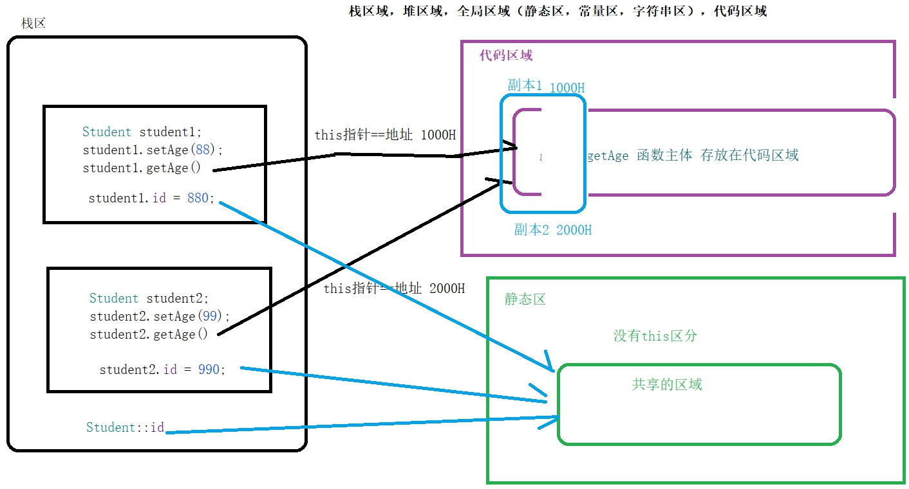

日期： 2022-05-05

标签： #学习笔记 #技术 #C语言 

学习资料： 
腾讯课堂 - https://ke.qq.com/webcourse/3060320/105200059#taid=13821136042111584&vid=387702298741278473

百度网盘 - https://pan.baidu.com/disk/main?from=homeFlow&_at_=1651480206800#/index?category=all&path=%2F%E5%AD%A6%E4%B9%A0%2F%E4%BA%AB%E5%AD%A6VIP%E8%AF%BE%E7%A8%8B%2F2%E6%9C%9F%2F%E3%80%9007%E3%80%91NDK%2F%EF%BC%8810%EF%BC%892021.3.16%20C%2B%2B%E8%AF%AD%E8%A8%80%E4%B9%8Bthis%E5%8E%9F%E7%90%86%E4%B8%8E%E5%8F%8B%E5%85%83%E5%87%BD%E6%95%B0%E5%8F%8B%E5%85%83%E7%B1%BB%EF%BC%88NDK%E7%AC%AC%E5%8D%81%E8%8A%82%E8%AF%BE%EF%BC%89%20--derry%E8%80%81%E5%B8%88

---
<br>

### 一、可变参数
- Java可变参数写法 `void foo(int ...)`、C++可变参数写法 `void foo(...)`
- **核心函数：**
	1. `va_list` ：声明变量
	2. `va_start` ：为可变参数变量加载信息
	3. `va_arg`：从可变参数中读取一个值
	4. `va_end`：关闭可变参数的读取（规范：例如file文件要关闭流一样）
- **越界：** 越界后仍然可以读取值，但会读取到一个系统值、乱码

```cpp
#include <iostream>
#include <stdarg.h> // 可变参数的支持
using namespace std;

// Java的可变参数: int ...
// C++的可变参数写法：...
// count建议传入可变参数的个数，可以用于循环遍历
void sum(int count, ...) {
	// 1. 声明可变参数变量
	va_list vp;

	// 2. 为可变参数变量加载信息
	// 参数一，vp：可变参数变量
	// 参数二，count：此地建议是用函数的形参传入。内部需要一个，存储地址用的参考值，如果没有第二个参数，内部他无法处理存放参数信息
	va_start(vp, count);

	// 3. 到这里后：vp就已经有丰富的信息

	// 4. 从可变参数中读取值（遍历读取）
	for (int i = 0; i < count; ++i) {
		int arg = va_arg(vp, int);

		cout << "可变参数值：" << arg << endl;
	}

	// 5. 继续取出可变参数的一个值
	// 这里会导致越界，读取到一个系统值、乱码
	int number = va_arg(vp, int);
	cout << endl << "越界系统值：" << number << endl;

	number = va_arg(vp, int);
	cout << "越界系统值：" << number << endl;

	// 6. 关闭可变参数的读取（规范：例如file文件要关闭流一样）
	va_end(vp);
}


int main() {
	sum(3, 6, 7, "abc");

	return 0;
}
```

<br><br>

### 二、关键字：static
1. 可以直接通过类名::静态成员（字段/函数）
2. 静态属性必须要被初始化，否则无论哪里引用都会运行crash
3. 静态属性必须要先在`.h`文件中声明，然后再在`.cpp`文件中实现初始化
4. 静态函数只能取操作静态的属性和方法（与Java一样）

```cpp
#include <iostream>

using namespace std;

class Dog {
public:
	char* info;
	int age;

	// 1. 先声明
	static int id;

	static void update() {
		id += 100;// 如果id没有初始化过，这里会运行报错

		// 报错：静态函数不能调用非静态函数（与Java一样）
		// update2();
	}

	void update2() {
		id = 13;
	}
};

// 2. 再实现初始化
int Dog::id = 9;

int main() {
	Dog dog;
	dog.update2(); // 调用普通函数
	Dog::update(); // 调用静态函数
	dog.update(); // 对象名.静态函数（一般都是使用::调用静态成员，这种方式也可以，知道就行）

	cout << Dog::id << endl;
	return 0;
}
```

<br><br>

### 三、关键字：this
1. 当声明对象时，**构造函数**会创建一个`this`的指针，指向当前对象的地址。并且用`const`修饰，使其指向地址不可修改，但是成员变量允许修改。参见`const`修饰指针的细节：
2. 所有**成员函数**都在**代码区**运行，当被调用时，会传入对象的`this`地址到代码区。同理，构造函数、栈区空间，也会传入



<br><br>

### 四、关键字：const
