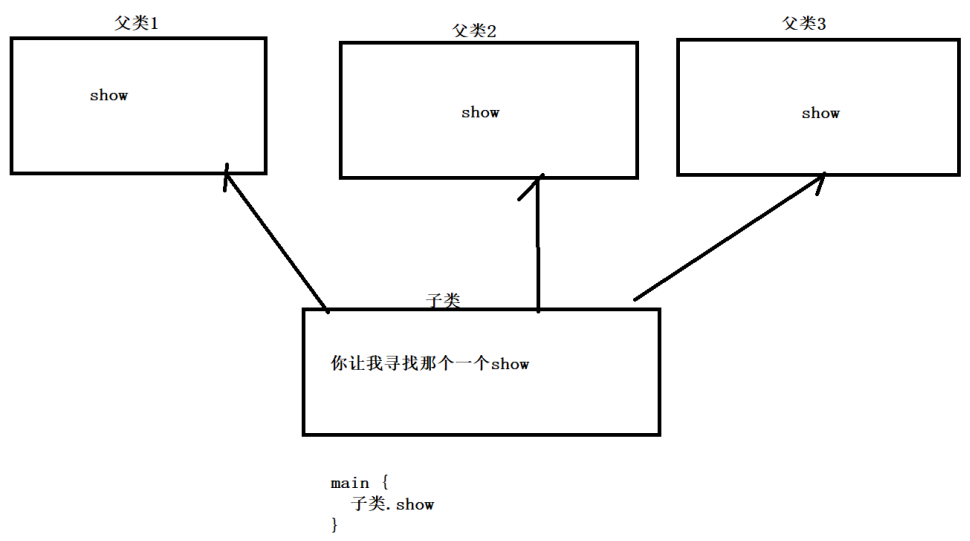

日期： 2022-05-07

标签： #学习笔记 #技术 #Android 

学习资料： 
腾讯课堂 - https://ke.qq.com/webcourse/3060320/105200059#taid=13821157516948064&vid=387702298741241216

百度网盘 - https://pan.baidu.com/disk/main?from=homeFlow&_at_=1651480206800#/index?category=all&path=%2F%E5%AD%A6%E4%B9%A0%2F%E4%BA%AB%E5%AD%A6VIP%E8%AF%BE%E7%A8%8B%2F2%E6%9C%9F%2F%E3%80%9007%E3%80%91NDK%2F%EF%BC%8811%EF%BC%892021.3.18%20C%2B%2B%E9%9D%A2%E5%90%91%E5%AF%B9%E8%B1%A1%E7%BB%A7%E6%89%BF%E4%B8%8E%E6%93%8D%E4%BD%9C%E7%AC%A6%E9%87%8D%E8%BD%BD--derry

---
<br>

### 一、运算符重载
- **关键字：`operator`**

##### 1、运算符重载：+、-、对象++、++对象、输入>>、输出<<

```cpp
#include <iostream>
using namespace std;

class Derry {
private:
	int x, y;

public:
	Derry() {

	}

	Derry(int x, int y) :x(x), y(y) {}

	// set get 函数
	void setX(int x) {
		this->x = x;
	}
	void setY(int y) {
		this->y = y;
	}
	int getX() {
		// this->x  -9; 系统怕你在函数里面 修改了
		return this->x;
	}
	int getY() {
		return this->y;
	}

	// 1. 运算符 + 号的重载（即当 对象1 + 对象2 的写法时，把 + 重载自定义掉）
	// 使用 & 是为了性能的提高，如果没有&，运行 + 运算时，会构建新的副本对象，浪费性能开销
	// 如果增加了& 引用是给这块内存空间取一个别名而已，实质上没有额外创建新对象
	// 设计理念类似Java中的Comparable
	Derry operator + (const Derry& derry1) {
		// this指针 指向当前对象，所以只需要一个
		int x = this->x + derry1.x; // 在类的内部，允许访问私有成员
		int y = this->y + derry1.y; // 在类的内部，允许访问私有成员

		return Derry(x, y);// 【注意】虽然函数弹栈会释放这里栈成员的内存，但是在上层=拷贝逻辑未执行完毕前，该函数不会弹栈
	}

	// 2. 运算符 - 号的重载
	Derry operator - (const Derry& derry1) {
		int x = this->x - derry1.x;
		int y = this->y - derry1.y;

		return Derry(x, y);
	}

	// 3.1 运算符 ++ 号的重载（++对象）
	void operator ++() {
		this->x = this->x + 1;
		this->y = this->y + 1;
	}
	// 3.2 运算符 ++ 号的重载（对象++）
	void operator ++ (int) {
		this->x = this->x + 1;
		this->y = this->y + 1;
	}


	// 4.1 "单个"的输出运算符 << 的重载
	// ostream 输出
	friend void operator << (ostream& _START, Derry derry1) {
		_START << "单个cout，开始输出: x-" << derry1.x << " , y-" << derry1.y << endl;
	}

	// 4.2 "多个"的输出运算符 >> 的重载
	// ostream 输出
	friend ostream& operator >> (ostream& _START, const Derry& derry) {
		_START << "多个cout，开始输出: x-" << derry.x << " , y-" << derry.y << endl;
		return _START;

		// 实现上，与"单个"的区别在于，要将入参 _START return出去，
		// 类似 RxJava 链式调用， .操作符.操作符.操作符 每次都是放回this
	}

	// 5. "多个"的输入运算符 >> 的重载
	// istream 输入
	friend istream& operator >> (istream& _START, Derry& derry) {
		// 接收用户的输入，把输入的信息，给x、y

		cout << "请输入x:";
		_START >> derry.x;

		cout << "请输入y:";
		_START >> derry.y;

		// 下面的写法也可以，但是可读性不好，简化了
		// _START >> derry.x >> derry.y;

		return _START;
	}
};

int main() {
	Derry derry1(1000, 2000);
	Derry derry2(3000, 4000);
	cout << "derry1: x-" << derry1.getX() << " , y-" << derry1.getY() << endl;
	cout << "derry2: x-" << derry2.getX() << " , y-" << derry2.getY() << endl;

	cout << endl;

	Derry result1 = derry1 + derry2;

	cout << "result1 = derry1 + derry2: x-" << result1.getX() << " , y-" << result1.getY() << endl;

	Derry result2 = derry2 - derry1;

	cout << "result2 = derry2 - derry1: x-" << result2.getX() << " , y-" << result2.getY() << endl;

	cout << endl;

	Derry result3(1, 2);
	cout << "result3: x-" << result3.getX() << " , y-" << result3.getY() << endl;
	result3++;
	++result3;

	cout << "result3++、++result3: x-" << result3.getX() << " , y-" << result3.getY() << endl;

	cout << endl;

	cout << derry1; // 单个的cout输出

	cout << endl;

	cout >> derry1 >> derry1 >> derry1 >> derry1; // 多个的cout输出

	cout << endl;

	/*
	 * cout = C++输出
	 * cin = C++输入
	 */
	Derry derryInput;
	cin >> derryInput; // istream输入运算符 >> 是被我们自己重载的
	cout << "你输入的是x：" << derryInput.getX() << endl;
	cout << "你输入的是y：" << derryInput.getY() << endl;

	return 0;
}
```

<br>

##### 2、运算符重载：方括号[ ]
- 系统的“数组”源码，已经把运算符[]进行重载过，重载后的逻辑为 `*(arr + i)`。

```cpp
#include <iostream>
using namespace std;

class ArrayClass {

private:
	int size = 0; // 容器大小，需要赋默认值，不然会为系统值
	int maxSize = 5;// 最大容器大小，扩容时候用
	int* arrayValue; // 数组存放

public:
	ArrayClass() {
		arrayValue = new int[maxSize];
	}

	// 插入值
	void set(int index, int value) {
		size += 1;

		// 扩容
		if (size >= maxSize) {
			maxSize = maxSize * 2;

			int* temp = arrayValue;
			arrayValue = new int[maxSize];

			for (int i = 0; i < size - 1; i++) {
				arrayValue[i] = temp[i];
			}
		}

		arrayValue[index] = value; // 这里的[]，是系统的
	}
	int getSize() {
		return this->size;
	}

	// 运算符 [] 的重载
	int operator[](int index) {
		return arrayValue[index]; // 这里的[]，是系统的
	}
};

// 输出容器的内容
void printfArryClass(ArrayClass arrayClass) {
	for (int i = 0; i < arrayClass.getSize(); i++) {
		cout << "arrayClass[" << i << "]: " << arrayClass[i] << endl; // 这里的[]，是我们重载过的
	}
}

int main() {
	// 能在栈区开辟的，尽量在栈区开辟
	// 1.代码量少
	// 2.避免麻烦
	// 3.怕有问题
	// 4.栈区的回收，不是你负责的，责任推卸
	ArrayClass arrayClass;  // “栈区”实例出来的对象

	for (int i = 0; i < 20; ++i) {
		arrayClass.set(i, i * 1000);
	}

	cout << "arrayClass.getSize(): " << arrayClass.getSize() << endl << endl;

	printfArryClass(arrayClass);

	return 0;
}
```

<br><br>

### 二、对象的继承

##### 1、继承基本知识点
1. **私有继承**
	- `: private 父类`
	- 在子类里面是可以访问父类的成员，但是在类的外面不行(类似Java中的protected)，即使父类是public的成员也不可以
	- 默认，是私有继承

2. **公开继承**
	- `: public 父类`
	- 公开继承，子类的外面才可以访问父类的成员

```cpp
#include <iostream>

using namespace std;

class Person {
public:
	char* name;
	int age;

public:
	Person(char* name, int age) : name(name) {
		this->age = age;
		cout << "Person 构造函数" << endl;
	}

	void print() {
		cout << this->name << " , " << this->age << endl;
	}
};

class Student : public Person {

private:
	char* course;// 子类成员

public:
	// 子类构造函数() + :父类构造函数() + , + 子类成员初始化
	Student(char* name, int age, char* course) : Person(name, age), course(course) {
		cout << "Student 构造函数" << endl;
	}

	void test() {
		cout << name << endl;
		cout << age << endl;
		print();
	}
};

int main() {
	Student stu("李元霸", 99, "C++");

	// 公开继承，才可以访问父类的成员
	stu.name = "李四";

	return 0;
}
```

<br>

##### 2、多继承 与 二义性
1. C++允许多继承的，但是Java语言不允许多继承，因为多继承有歧义，会导致代码不健壮，引发“二义性”问题。Java通过多实现，严格避免出现“二义性”问题

2. 真实C++开发中，是很少出现二义性（歧义），如果出现，则要尽量优化规避掉

3. **二义性及其解决方案**
```cpp
#include <iostream>

using namespace std;

class BaseActivity1 {
public:
	void onCreate() {
		cout << "BaseActivity1 onCreate" << endl;
	}

	void onStart() {
		cout << "BaseActivity1 onStart" << endl;
	}

	void show() {
		cout << "BaseActivity1 show" << endl;
	}
};

class BaseActivity2 {
public:
	void onCreate() {
		cout << "BaseActivity2 onCreate" << endl;
	}

	void onStart() {
		cout << "BaseActivity2 onStart" << endl;
	}

	void show() {
		cout << "BaseActivity2 show" << endl;
	}
};

class BaseActivity3 {
public:
	void onCreate() {
		cout << "BaseActivity3 onCreate" << endl;
	}

	void onStart() {
		cout << "BaseActivity3 onStart" << endl;
	}

	void show() {
		cout << "BaseActivity3 show" << endl;
	}
};

// 子类 继承 三个父类
class MainActivity1 : public BaseActivity1, public BaseActivity2, public BaseActivity3 {
public:
	void onCreate() {
		cout << "MainActivity1 onCreate" << endl;
	}

	void onStart() {
		cout << "MainActivity1 onStart" << endl;
	}

	void showSonInfo() {
		cout << "MainActivity1 showSonInfo" << endl;
	}

	// 解决方案二： 子类重写父类的show()函数
	void show() {
		cout << "MainActivity1 show" << endl;
	}

};

int main() {
	// 1. 这组调用，因为子类中已经定义特别明确，所以是“优先寻找子类”的函数
	MainActivity1 mainActivity1; // 子类
	mainActivity1.onCreate();
	mainActivity1.onStart();
	mainActivity1.showSonInfo();

	// 2. 报错，存在二义性
	// error: request for member 'show' is ambiguous
	// mainActivity1.show();

	// 3.1 报错解决方案一： 明确指定调用哪个父类的函数 父类::函数名
	mainActivity1.BaseActivity3::show();
	mainActivity1.BaseActivity2::show();
	mainActivity1.BaseActivity1::show();

	// 3.1 解决方案二： 子类重写父类的show()函数
	mainActivity1.show();

	return 0;
}
```



4. **二义性与虚基类**
```cpp
#include <iostream>

using namespace std;

// 祖父类
class Object {
public:
	int number;

	void show() {
		cout << "祖父类.show() run..." << endl;
	}
};

// 父类1，用virtual声明为虚继承
class BaseActivity1 : virtual public Object {

};

// 父类2
class BaseActivity2 : virtual public Object {

};

// 子类
class Son : public BaseActivity1, public BaseActivity2 {

};

int main() {
	Object object;
	BaseActivity1 baseActivity1;
	BaseActivity2 baseActivity2;
	Son son;

	// 这里统一调用祖父的show()
	object.show();
	baseActivity1.show();
	baseActivity2.show();
	son.show();

	// 这里仅限修改自己的number成员
	object.number = 100;
	baseActivity1.number = 200;
	baseActivity2.number = 300;
	son.number = 400;

	cout << "object.number: " << object.number << endl;
	cout << "baseActivity1.number: " << baseActivity1.number << endl;
	cout << "baseActivity2.number: " << baseActivity2.number << endl;
	cout << "son.number: " << son.number << endl;

	return 0;
}
```
