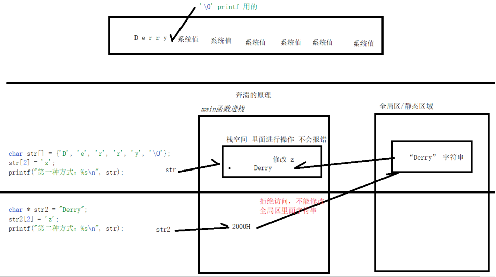
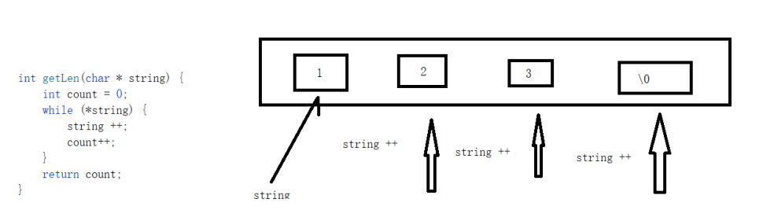

日期： 2022-04-18

标签： #学习笔记 #技术 #Android 

学习资料： 
腾讯课堂 - https://ke.qq.com/webcourse/3060320/105200059#taid=13820977128321632&vid=387702298740034439

百度网盘 - https://pan.baidu.com/disk/main?from=homeFlow#/index?category=all&path=%2F%E5%AD%A6%E4%B9%A0%2F%E4%BA%AB%E5%AD%A6VIP%E8%AF%BE%E7%A8%8B%2F2%E6%9C%9F%2F%E3%80%9007%E3%80%91NDK%2F%EF%BC%8804%EF%BC%892021.3.2%E6%8C%87%E9%92%88%E5%AE%9E%E6%88%98%E8%BF%90%E7%94%A8%E8%BF%9B%E9%98%B6%E4%B9%8B%E5%AD%97%E7%AC%A6%E4%B8%B2%E6%93%8D%E4%BD%9C%EF%BC%88NDK%E7%AC%AC%E5%9B%9B%E8%8A%82%E8%AF%BE%EF%BC%89

---
<br>

### 一、字符串两种声明方式
1. `char str[] = {'a','b','c','\0'};` ：声明一个char数组，里面的元素能够被修改。末尾是 `\0` 可以保证 `printf()` 不打印后续的系统值
2. `char* str = "abc";` : 这种声明方式，"abc" 会到 "全局区/静态区" 中，并且不可修改。

```C
#include <stdio.h>

// 字符串声明
int mainT2() {
	char str[] = { 'D', 'e', 'r', 'r', 'y', '\0' };
	str[2] = 'z';
	printf("第一种方式：%s\n", str); // printf()必须遇到 \0 才结束打印

	char* str2 = "Derry"; // 隐式添加 \0，即 Derry+\0
	str2[2] = 'z'; // 会奔溃，这里str2指向的，是 "全局区/静态区" 里的 "Derry" 字符串地址，这个字符串是不允许修改的
	printf("第二种方式：%s\n", str2);

	return 0;
}
```



<br><br>

### 二、指针挪动获取字符串长度
- 循环 + 指针挪动
```C
// 3.指针挪动获取字符串信息(手写API)。

#include <stdio.h>

void getLenWithP(int* result, char intarr[]) {
	/* 
		C/C++编译器：当数组作为参数传递时，会把数组优化成一个指针（为了高效率）
		因为数组被转成指针，导致 sizeof(intarr) 返回的是一个指针的长度=4，所以就不能用下面的方式计算字符串长度：

		// sizeof(intarr)28 / sizeof(int)4 = 7
		int len = sizeof(intarr) / sizeof(int);
		printf("getLen len长度是: %d\n", len);
	*/

	// 因为【int类型】的数组中，0与\0相等，所以不能用 if(*intarr != '\0') 或者 if(*intarr) 的方式判断是否已遍历到数组末尾，而应该调用 strlen() 计算数组长度
	// int intarr[] = { 1,2,3,0,5,6,7 };

	// 遍历计算长度
	int count = 1; // 之所以这里要从1开始，是为了把 '\0' 也计算进来
	
	while (*intarr) { // 等价于 *intarr != '\0'
		printf("count start: %d, %c\n", count, *intarr);

		intarr++; // 指针挪动
		count++;

		printf("count end: %d, %c\n\n", count, *intarr);
	}

	*result = count; //通过指针赋值的方式，将结果返回出去
}

int mainT3() {
	
	char intarr[] = { '1','2','3','0','5','6','7','\0' };

	// 【第一种方式】
	// sizeof(intarr)28 / sizeof(char)1 = 7
	int len = sizeof(intarr) / sizeof(char);
	printf("len长度是: %d\n\n", len);

	// 【第二种方式】
	int result;
	getLenWithP(&result, intarr); // 传入指针&result，接收返回值
	printf("getLenWithP 返回的长度是: %d\n", result);

	return 0;
}
```



<br><br>

### 三、字符串转换、比较
- `strcmp(char *str1, const char *str2)` ：对比两个字符串是否相等，区分大小写；返回0=相等、非0=不相等。
- `strcmpi(char *str1, const char *str2)` ：对比两个字符串是否相等，"不" 区分大小写；返回0=相等、非0=不相等。
- `atoi(char *numStr)` ：把字符串转换成长整型数。
- `atof(char *numStr)` ：把字符串转换成浮点数。
```C
#include <stdio.h>
#include <stdlib.h>
#include <string.h>

int mainT4() {
	/*
		1.【字符串转换】 =======================
	*/
	char* num = "12.68";// atoi转换成 12; atof转换成 12.68

	//【int】
	int result = atoi(num); // atoi，把字符串转换成长整型数
	if (result) { // 非0即ture，0就是false
		printf("恭喜你转换成功:%d\n", result);
	}
	else {
		printf("转换失败！\n");
	}

	//【double】
	double resultD = atof(num);
	printf("恭喜你转换成功:%lf\n", resultD);


	/*
		2.【字符串的比较】 =======================
	*/
	char* str1 = "Derry";
	char* str2 = "derry";

	// int resultC = strcmp(str1, str2); // strcmp = 区分大小写
	int resultC = strcmpi(str1, str2); // strcmpi = "不" 区分大小写

	if (!resultC) { // 0=相等，非0=不相等
		printf("相等");
	}
	else {
		printf("不相等");
	}

	return 0;
}

```

<br><br>

### 四、字符串查找、包含、拼接
- `char* strstr(char* text, char* dest)` ：
	1. 在字符串 **text** 中查找第一次出现字符串 **dest** 的位置，不包含终止符  `'\0'`
	2. 返回以该位置为起始的 **子字符串**
- `char *strcpy(char *dest, char *src)` ：把 **src** 所指向的字符串复制到 **dest**。
- `char *strcat(char *dest, char *src)` ：
	1. 指向目标数组，该数组包含了一个 C 字符串，且 **足够容纳** 追加（拼接）后的字符串。
	2. 指向要追加（拼接）的字符串，该字符串不会覆盖目标字符串。
```C
// 字符串查找、包含，拼接。
#include <stdio.h>
#include <stdlib.h>
#include <string.h>

int mainT5() {

	// 1.【查找、包含】 ========================
	char* text = "name is Derry";
	char* dest = "D";

	/*
		char* strstr(char* text, char* dest)

		1. 在字符串text中查找第一次出现字符串dest的位置，不包含终止符 '\0'
		2. 以该位置为起始，返回字符串
	 */
	char* subtext = strstr(text, dest);

	if (subtext) { // 非NULL，就是查找到了
		printf("在 %s 中查找到了 %s, subtext的值是: %s\n", text, dest, subtext);
	}
	else {
		printf("%s中没有查找到%s\n", text, dest);
	}

	/*
		【查找subtext在text中的位置】
		
		核心思路：subtext - text

		1. subtext是从text中截取的一块连续的内存空间，没有断层，所以二者可以相减
		2. subtext - text 相当于 subtext指向的内存地址 - text指向的内存地址
		3. 两个地址相减后得出的差值x，代表了subtext的地址是在text的地址后第x个内存上出现的，也就是subtext处于text中的位置
	 */
	int index = subtext - text;
	printf("在 %s 中第一次出现 %s 的位置是: %d\n", text, dest, index); // 我的D在第8个位置

	// 这样相减无效，因为a、b是独立声明的两个字符串，并不是一块连续内存空间上截取的
	char* a = "ABCDEFG";
	char* b = "AB";
	int r = b - a;
	printf("无效的字符串地址相减r: %d\n", r);


	// 2.【拼接】 ========================

	char destination[25];// 定义存放拼接后字符串的容器

	char* blank = "--到--", * CPP = "C++", * Java = "Java";
	strcpy(destination, CPP); // 1.先把CPP Copy到数组里
	strcat(destination, blank); // 2.然后拼接blank
	strcat(destination, Java); // 3.然后再拼接Java

	printf("拼接后的结果: %s\n", destination); // 输出 C++--到--Java

	return 0;
}
```

<br><br>

### 五、字符串大小写转换

```C
// 大小写转换(手写API)

#include <stdio.h>
#include <ctype.h>

void lower(char* result, char* name) {
	/*
		1. 使用temp作为临时操作指针，目的是不破坏name指针位置
		2. 【注意！！！】：这里即使破坏，也只是 lower() 函数栈空间里的形参name的指针位置，对于外界的name无影响
	*/
	char* temp = name;
	
	while (*temp) {
		*result = tolower(*temp);
		temp++; // 挪动指针位置 ++
		result++; // 挪动指针位置 ++，目的是为了挪动指针到下一个内存地址，然后每挪动一个存储一个、挪动一个存储一个 ...
	}

	*result = '\0'; // 避免printf打印系统值

	printf("不能破坏 name: %s\n", name);
}

// 全部变成小写 derry
int mainT6() {
	char* name = "DerrY";

	char result[20];
	lower(result, name);
	printf("小写转换完毕，result = %s，name = %s\n", result, name);

	return 0;
}
```

<br><br>

### 作业

```C
#include <stdio.h>
#include <string.h>
#include <stdlib.h>

/*
	作业：
	
	char * str = "Derry is";
	char * result;
	函数(&result, str, 2, 5);
	printf("%s\n", result); // 最终输出：rry
*/

// 【第一版】通用
void substrAction1(char* result, char* str, int start, int end) {
	char* temp = str; // 定义临时指针，不破坏str指针
	int count = 0; // 记录当前的位置
	while (*temp) {
		// 2 到 5 的位置  在截取的范围内
		if (count >= start && count < end) {
			*result = *temp; // *temp 取出 D e r r y ...
			result++; // （接收值也要挪动）挪动指针来接收   =   *temp给我的值
		}
		temp++; // 取值也要挪动
		count++; // 当前的位置要同步
	}
}

// 【第二版】有意让同学，深刻理解  栈区 堆区 开辟
void substrAction2(char** result, char* str, int start, int end) {
	char* temp = str; // 定义临时指针，不破坏str指针
	char* resultArr;

	// 这里申请分配的是栈空间，函数结束后会自动回收
	//char* resultArr = char [end - start]; // 合理分配、节约内存，截取多少申请多少

	// malloc解决方案，防止上层获取一个被释放的内存空间
	// 尽量不要使用malloc方案，会被C工程师鄙视的，为什么？你申请开辟的，就应该你负责回收
	// char* resultArr = malloc(end - start); // 堆区开辟，

	int count = 0;
	for (int i = start; i < end; ++i) {
		resultArr[count] = *(temp + i); // *(temp + i); 取出D e r r y 给  数组容器
		count++;
	}

	// *result = resultArr; // 不能让result一级指针指向容器，因为容器会在函数弹栈后被回收掉

	// 通过把值copy到目标内存的方式，来保证函数弹栈后，resultArr被回收时不会影响上层main函数
	strcpy(*result, resultArr);

	printf("%s\n", resultArr);

	// 不能回收堆空间，否则上层的main函数会打印空
	// free(resultArr);

} // 函数弹栈后，会回收所有的栈成员，这里声明的resultArr就是在其中之一

// 【第三版】遍历赋值
void substrAction3(char* result, char* str, int start, int end) { // 没有涉及栈区 堆区的概念
	// 合理分配，截取多少用多少，节约 思路
	for (int i = start; i < end; ++i) { // 刚好结束 循环三次
		*(result++) = *(str + i); // i = 2
	}
}

// 【第四版】调用库函数：strncpy
void substrAction4(char* result, char* str, int start, int end) {
	// 参数1：我最终是copy到result容器里面
	// 参数2：直接从start开始，因为我一级做了，指针挪动了
	// 参数3：需要挪动多少
	strncpy(result, str + start, end - start);
}


int main() {

	char* str = "Derry is";
	char* result; // char * 不需要结尾符\0

	// 截取第二个位置到第五个位置 2，5

	// substrAction1(result, str, 2, 5);
	// substrAction2(&result,str, 2, 5); // 复习一下二级指针
	// substrAction3(result,str, 2, 5);
	substrAction4(result, str, 2, 5);

	printf("main 截取的内容是：%s", result); // 最终截取：rry

	if (result) {
		free(result);
		result = NULL;
	}

	return 0;
}
```


