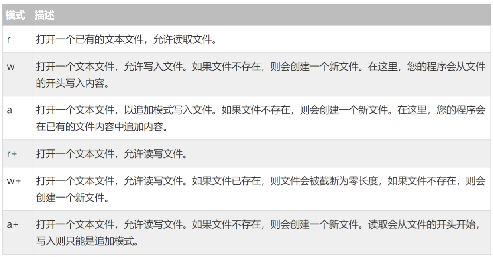

日期： 2022-04-24

标签： #学习笔记 #技术 #Android 

学习资料： 
腾讯课堂 - https://ke.qq.com/webcourse/3060320/105200059#taid=13821032962896480&vid=387702298740321512

百度网盘 - https://pan.baidu.com/disk/main?from=homeFlow#/index?category=all&path=%2F%E5%AD%A6%E4%B9%A0%2F%E4%BA%AB%E5%AD%A6VIP%E8%AF%BE%E7%A8%8B%2F2%E6%9C%9F%2F%E3%80%9007%E3%80%91NDK%2F%EF%BC%8806%EF%BC%892021.3.7C%E8%AF%AD%E8%A8%80%E6%B8%B8%E6%88%8F%E7%A0%B4%E8%A7%A3%E5%99%A8%E4%B8%8E%E6%96%87%E4%BB%B6%E5%8A%A0%E8%A7%A3%E5%AF%86%EF%BC%88NDK%E7%AC%AC%E5%85%AD%E8%8A%82%E8%AF%BE%EF%BC%89

---
<br>

### 一、文件操作
##### 打开文件流
- 库引入： **`#include <stdlib.h>`** 
- 打开文件： **`FILE* fopen (const char* fileName, const char* mode);`**
mode参数说明

- 【重要】关闭文件流： **`fclose(FILE* stream);`**

##### 2、读文件
- 读取文件：**`char* fgets( char *buf, int n, FILE *fp );`**

```C
#include <stdio.h>
#include <stdlib.h> // 文件的操作，是在这个头文件里面的
#include <string.h>

int main() {

	// fopen打开文件的意思（参数1：文件路径 文件源，  参数2：模式 r(读) w(写)  rb(作为二进制文件读) rw(作为二进制文件写)  返回值 FILE 结构体）
	// FILE * fopen (const char *, const char *);

	char* fileNameStr = "D:\\Temp\\DerryFile.txt";

	// 因为使用了r，所以要提前生成好文件
	FILE* file = fopen(fileNameStr, "r"); // file == 指针

	if (!file) {
		printf("文件打开失败，请你个货检测：路径为%s路径的文件，看看有什么问题\n", fileNameStr);
		exit(0); // 退出程序
	}

	// 定义缓存区buffer (容器)
	char buffer[10];

	while (fgets(buffer, 10, file)) { // 1.缓冲区buffer， 2:读取长度， 3:文件指针
		printf("%s", buffer);
	}

	// 【重要】关闭文件
	fclose(file);

	return 0;
}
```

<br>

##### 3、写文件
- 写入文件：**`char* fputs( char* buf, FILE* fp );`**

```C
#include <stdio.h>
#include <stdlib.h> // 文件的操作，是在这个头文件里面的
#include <string.h>

int main() {

	char* fileNameStr = "D:\\Temp\\DerryFileW.txt";

	// 因为使用了w，所以会自动新建一个 0kb 的文件
	FILE* file = fopen(fileNameStr, "w"); // file == 指针

	if (!file) {
		printf("文件打开失败，请你个货检测：路径为%s路径的文件，看看有什么问题\n", fileNameStr);
		exit(0); // 退出程序
	}

	fputs("Derry Success run...", file);

	// 【重要】关闭文件
	fclose(file);

	return 0;
}
```

<br>

##### 4、复制文件
```C
#include <stdio.h>
#include <stdlib.h> // 文件的操作，是在这个头文件里面的
#include <string.h>

// 二进制文件来复制 rb rw
int main() {

	char* fileNameStr = "D:\\Temp\\DerryFile.txt"; // 来源
	char* fileNameStrCopy = "D:\\Temp\\DerryFileCopy.txt"; // 目标

	// rb 读取二进制数据
	FILE* file = fopen(fileNameStr, "rb");

	// wb 写入二进制数据
	FILE* fileCopy = fopen(fileNameStrCopy, "wb");

	if (!file || !fileCopy) {
		printf("文件打开失败，请你个货检测：路径为%s路径的文件，看看有什么问题\n", fileNameStr);
		exit(0); // 退出程序
	}

	int buffer[514];
	int len; // 每次读取的长度

	/*
		fread()

		参数1：容器buffer，
		参数2：每次偏移多少，
		参数3：容器大小，需要与容器声明的大小相等

	*/
	while ((len = fread(buffer, sizeof(int), sizeof(buffer) / sizeof(int), file)) != 0) {
		fwrite(buffer, sizeof(int), len, fileCopy);
	}

	// 关闭文件
	fclose(file);
	fclose(fileCopy);

	return 0;
}
```

<br>

##### 5、获取文件大小
- 没有专门的 文件大小获取 API
- 【思路】：读取文件头指针，将头指针挪动位置并记录挪动的信息，当挪动到最后，就可以求得文件大小

```C
#include <stdio.h>
#include <stdlib.h> // 文件的操作，是在这个头文件里面的
#include <string.h>

int main() {

	char* fileNameStr = "D:\\Temp\\DerryFile.txt"; // 来源

	// 既然是使用了w，他会自动生成文件 0kb
	FILE* file = fopen(fileNameStr, "rb"); // file == 指针

	if (!file) {
		printf("文件打开失败，请你个货检测：路径为%s路径的文件，看看有什么问题\n", fileNameStr);
		exit(0); // 退出程序
	}

	// SEEK_SET（开头）  SEEK_CUR（当前）  SEEK_END（结尾）
	fseek(file, 0, SEEK_END);
	// 走到这里之后：file有了更丰富的值，给你的file指针赋值，挪动的记录信息

	// 读取刚刚给file赋值的记录信息
	// ftell函数目的是：计算偏移的位置，ftell 从 0 开始统计到当前（SEEK_END）
	long file_size = ftell(file);
	printf("%s文件的字节大小是:%ld\n", fileNameStr, file_size);

	// 关闭文件
	fclose(file);

	return 0;
}
```
