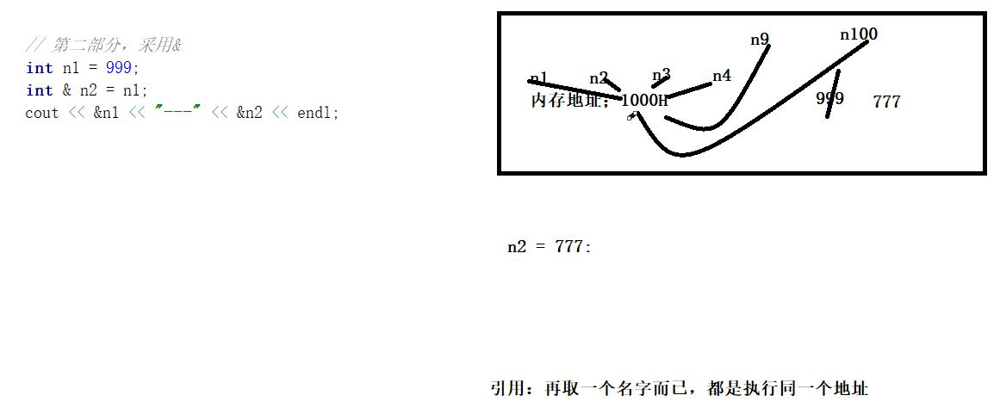

日期： 2022-04-27

标签： #学习笔记 #技术 #Android 

学习资料： 
腾讯课堂 - https://ke.qq.com/webcourse/3060320/105200059#taid=13821067322634848&vid=387702298740968272

百度网盘 - https://pan.baidu.com/disk/main?from=homeFlow#/index?category=all&path=%2F%E5%AD%A6%E4%B9%A0%2F%E4%BA%AB%E5%AD%A6VIP%E8%AF%BE%E7%A8%8B%2F2%E6%9C%9F%2F%E3%80%9007%E3%80%91NDK%2F%EF%BC%8807%EF%BC%892021.3.9C%2B%2B%E8%AF%AD%E8%A8%80%E5%AD%A6%E4%B9%A0%E4%B9%8B%E9%9D%A2%E5%90%91%E5%AF%B9%E8%B1%A1%EF%BC%88NDK%E7%AC%AC%E4%B8%83%E8%8A%82%E8%AF%BE%EF%BC%89--derry%E8%80%81%E5%B8%88

---
<br>

### 一、C++基础概念
- C++语言面向对象 + 标准特性
- C语言面向过程，函数+结构体
- C++里面可以运行C语言，可以调用C语言；反之则不行，C语言无法运行C++
- 打印函数： `std::cout << "Hello World" << std::endl;` ，其中endl==\n，换行符
- 引入命名空间： `using namespace std;` ，这样允许不用额外写 `std::`

```cpp
// #include <stdio.h> // C语言的标准支持

#include <iostream> // C++标准支持  C++的与众不同

using namespace std; // 命名空间 C++ 的特性 （Java语言的内部类）

int main() {

	// C++里面可以运行C语言，可以调用C语言，反之 就不行C语言无法运行C++
	printf("降龙十八掌(C版)\n");

	// std::cout << "C++语言的学习" << std::endl;
	cout << "C++语言的学习" << endl; // 因为你前面引入了命名空间，所以允许省略std::

	// endl == \n  都是换行的含义一样

	// << 不是属性里面的运算，操作符重载，后面会讲
	cout << "擒龙功" << endl;

	cout << "铁头功\n"
		<< "金刚腿\n"
		<< "铁布衫\n";

	return 0;
}
```

<br><br>

### 二、C和C+C+++的常量
常量关键字 `const`
<br>
##### 1、C的常量
- C语言中的常量是个“假”常量，属于伪命题，因为可以通过指针直接修改。

```C
#include <stdio.h>

int main() {
	const int number = 100;

	// number = 200; // 编译报错，不能直接修改

	int* numP = &number;

	*numP = 10000; // 指针修改常量

	printf("%d\n", number);

	return 0;
}
```

##### 2、C++的常量
- C++的常量是真常量，无论直接修改还是指针修改，都不允许。

```cpp
#include <iostream>

int main() {
	const int number = 100;

	/*
		编译不通过，或者运行报错，C++不允许修改常量
	*/
	
	// 1. 直接修改
	// number = 200; 
	
	// 2. 指针修改
	// int * numP = &number;
	// *numP = 10000;

	printf("%d\n", number);

	return 0;
}
```

<br><br>

### 三、引用的原理 与 常量引用
##### 1、例子：两数互换
- C语言方案：通过指针取地址互换
- C++方案：通过引用对象互换

```cpp
#include <iostream>

using namespace std;

// 【1.C语言方案：通过指针取地址互换】
// 接收number1、number2的地址，取该地址上的值，来完成的互换
void numberChange(int* number1, int* number2) {
	int temp = 0;
	temp = *number1;
	*number1 = *number2;
	*number2 = temp;
}

// 【2.C++方案：通过引用对象互换】
// &符是C++的引用语法
void numberChange2(int& number1, int& number2) {

	// 如果不采用引用语法，则main() 与 numberChange2() 中，入参与形参的内存地址不一样的
	// 如果采用引用语法，则main() 与 numberChange2() 中，入参与形参的内存地址是一样的
	cout << "numberChange2()中：" << "number1地址：" << &number1 << " , number2地址：" << &number2 << endl;

	int temp = 0;
	temp = number1;
	number1 = number2;
	number2 = temp;
}

int main() {

	int number1 = 10;
	int number2 = 20;

	cout << "main()中：" << "number1地址：" << &number1 << " , number2地址：" << &number2 << endl;

	// numberChange(&number1, &number2);
	numberChange2(number1, number2);

	cout << "n1:" << number1 << " , n2:" << number2 << endl; // 两数互换成功

	return 0;
}
```

<br>

##### 2、C++引用语法的原理
- 引用语法符：`&`  ，例如 `int n1 = 999;  int& n2 = n1;`
- 当使用引用传递，**原始变量** 与 **引用变量** 的内存地址就一致了，可以相互修改值
- 当不采用引用传递，变量之间赋值仅限于 **“值传递”** ，各自的地址仍然不同，互相无法修改值

```cpp
int main() {

	// 1. 不采用 &，仅限于值传递
	int nn1 = 999;
	int nn2 = nn1;
	nn2 = 1000;
	cout << &nn1 << "---" << &nn2 << endl; // 0xffffcbb4、0xffffcbb0
	cout << nn1 << "---" << nn2 << endl; // nn1 = 999、nn2 = 1000

	// 2. 采用 &，地址相同
	int n1 = 999;
	int& n2 = n1;
	int& n9 = n1;
	n2 = 777;
	n9 = 9527;
	cout << "地址：" << &n1 << "---" << &n2 << endl; // 都是0xffffcbb4
	cout << "值：" << n1 << "---" << n2 << endl; // 都是9527

	return 0;
}

```

值传递


引用传递


<br>

##### 3、常量引用
- 借助于C++的 **“真”** 常量特性，实现引用对象不可被修改
- 不可被修改包括：

