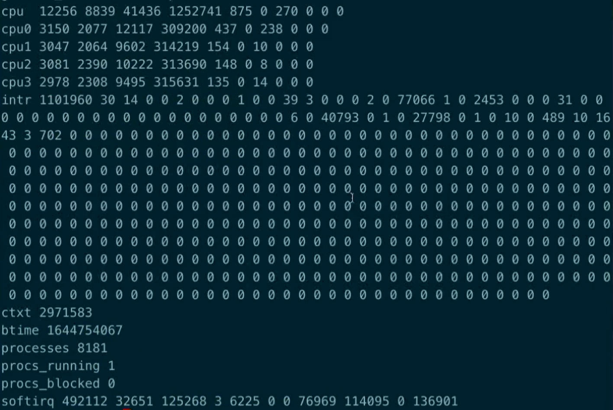

日期： 2022-04-03

标签： #学习笔记 #技术  #Android 

学习源： 
腾讯课堂 - https://ke.qq.com/webcourse/347420/103755197#taid=12286784742706460&vid=387702296036454930

百度网盘 - https://pan.baidu.com/disk/main?from=homeFlow&_at_=1648737764421#/index?category=all&path=%2F%E5%AD%A6%E4%B9%A0%2F%E4%BA%AB%E5%AD%A6VIP%E8%AF%BE%E7%A8%8B%2F3%E6%9C%9F%2F%E3%80%9006%E3%80%91%E6%80%A7%E8%83%BD%E4%BC%98%E5%8C%96%2F%EF%BC%8808%EF%BC%892022.2.13-%E5%8D%A1%E9%A1%BF%E7%9B%91%E6%B5%8B%26%E5%B8%83%E5%B1%80%E4%BC%98%E5%8C%96---%E8%B7%AF%E5%93%A5

---
<br>

## 渲染流图
![[4391195058704.jpg|600]]
- GPU：着色器、片元

<br><br>


## Systrace
- 本质是脚本，用 python 调用 Linux 的 run_systrace 工具。视频10:34开讲
- 推荐用 Perfetto：Open trace file 新版本、Open with legacy UI 老版systrace
- 各种参数，可参见官方文档
	- UI相关：gfx、input、wm、view、webview
	- 运行时：freq、idle、sched
- 信息关注
	- process选项：SurfaceFlinger进程、本App进程
	- Alert，几大分类
	- Frame —— UI Thread、RenderThread 两个线程；点击查看黄、红色的 F 图标
	- animator
-  Application.onCreate() 调用开始，Activity.onWindowFacusChanged() 调用结束：Trace.beginSection()、Trace.endSection()
- Fragment执行bigin、end事务
- release包，反射调用 android.os.Trace 的 setAppTracingAllowed() 方法

<br><br>


## 线上监控
- 使用并学习 **blockcanary框架**
- 框架原理：
	- Handler核心流程
		- Hanlder.postMessage -> mainLooper -> MessageQueue.enqueueMessage() -> Looper.Printer.println(time1) -> dispatchMessage -> Printer.println(time2)
		- 计算 time2-time1 耗时；记录dump方法栈
	- 注册Handler监听消息机制
		- Looper.setMessageLogging(Printer printer);
		- LooperMonitor.println()
	- 记录方法栈
		- LooperMonitor.startDump() -> StackSample.doSample() -> Thread.getStackTrace() -> StackTraceElement.toString()
	- 记录CPU
		- LooperMonitor.startDump() -> CpuSampler.doSample() -> 读取 /proc/stat、/proc/$pid/stat 文件信息
		

<br><br>


## Android布局加载原理
- XML的资源进行View的转换（inflate）：setContentView -> layout inflate -> xmlResourceParse
	- LayoutInflater.tryCreateView()
	- Factory2.onCreateView()
	- **缺点**：反射、IO开销
- 测量布局渲染耗时
	- 在Activity执行setContentView()之前，调用 -> 
```java 
LayoutInflaterCompat.setFactory2(getLayoutInflater(), new LayoutInflater.Factory2() {  
	@Override 
	public View onCreateView(View parent, String name, Context context, AttributeSet attrs) {  
		long st = System.currentTimeMillis();  
		View view = getDelegate().createView(parent, name, context, attrs);  
		long viewCostTime = System.currentTimeMillis() - st;  
		Log.e("t", viewCostTime + "");  
		
		return view;  
	}  
  
	@Override 
	public View onCreateView(String name, Context context, AttributeSet attrs) {  
		// Factory的老接口, 不用, 返回null
		return null;  
	}  
});
```
> 1. 最终Delegate调用的是 AppCompatViewInflater.createView()
> 2. 上述方案还可以应用到 ***统一替换View、换肤 等等***
> 3. 复写Factory2.onCreateView()，做View自定义操作。比如判断name为Button，则返回一个MyButton；遍历AttributeSet，进行熟悉修改等等
> 4. 如果要对非AppCompatActivity的Activity使用，可以尝试用getLayoutInflater().setFactory2();

## 布局优化
- 常规方案：cliprect、include、stub
- 异步加载布局
```java 
new AsyncLayoutInflater(this).inflate(R.layout.activity_main, null, new AsyncLayoutInflater.OnInflateFinishedListener() {  
	@Override  
	public void onInflateFinished(@NonNull View view, int resid, @Nullable ViewGroup parent) {  
		setContentView(R.layout.activity_main);  
	}  
});
```
> 1. 可以学习下这个库的源码，其实只有一个AsyncLayoutInflater类，其他都是内部类。"androidx.asynclayoutinflater:asynclayoutinflater:1.0.0"
> 2. 不能inflate带有 Fragment 的布局
- **X2C框架**
	- 编译时注解
	- 用new对象的方式，替代xml解析
	- 缺陷：兼容性问题，需要修改源码支持（例如Compat、merge等，具体可以看下官方github文档）