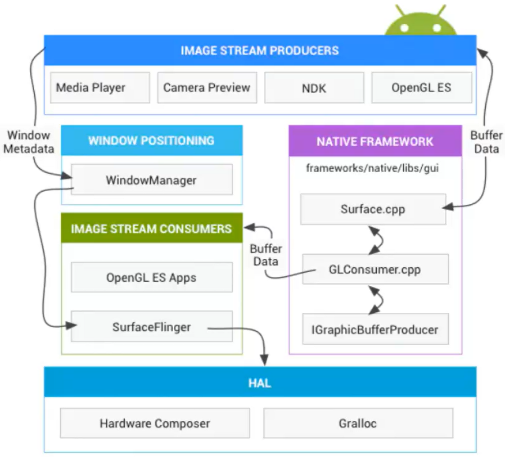

日期： 2022-03-06

标签： #学习笔记 #技术  #Android 

学习源： 
腾讯课堂 - 
https://ke.qq.com/webcourse/347420/103755197#taid=12286797627608348&vid=387702296383669027 （上）
https://ke.qq.com/webcourse/347420/103755197#taid=13385596290813212&vid=387702296478569180 （下）

百度网盘 - https://pan.baidu.com/disk/main?from=homeFlow#/index?category=all&path=%2F%E5%AD%A6%E4%B9%A0%2F%E4%BA%AB%E5%AD%A6VIP%E8%AF%BE%E7%A8%8B%2F3%E6%9C%9F%2F%E3%80%9006%E3%80%91%E6%80%A7%E8%83%BD%E4%BC%98%E5%8C%96%2F%EF%BC%8811%EF%BC%892022.2.20-%E7%BA%BF%E4%B8%8A%E6%80%A7%E8%83%BD%E4%BC%98%E5%8C%96---%E8%B7%AF%E5%93%A5


---
<br>


- 性能优化目的：知识点的沉淀、总结
- 比如Mem（2种方案 手动GC[Matrix]、阈值的处理[Koom]）
- FPS(Handler机制、Printer)、idleHandler（闲时延迟操作）

- 闲时延迟操作：
```java
Looper.myQueue().addIdelHandler(new Message.IdelHandler(){
	//queueIdle return true/false
})
```

## 一、so动态加载库：ReLinker
- [ReLinker 库github](https://github.com/KeepSafe/ReLinker )：
- 通过动态加载so的技术，解决UnsatisfiedLinkError问题。
	- UnsatisfiedLinkError : 主要的原因是兼容性的问题。包so的裁剪由于国内的厂商魔改ROM，改的是so加载的路径（3种）。
- Tinker的so的加载流程（电量那节课讲的[[享学Vip - 2022年2月15日 【网络优化（HttpDNS） & 电量】delay]]）
- 核心类 [`ReLinkerInstance`](https://github.com/KeepSafe/ReLinker/blob/master/relinker/src/main/java/com/getkeepsafe/relinker/ReLinkerInstance.java)
- ReLinker**最牛逼的地方就是解析SO的2进制文件，获取so的依赖属性。** 参见ELF文件解析类 [`ElfParser`](https://github.com/KeepSafe/ReLinker/blob/master/relinker/src/main/java/com/getkeepsafe/relinker/elf/ElfParser.java) 中的 `parseNeededDependencies()` 方法
- System类
	- `System.mapLibraryName("abc");` 自带拼接返回 `"libabc.so"` 字符串
	- `loadLibrary()`、`load()` 价值so
	- `getenv()`

<br><br>


## 二、性能优化
- 性能优化框架：做什么？怎么做？如何设计方案与架构？

### 1、主流开源项目的调研、用法：
- [rabbit 库github](https://github.com/SusionSuc/rabbit-client)
- [**Matrix 库github**](https://github.com/Tencent/matrix/wiki/Matrix-Android-TraceCanary) ：功能全，但很重，不适合公司的业务迭代，稳定性低
- 听云SDK（>8.0 CPU 指标的问题）
- 网易 腾讯GT （时间非常老）16年
- 360的[ArgusAPM](https://github.com/Qihoo360/ArgusAPM) gradle 集成的时候会有很多的问题
- [BlockCanary](https://github.com/markzhai/AndroidPerformanceMonitor)

<br>


### 2、APM有哪些指标
#### 2.1、不要去碰和讲的指标
1. 稳定性的问题（崩溃的问题）
	- 主流方案：breakpad+bugly+Firebase(海外)

2. 流量/网络 （Http协议的可达率、流量的大小）
	- 使用OKHTTP的拦截器（可以获取请求的链接、byte大小，但是能够覆盖的面太小）
	- 全链路的网络监控APM：网络一体化的问题、协议本身（例如Socket，但各家公司不一样，所以SDK本身很难统一的处理）

<br>


#### 2.2、重点关注的APM指标
##### 2.2.1、电量
battery、historian、广播

##### 2.2.2、流量消耗
- `TrafficStats / getUidRxBytes(int uid) / getTotalbytes()`
- 后台偷跑：后台定时任务，获取时间间隔（2、5分钟）流量，计算平均值

##### 2.2.3、内存指标的统计 / 内存的泄漏
 - rabbit库的 [RabbitMemoryMonitor](https://github.com/SusionSuc/rabbit-client/blob/master/rabbit-monitor/src/main/java/com/susion/rabbit/monitor/instance/RabbitMemoryMonitor.kt)
```java
/**
 * 只能用在debug model,
 **/
private fun getMemoryInfoInDebug(): RabbitMemoryInfo {
	val info = Debug.MemoryInfo()
	Debug.getMemoryInfo(info)
	
	val memInfo = RabbitMemoryInfo()
	memInfo.totalSize = (info.totalPss) * 1024 // 这个值比profiler中的total大一些
	memInfo.vmSize = (info.dalvikPss) * 1024   // 这个值比profiler中的 java 内存值小一些, Doesn't include other Dalvik overhead
	memInfo.nativeSize = info.nativePss * 1024
	memInfo.othersSize = info.otherPss * 1024 + info.totalSwappablePss * 1024
	memInfo.time = System.currentTimeMillis()
	memInfo.pageName = RabbitMonitor.getCurrentPage()
	
	return memInfo
}

// 统计进程的内存信息 total Pss
fun getMemoryByActivityManager(): Long {
	... 
    mActivityManager?.getProcessMemoryInfo(intArrayOf(Process.myPid())) ?: return 0
    ...
}
    

//内存的泄漏  利用ActivityLifeCycleCallback机制
weakreference
activity，activity.class.simplename
activity onStop的时候 手动GC2次 sleep间隔500ms，影响性能
```

##### 2.2.4、启动耗时监控
- 冷启动、暖启动
- Activity的first Frame
- CP大法 ContentProvider。

##### 2.2.5、FPS 帧率、卡顿
- Vsync 16ms
- 卡顿：偶尔丢1、2帧不会造成卡顿，但如果在某个时间点丢了较多帧，就会卡顿。[Matrix wiki-什么是卡顿](https://github.com/Tencent/matrix/wiki/Matrix-Android-TraceCanary#%E4%BB%80%E4%B9%88%E6%98%AF%E5%8D%A1%E9%A1%BF)
	> 1. 人眼识别的流程效果为：1秒显示60帧，每一帧都均匀分布耗时，即1帧≈16ms  
	> 2. FPS 意为 "帧/秒"，即1秒多少帧。  
	> 3. 若 FPS 低，只能说明1秒内显示的帧数较少，但不能表示一定发生了卡顿现象。假设，如果1秒只有30帧（即FPS低），但如果每一帧 "都耗时32ms"，则依然说明这30帧是连续的、均匀的，人眼看起来顶多觉得不流畅丝滑，但不会觉得卡顿。  
	> 4. 所谓发生卡顿，是指某一时间段内，发生了 "大量集中丢帧" 现象，即某1帧耗时突然超过了16ms，且这个超出值非常大，大到丢掉了后面非常多的帧。  
	> 5. Matrix引入 "掉帧程度" 的这个指标，来衡量卡顿程度(具体参见wiki文档)
	> 6. 综上，APM的 **==技术指标==** 应该是“单次连续掉了多少帧” ；**==治理手段==** ，是统计发生卡顿时，两帧之间的所有方法耗时。

- 原理知道了，代码写在什么位置？？
`onActivityResumed()` 开启监听 `onWindowFocusChanged()`

- 两种方案：
1. Choreographer（线上性能影响大）
```java
Choreographer.getInstance().postFrameCallback(new Choreographer.FrameCallback() {
    @Override    
    public void doFrame(long frameTimeNanos) {
        if(frameTimeNanos - mLastFrameNanos > 100) {
            ...
        }
        
        mLastFrameNanos = frameTimeNanos;
        
        Choreographer.getInstance().postFrameCallback(this);
    }
});
```

2. Message的消息监听（推荐）
```java
//推荐下面
public static void loop() {
    ...
    for (;;) {
        ...
        // This must be in a local variable, in case a UI event sets the logger
        Printer logging = me.mLogging;
        if (logging != null) {
            logging.println(">>>>> Dispatching to " + msg.target + " " + msg.callback + ": " + msg.what);
        }
        msg.target.dispatchMessage(msg);
        if (logging != null) {
            logging.println("<<<<< Finished to " + msg.target + " " + msg.callback);
        }
        ...
    }
}
```


<br><br>

## 三、帧率
### 图形显示过程
帧的渲染过程中一些关键组件的流程图


#### Image Stream Producers（图像生产者）
任何可以产生图形信息的组件都统称为图像的生产者，比如OpenGL ES, Canvas 2D, 和 媒体解码器等。

#### Image Stream Consumers（图像消费者）
SurfaceFlinger是最常见的图像消费者，Window Manager将图形信息收集起来提供给SurfaceFlinger,SurfaceFlinger接受后经过合成再把图形信息传递给显示器。同时，SurfaceFlinger也是唯一一个能够改变显示器内容的服务。SurfaceFlinger使用OpenGL和Hardware Composer来生成surface.

某些OpenGL ES 应用同样也能够充当图像消费者，比如相机可以直接使用相机的预览界面图像流，一些非GL应用也可以是消费者，比如ImageReader 类。

#### Window Manager
Window Manager是一个用于控制window的系统服务，包含一系列的View。每个Window都会有一个surface，Window Manager会监视window的许多信息，比如生命周期、输入和焦点事件、屏幕方向、转换、动画、位置、转换、z-order等，然后将这些信息（统称window metadata）发送给SurfaceFlinger，这样，SurfaceFlinger就能将window metadata合成为显示器上的surface。

#### Hardware Composer
为硬件抽象层（HAL）的子系统。SurfaceFlinger可以将某些合成工作委托给Hardware Composer，从而减轻OpenGL和GPU的工作。此时，SurfaceFlinger扮演的是另一个OpenGL ES客户端，当SurfaceFlinger将一个缓冲区或两个缓冲区合成到第三个缓冲区时，它使用的是OpenGL ES。这种方式会比GPU更为高效。

一般应用开发都要将UI数据使用Activity这个载体去展示，典型的Activity显示流程为：

1.  startActivity启动Activity；    
2.  为Activity创建一个window(PhoneWindow)，并在WindowManagerService中注册这个window；    
3.  切换到前台显示时，WindowManagerService会要求SurfaceFlinger为这个window创建一个surface用来绘图。SurfaceFlinger创建一个”layer”（surface）。（以想象一下C/S架构，SF对应Server，对应Layer；App对应Client，对应Surface）,这个layer的核心即是一个BufferQueue，这时候app就可以在这个layer上render了； 将所有的layer进行合成，显示到屏幕上。    

一般app而言，在任何屏幕上起码有三个layer：
-   屏幕顶端的status bar    
-   屏幕下面的navigation bar    
-   还有就是app的UI部分。 一些特殊情况下，app的layer可能多余或者少于3个，例如对全屏显示的app就没有status bar，而对launcher，还有个为了wallpaper显示的layer。status bar和navigation bar是由系统进行去render，因为不是普通app的组成部分嘛。而app的UI部分对应的layer当然是自己去render，所以就有了第4条中的所有layer进行“合成”。

### GUI框架

### Hardware Composer
那么android是如何使用这两种合成机制的呢？这里就是Hardware Composer的功劳。处理流程为：
1.  SurfaceFlinger给HWC提供layer list，询问如何处理这些layer；    
2.  HWC将每个layer标记为overlay或者GLES composition，然后回馈给SurfaceFlinger；    
3.  SurfaceFlinger需要去处理那些GLES的合成，而不用去管overlay的合成，最后将overlay的layer和GLES合成后的buffer发送给HWC处理。    

借用google一张图说明，可以将上面讲的很多概念展现，很清晰。地址位于 [https://source.android.com/devices/graphics/](https://link.jianshu.com/?t=https://source.android.com/devices/graphics/)

### 关于帧率
即 Frame Rate，单位 fps，是指 gpu 生成帧的速率，如 33 fps，60fps，越高越好。  但是对于快速变化的游戏而言，你的FPS很难一直保持同样的数值，他会随着你所看到的显示卡所要描画的画面的复杂程度而变化。

### VSync
[Android 显示刷新机制、VSYNC和三重缓存机制](https://iww0abxi5u.feishu.cn/docx/doxcnPYGcXtLf8RQMW6zByojKdd)

安卓系统中有 2 种 VSync 信号：
1.  屏幕产生的 **硬件VSync**： 硬件VSync 是一个脉冲信号，起到开关或触发某种操作的作用。   
2.  由 SurfaceFlinger 将其转成的 **软件Vsync信号**：经由 Binder 传递给 Choreographer。    

#### 单层缓冲引发“画面撕裂”问题
如上图，CPU/GPU 向 Buffer 中生成图像，屏幕从 Buffer 中取图像、刷新后显示。这是一个典型的生产者——消费者模型。理想的情况是帧率和刷新频率相等，每绘制一帧，屏幕显示一帧。而实际情况是，二者之间没有必然的大小关系，如果没有锁来控制同步，很容易出现问题。

所谓”撕裂”就是一种画面分离的现象，这样得到的画像虽然相似但是上半部和下半部确实明显的不同。这种情况是由于帧绘制的频率和屏幕显示频率不同步导致的，比如显示器的刷新率是75Hz,而某个游戏的FPS是100. 这就意味着显示器每秒更新75次画面，而显示卡每秒更新100次，比你的显示器快33%。

#### 双缓冲
两个缓存区分别为 Back Buffer 和 Frame Buffer。**CPU/GPU** 向 Back Buffer 中写入图像数据、**屏幕** 向 Frame Buffer 中读取图像数据、**VSync信号** 负责从 Back Buffer 到 Frame Buffer 的复制操作，可认为该复制操作在瞬间完成。

双缓冲的模型下，工作流程这样的：
-   在某个时间点，一个屏幕刷新周期完成，进入短暂的刷新空白期。此时 VSync信号 产生，并先执行复制操作，然后再通知 CPU/GPU 绘制下一帧图像数据。当刚才的复制操作完成后，屏幕进入到下一个刷新周期，读取刚才复制到 Frame Buffer 中的图像数据，并显示到屏幕上。    
-   在这种模型下，只有当 VSync 信号产生时，CPU/GPU 才会开始绘制图像数据。这样，当帧率大于刷新频率时，帧率就会被迫跟刷新频率保持同步，从而避免“tearing”现象。    

#### VSync 偏移
应用和SurfaceFlinger的渲染回路必须同步到硬件的VSYNC，在一个VSync信号中，显示器将显示第N帧，SurfaceFlinger合成第N+1帧，app合成第N+2帧。

使用VSYNC同步可以保证延迟的一致性，减少了app和SurfaceFlinger的错误，以及显示在各个阶段之间的偏移。然而，前提是app和SurfaceFlinger每帧时间的变化并不大。因此，从输入到显示的延迟至少有两帧。  为了解决这个问题，您可以使用VSYNC偏移量来减少输入到显示的延迟，其方法为将app和SurfaceFlinger的合成信号与硬件的VSYNC关联起来。因为通常app的合成耗时是小于两帧的（33ms左右）。  VSYNC偏移信号细分为以下3种，它们都保持相同的周期和偏移向量：
-   HW_VSYNC_0：显示器开始显示下一帧。    
-   VSYNC：app读取输入并生成下一帧。    
-   SF VSYNC：SurfaceFlinger合成下一帧。 收到VSYNC偏移信号之后， SurfaceFlinger 才开始接收缓冲区的数据进行帧的合成，而app才处理输入并渲染帧，这些操作都将在16.7ms完成。    

### Jank 掉帧
注意，当 VSync信号 发出时，若 GPU/CPU 还在生产帧数据中，则此时不会发生双缓冲的复制操作。屏幕进入下一个刷新周期时，从 Frame Buffer 中取出的是“老”数据，而非正在产生的帧数据，则前后两次刷新周期内显示的是同一帧数据。这就是我们称之为发生了“掉帧现象”（Dropped Frame，Skipped Frame，Jank）。

<br>


### 流畅性解决方案思路
1.  从dumpsys SurfaceFlinger --latency中获取127帧的数据    
2.  上面的命令返回的第一行为设备本身固有的帧耗时，单位为ns，通常在16.7ms左右    
3.  从第二行开始，分为3列，一共有127行，代表每一帧的几个关键时刻，单位也为ns    

第一列t1： when the app started to draw （开始绘制图像的瞬时时间） 第二列t2： the vsync immediately preceding SF submitting the frame to the h/w （VSYNC信令将软件SF帧传递给硬件HW之前的垂直同步时间），也就是对应上面所说的软件Vsync 第三列t3： timestamp immediately after SF submitted that frame to the h/w （SF将帧传递给HW的瞬时时间，及完成绘制的瞬时时间）

1.  将第i行和第i-1行t2相减，即可得到第i帧的绘制耗时，提取出每一帧不断地dump出帧信息，计算出    
，
<br>

### 一些计算规则
#### 计算fps:
每执行adb shell dumpsys SurfaceFlinger一次计算汇总出一个fps,计算规则为：  frame的总数N：127行中的非0行数  绘制的时间T：设t=当前行t2 - 上一行的t2，求出所有行的和∑t  fps=N/T (要注意时间转化为秒)

#### 计算中一些细节问题
一次adb shell dumpsys SurfaceFlinger会输出127帧的信息，但是这127帧可能是这个样子：
...  
0               0               0  
0               0               0  
0               0               0  
575271438588    575276081296    575275172129  
575305169681    575309795514    575309142441  
580245208898    580250445565    580249372231  
580279290043    580284176346    580284812908  
580330468482    580334851815    580333739054   
0               0               0  
0               0               0  
...  
575271438588    575276081296    575275172129  
575305169681    575309795514    575309142441   

-   出现0的地方是由于buffer中没有数据，而非0的地方为绘制帧的时刻，因此仅计算非0的部分数据    
-   观察127行数据，会发现偶尔会出现9223372036854775808这种数字，这是由于字符溢出导致的，因此这一行数据也不能加入计算    
-   不能单纯的dump一次计算出一个fps，举个例子，如果A时刻操作了手机，停留3s后，B时刻再次操作手机，按照上面的计算方式，则t>3s,并且也会参与到fps的计算去，从而造成了fps不准确，因此，需要加入一个阀值判断，当t大于某个值时，就计算一次fps，并且把相关数据重新初始化，这个值一般取500ms    
-   如果t<16.7ms,则直接按16.7ms算，同样的总耗时T加上的也是16.7    

#### 计算jank的次数:
如果t3-t1>16.7ms，则认为发生一次卡顿

<br><br>


## 流畅度得分计算公式
设目标fps为target_fps，目标每帧耗时为target_ftime=1000/target_fps  从以下几个维度衡量流畅度：
-   fps: 越接近target_fps越好，权重分配为40%    
-   掉帧数：越少越好，权重分配为40%    
-   超时帧：拆分成以下两个维度    
    -   超时帧的个数，越少越好，权重分配为5%        
    -   最大超时帧的耗时，越接近target_ftime越好，权重分配为15%        

end_time = round(last_frame_time / 1000000000, 2)  
T = utils.get_current_time()  
fps = round(frame_counts * 1000 / total_time, 2)  
​  
# 计算得分  
g = fps / target  
if g > 1:  
  g = 1  
if max_frame_time - kpi <= 1:  
       max_frame_time = kpi  
h = kpi / max_frame_time  
 score = round((g * 50 + h * 10 + (1 - over_kpi_counts / frame_counts) * 40), 2)

### SurfaceView
Vsync 屏幕的重绘 16ms
SurfaceView&view

#### APM框架总结
-   类似组件化、common library（反射、工具类 获取进程ID )、业务（电量、网络监听、资源问题、anr、内存、FPSUi的问题）    
-   每一个功能组件都打成AAR的包，你想用什么 集成哪一个。(Maven私有仓库)