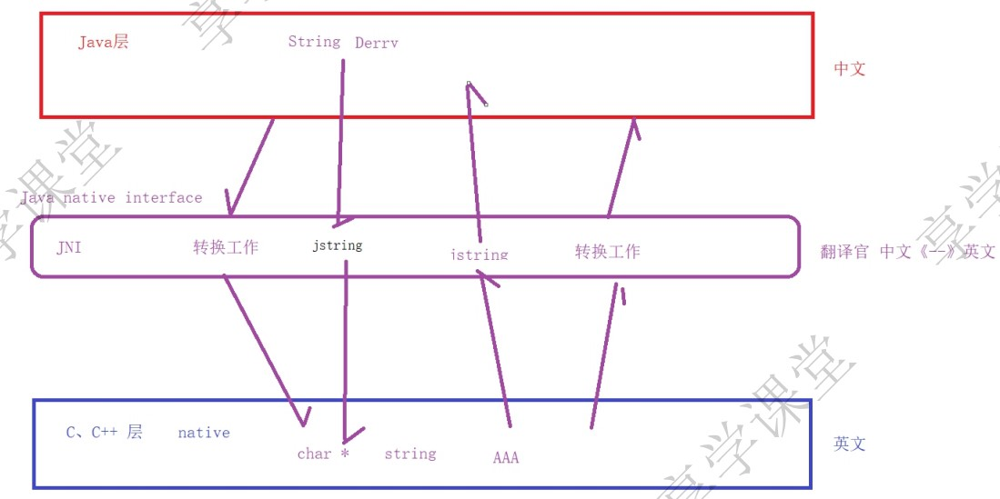

日期： 2022-05-08

标签： #学习笔记 #技术 #Android 

学习资料： 
腾讯课堂 - https://ke.qq.com/webcourse/3060320/105200059#taid=13821183286751840&vid=387702299872991795

百度网盘 - https://pan.baidu.com/s/1zjmJzrU-4kq0TJ7Yxu9tvA#list/path=%2Fsharelink1103492872705-314800681445689%2F%E3%80%9008%E3%80%91NDK%2F2022.4.26-JNI%E4%BB%8E%E5%85%A5%E9%97%A8%E5%88%B0%E5%9F%BA%E7%A1%80%E5%85%A8%E9%9D%A2%E6%8E%8C%E6%8F%A1---derry%E8%80%81%E5%B8%88&parentPath=%2Fsharelink1103492872705-314800681445689

---
 

### 一、JNI初识
##### 1、

##### 2、签名规则
boolean --> Z

byte --> B

char --> C

short --> S

int --> I

long --> J

float --> F

double --> D

void --> V

object --> L完整的类名；

array[ 数组的数据类型 ] -->  int[] [I double[][] [[D

method(参数类型)返回值类型  -->  void name（int a，double b） （ID）V