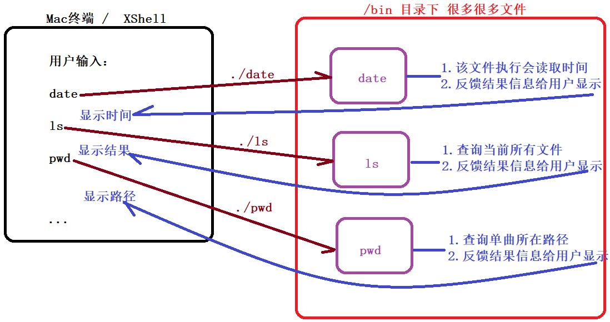

日期： 2022-05-29

标签： #学习笔记 #技术 #Android 

学习资料： 
腾讯课堂 - 

百度网盘 - https://pan.baidu.com/s/1zjmJzrU-4kq0TJ7Yxu9tvA#list/path=%2Fsharelink1103492872705-314800681445689%2F%E3%80%9008%E3%80%91NDK%2F2022.5.14-Linux%E5%AD%A6%E4%B9%A0%E4%B9%8B%E5%91%BD%E4%BB%A4%E6%89%A7%E8%A1%8C%E5%8E%9F%E7%90%86%E4%B8%8E%E6%96%87%E4%BB%B6%E7%94%A8%E6%88%B7%E7%BB%84%E7%AD%89%EF%BC%88%E4%B8%80%EF%BC%89---derry%E8%80%81%E5%B8%88&parentPath=%2Fsharelink1103492872705-314800681445689

---
 

-rw-r--r--            1              root        root         0        Mar 27 14:12    file01.txt
文件权限    硬链接计数    所有者    所属组    大小            时间              名称

- Linux文件类型：
1. 常用
“-” 【普通文件】
d 【文件夹】

2. 不常用
l 【软链接，硬链接软件接：相当于 windows 的快捷图标】
c 【字符设备文件】
b 【块设备文件】
p 【管道文件】
s 【套接字】

-  命令执行原理

