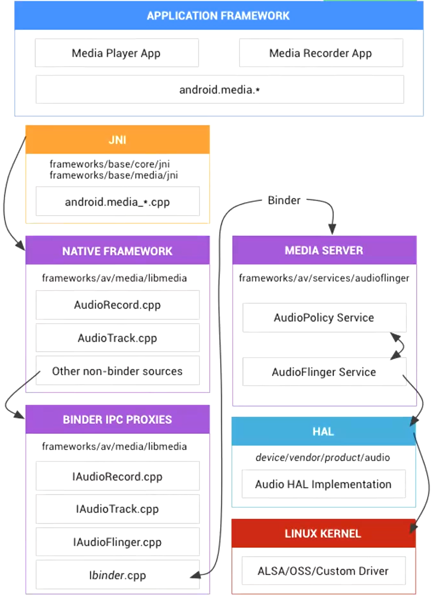

日期： 2022-06-11

标签： #学习笔记 #技术 #Android 

学习资料： 
腾讯课堂 - https://ke.qq.com/webcourse/3060320/105200059#taid=14015397412909664&vid=387702301410831980

百度网盘 - https://pan.baidu.com/s/1zjmJzrU-4kq0TJ7Yxu9tvA#list/path=%2Fsharelink1103492872705-314800681445689%2F%E3%80%9008%E3%80%91NDK%2F2022.5.29Android%E9%9F%B3%E8%A7%86%E9%A2%91%E5%9F%BA%E7%A1%80%E7%90%86%E8%AE%BA-%E9%9F%B3%E9%A2%91&parentPath=%2Fsharelink1103492872705-314800681445689

---
<br>

### 一、音视频基础
> **==看pdf课件==**

- Nyquist，频率的2倍
- 采样率：一秒钟采样的次数。代表音频的质量
- 采样位数：采样范围，精度，越高越逼真
- 声道：Channel，左声道、双通道等等
- 码率：比特数，指每秒传送的⽐特(bit)数。码率=采样率X采样位数X声道数
- 音频编码过程

- 傅里叶变化 https://www.bilibili.com/video/BV1kX4y1u7GJ/?spm_id_from=333.788.recommend_more_video.1
- Android音频架构


<br>

### 二、OpenSL ES
##### 1、OpenSL ES 背景
- 核心作用：处理、播放PCM数据。
> **OpenSL ES** 全称为 **Open Sound Library for Embedded Systems**，即 **嵌⼊式⾳频加速标准**。OpenSL ES是⽆授权费、跨平台、针对嵌⼊式系统精⼼优化的硬件⾳频加速 API。它为嵌⼊式移动多媒体设备上的本地 应⽤程序开发者提供了标准化、⾼性能、低响应时间的⾳频功能实现⽅法，同时还实现了软/硬件⾳频性能的直接跨平台部署，不仅降低了执⾏难度，⽽且促进了⾼级⾳频市场的发展。简单来说OpenSL ES是⼀个嵌⼊式跨平台免费的⾳频处理库。 所以它不是Android特有的。

- 官方文档： https://developer.android.google.cn/ndk/guides/audio/opensl
- pdf文档： https://kdocs.cn/l/csTk96yji5wD
- 文档怎么读：
	- **播放、录音** 两个板块
	- 第二章：Features and Profiles，Effects and controls（用ffmpeg）、3D Audio（支持太弱） 跳过不看
	- 第三章：Design Overview，**3.1小节**有大量设计原理、代码示例，认真看。
	- 第四章：Functional Overview，核心功能点介绍
	- 第六章：Functions，API文档，后续当字典查即可
	- 第七章：Object Definitions，对象定义，7.2~7.4要看

<br>

##### 2、对象状态流转

> When the application destroys an object, that object implicitly transitions through the Unrealized state. Thus it frees its resources and makes them available to other objects.

<br>

##### 3、核心代码
###### 3.1、播放功能 Play
-  把 PCM 数据（char[]）发送给底层的es进行播放  
```C
extern "C"  
JNIEXPORT void JNICALL  
Java_com_opensource_openslesdemo_OpenSlEsPlayer_sendPcmData(JNIEnv *env,  
                                                            jobject thiz,  
                                                            jbyteArray data_,  
                                                            jint size) {  
    if (audio == NULL) {  
        audio = new Audio(dataQueue, 44100);  
        audio->play();  
    }  
    jbyte *data = env->GetByteArrayElements(data_, nullptr);  
  
    PcmData *pdata = new PcmData((char *) data, size);  
    dataQueue->putPcmData(pdata);  
    LOGE("size is %d queue size is %d", size, dataQueue->getPcmDataSize());  
    env->ReleaseByteArrayElements(data_, data, 0);  
}
```

- 初始化OpenSLES，看Demo中的 `Audio.cpp`
```C
void Audio::initOpenSLES() {  
    struct timeval t_start, t_end;  
    gettimeofday(&t_start, NULL);  
    LOGD("Start time: %ld us", t_start.tv_usec);  


    /***********    1 创建引擎 获取SLEngineItf    ***********/  
    SLresult result;  
    result = slCreateEngine(&engineObject, 0, 0, 0, 0, 0);  
    if (result != SL_RESULT_SUCCESS)  
        return;  
    result = (*engineObject)->Realize(engineObject, SL_BOOLEAN_FALSE);  
    if (result != SL_RESULT_SUCCESS)  
        return;  
    result = (*engineObject)->GetInterface(engineObject, SL_IID_ENGINE, &engineEngine);  
    if (result != SL_RESULT_SUCCESS)  
        return;  
    if (engineEngine) {  
        LOGD("get SLEngineItf success");  
    } else {  
        LOGE("get SLEngineItf failed");  
    }  
    /***********    1 创建引擎    ***********/  


    /***********    2 创建混音器    ***********/
	const SLInterfaceID mids[1] = {SL_IID_ENVIRONMENTALREVERB};  
    const SLboolean mreq[1] = {SL_BOOLEAN_FALSE};  
    result = (*engineEngine)->CreateOutputMix(engineEngine, &outputMixObject, 1, mids, mreq);  
    if (result != SL_RESULT_SUCCESS) {  
        LOGE("CreateOutputMix failed");  
        return;    } else {  
        LOGD("CreateOutputMix success");  
    }  
  
    //实例化混音器  
    result = (*outputMixObject)->Realize(outputMixObject, SL_BOOLEAN_FALSE);  
    if (result != SL_RESULT_SUCCESS) {  
        LOGE("mixer init failed");  
    } else {  
        LOGD("mixer init success");  
    }  
  
    result = (*outputMixObject)->GetInterface(outputMixObject, SL_IID_ENVIRONMENTALREVERB, &outputMixEnvironmentalReverb); 
                                               
    if (SL_RESULT_SUCCESS == result) {  
        SLEnvironmentalReverbSettings reverbSettings = SL_I3DL2_ENVIRONMENT_PRESET_STONECORRIDOR;  
        result = (*outputMixEnvironmentalReverb)->SetEnvironmentalReverbProperties(  
                outputMixEnvironmentalReverb, &reverbSettings);  
        (void) result;  
    }  
    /***********    2 创建混音器    ***********/  


    /***********    3 配置音频信息，主要配置PCM格式    ***********/
	SLDataLocator_OutputMix outputMix = {SL_DATALOCATOR_OUTPUTMIX, outputMixObject};  
    SLDataSink slDataSink = {&outputMix, 0};  
    //缓冲队列  
    SLDataLocator_AndroidSimpleBufferQueue android_queue = {SL_DATALOCATOR_ANDROIDSIMPLEBUFFERQUEUE, 2};  
    //音频格式  
    SLDataFormat_PCM pcmFormat = {  
            SL_DATAFORMAT_PCM, //播放pcm格式的数据  
            //声道数  
            static_cast<SLuint32>(getCurrentSampleRateForOpensles(sample_rate)),  
            SL_PCMSAMPLEFORMAT_FIXED_16, //位数 16位  
            SL_PCMSAMPLEFORMAT_FIXED_16, //和位数一致就行  
            SL_SPEAKER_FRONT_LEFT | SL_SPEAKER_FRONT_RIGHT, //立体声（前左前右）  
            //字节序，小端  
            SL_BYTEORDER_LITTLEENDIAN  
    };  
    SLDataSource slDataSource = {&android_queue, &pcmFormat};  
    /***********    3 配置音频信息    ***********/  


    /***********    4 创建播放器    ***********/
	const SLInterfaceID ids[] = {SL_IID_BUFFERQUEUE, SL_IID_VOLUME, SL_IID_MUTESOLO};  
    const SLboolean req[] = {SL_BOOLEAN_TRUE, SL_BOOLEAN_TRUE, SL_BOOLEAN_TRUE};  
  
  
    result = (*engineEngine)->CreateAudioPlayer(engineEngine, 
											    &pcmPlayerObject, 
												&slDataSource,  
                                                &slDataSink, 
                                                sizeof(ids) / sizeof(SLInterfaceID),  
                                                ids, 
                                                req);  
                                                
    if (result != SL_RESULT_SUCCESS) {  
        LOGE("create audio player failed");  
    } else {  
        LOGE("create audio player success");  
    }  
    //初始化播放器  
    result = (*pcmPlayerObject)->Realize(pcmPlayerObject, SL_BOOLEAN_FALSE);  
    if (result != SL_RESULT_SUCCESS) {  
        LOGE("audio player init failed");  
    } else {  
        LOGE("audio player init success");  
    }  
    //获取player接口  
    result = (*pcmPlayerObject)->GetInterface(pcmPlayerObject, SL_IID_PLAY, &pcmPlayerPlay);  
    if (result != SL_RESULT_SUCCESS) {  
        LOGE("player get SL_IID_PLAY failed");  
    } else {  
        LOGD("player get SL_IID_PLAY success");  
    }  
    //获取声道操作接口  
    (*pcmPlayerObject)->GetInterface(pcmPlayerObject, SL_IID_MUTESOLO, &pcmMutePlay);  
    // 音量  
    (*pcmPlayerObject)->GetInterface(pcmPlayerObject, SL_IID_VOLUME, &pcmVolumePlay);  
  
    //获取播放队列接口  
    result = (*pcmPlayerObject)->GetInterface(pcmPlayerObject, SL_IID_BUFFERQUEUE, &pcmBufferQueue);  
    if (result != SL_RESULT_SUCCESS) {  
        LOGE("player get SL_IID_BUFFERQUEUE failed");  
    } else {  
        LOGD("player get SL_IID_BUFFERQUEUE success");  
    }  
    /***********    4 创建播放器    ***********/  


    //设置回调函数  
    (*pcmBufferQueue)->RegisterCallback(pcmBufferQueue, pcmBufferCallBack, this);  
    
    //设置播放状态  
    (*pcmPlayerPlay)->SetPlayState(pcmPlayerPlay, SL_PLAYSTATE_PLAYING);  
    
    // 启动
    // 先手动调用一次回调函数
    pcmBufferCallBack(pcmBufferQueue, this);  

    // 启动  
    // (*pcmBufferQueue)->Enqueue(pcmBufferQueue,"",1);  
  
    gettimeofday(&t_end, NULL);  
    LOGD("End time: %ld us", t_end.tv_usec);  
  
    long cost_time = t_end.tv_usec - t_start.tv_usec;  
    LOGD("opensled create cost:%ld ms", cost_time / 1000);  
}

//回调函数 
//OpenSLES 会自动回调  
//作用是不停的把pcm数据放入到队列中处理
void pcmBufferCallBack(SLAndroidSimpleBufferQueueItf bf, void *context) {  
    LOGD("pcmBufferCallBack ok");  
  
    Audio *audio = (Audio *) context;  
    if (audio != NULL) {  
        PcmData *data = audio->dataQueue->getPcmData();  
        if (NULL != data) {  
            LOGD("Enqueue ok");  
            (*audio->pcmBufferQueue)->Enqueue(audio->pcmBufferQueue,  
                                              data->getData(),  
                                              data->getSize());  
        }  
    }  
}
```

###### 3.2、录音功能 Recoder
- 结合文档第6章，看Demo中的 `AudioRecoreder.cpp` 的API解释
- `createEngine()` --> `startRecord()` --> `AudioRecorderCallback` --> `Enqueue`