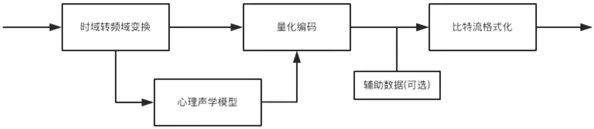

日期： 2022-06-11

标签： #学习笔记 #技术 #Android 

学习资料： 
腾讯课堂 - https://ke.qq.com/webcourse/3060320/105200059#taid=14015397412909664&vid=387702301410831980

百度网盘 - https://pan.baidu.com/s/1zjmJzrU-4kq0TJ7Yxu9tvA#list/path=%2Fsharelink1103492872705-314800681445689%2F%E3%80%9008%E3%80%91NDK%2F2022.5.29Android%E9%9F%B3%E8%A7%86%E9%A2%91%E5%9F%BA%E7%A1%80%E7%90%86%E8%AE%BA-%E9%9F%B3%E9%A2%91&parentPath=%2Fsharelink1103492872705-314800681445689

---
 

- Nyquist，频率的2倍
- 采样率：一秒钟采样的次数。代表音频的质量
- 采样位数：采样范围，精度，越高越逼真
- 声道：Channel，左声道、双通道等等
- 码率：比特数，指每秒传送的⽐特(bit)数。码率=采样率X采样位数X声道数
- 音频编码过程

- 傅里叶变化 https://www.bilibili.com/video/BV1kX4y1u7GJ/?spm_id_from=333.788.recommend_more_video.1
- Android音频架构

### OpenSL ES
https://developer.android.google.cn/ndk/guides/audio/opensl

- 处理PCM数据
- 