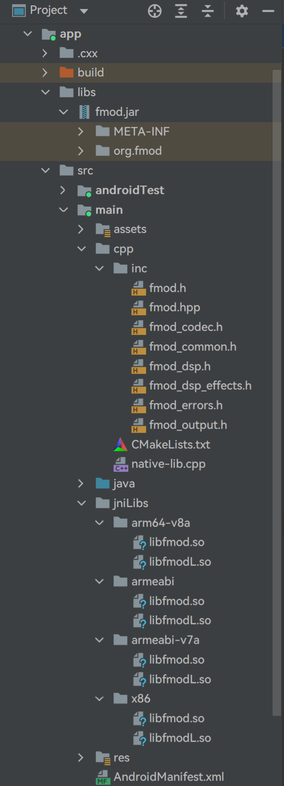
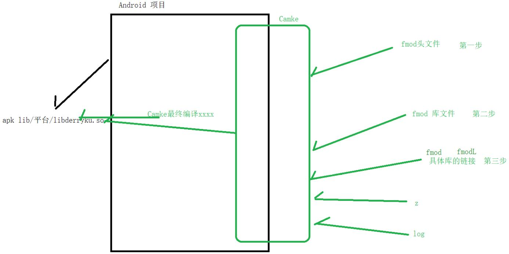

日期： 2022-05-16

标签： #学习笔记 #技术 #Android 

学习资料： 
腾讯课堂 - https://ke.qq.com/webcourse/3060320/105200059#taid=14015358758204000&vid=387702300257115186

百度网盘 - https://pan.baidu.com/s/1zjmJzrU-4kq0TJ7Yxu9tvA#list/path=%2Fsharelink1103492872705-314800681445689%2F%E3%80%9008%E3%80%91NDK%2F2022.5.5-JNI%E6%8A%80%E6%9C%AF%E4%B9%8BFMOD%E5%AE%9E%E7%8E%B0%E5%A3%B0%E9%9F%B3%E7%89%B9%E6%95%88---derry%E8%80%81%E5%B8%88&parentPath=%2Fsharelink1103492872705-314800681445689

---
<br>

### 一、导包、编译





##### 1、CMakeLists.txt 文件
```cmake
cmake_minimum_required(VERSION 3.4.1)  # 最低支持的CMake版本  
 
# <批量导入源文件> step1  
file(GLOB allCPP *.c *.h *.cpp)  
  
  
# TODO【第一步】：导入头文件  
# 相对路径（即CMakeList.txt文件当前所在目录下的inc文件夹。如果是父目录下，则用../inc）  
include_directories("inc") 
  
add_library(  
        native-lib  # 库的名字，最终文件名头部会自动拼接lib，即libnative-lib.so  
        SHARED      # 动态库，生成.so文件  
        native-lib.cpp  # 导入源文件  
  
        # <批量导入源文件> step2  
        ${allCPP}  
)  
  
  
# TODO【第二步】：设置CMAKE_CXX_FLAGS环境变量(即源文件、库文件的路径)  
  
# ${CMAKE_CXX_FLAGS}：本台设备C++的环境变量(例如%JAVA_HOME%;%ANDROID_HOME%;%C++HOME%;)、${CMAKE_C_FLAGS}：本台设备C语言的环境变量  
# ${CMAKE_SOURCE_DIR}：CMakeList.txt文件当前所在目录地址，例如本项目就是 xxx\xxx\src\main\cpp\# ${CMAKE_SOURCE_DIR}/../jniLibs：等价于CMakeList.txt文件当前所在目录的父目录地址  
# ${CMAKE_ANDROID_ARCH_ABI}：自动获取CPU abi架构  
set(CMAKE_CXX_FLAGS "${CMAKE_CXX_FLAGS} -L${CMAKE_SOURCE_DIR}/../jniLibs/${CMAKE_ANDROID_ARCH_ABI}")  
  
  
# TODO【第三步】：链接具体的库到 libnative-lib.so 里面去  
target_link_libraries(  
        native-lib  
        log   # 把 Android的log库 链接到 native-lib 里面去。如果没有链接，那么运行时c层调用log相关函数会崩溃：提示找不到 liblog.so 库  
        fmod  # 把 fmod库 链接到 native-lib 里面去，工具会自动拼接并最终得到libfmod.so文件名  
        fmodL # 把 fmodL库 链接到 native-lib 里面去，工具会自动拼接并最终得到libfmodL.so文件名  
)
```

##### 2、build.gradle 文件
```groovy
plugins {  
    id 'com.android.application'  
    id 'kotlin-android'  
}  
  
android {  
    compileSdkVersion 30  
    buildToolsVersion "30.0.3"  
  
    defaultConfig {  
        applicationId "com.derry.as_jni_projectkt"  
        minSdkVersion 16  
        targetSdkVersion 30  
        versionCode 1  
        versionName "1.0"  
  
        testInstrumentationRunner "androidx.test.runner.AndroidJUnitRunner"  
  
        // TODO【第四步】：指定CPU架构 Cmake中的本地库，例如：libnative-lib.so libderryku.so  
        externalNativeBuild {  
            cmake {  
                // cppFlags "" // 这样写，默认是四大CPU架构都支持  
  
                // 指定CPU架构是armeabi-v7a  
                // 【注意】：这里指定本地库到armeabi-v7a，仅影响CMakeLists.txt文件中的${CMAKE_ANDROID_ARCH_ABI}变量值（详情看【第二步】）  
                abiFilters "armeabi-v7a"  
            }  
        }  


        // TODO【第五步】：指定CPU的架构  apk/lib/平台  
        // 下面代码不写，默认是四大CPU架构平台  
        ndk {  
            // 指定CPU架构是armeabi-v7a  
            // 【注意】：这里指定所有库"编译打包"到armeabi-v7a进apk，即apk里只有armeabi-v7a文件夹  
            abiFilters("armeabi-v7a")  
        }  
    }  
    
    buildTypes {  
        release {  
            minifyEnabled false  
            proguardFiles getDefaultProguardFile('proguard-android-optimize.txt'), 'proguard-rules.pro'  
        }  
    }
	
	externalNativeBuild {  
        cmake {  
            path "src/main/cpp/CMakeLists.txt"  
            version "3.10.2"  
        }  
    }
	
	compileOptions {  
        sourceCompatibility JavaVersion.VERSION_1_8  
        targetCompatibility JavaVersion.VERSION_1_8  
    }  
    
    kotlinOptions {  
        jvmTarget = '1.8'  
    }  
}  
  
dependencies {  
    // TODO【第六步】：主要是 有没有提供 java的 jar包  
    implementation files("libs\\fmod.jar")  
}
```
