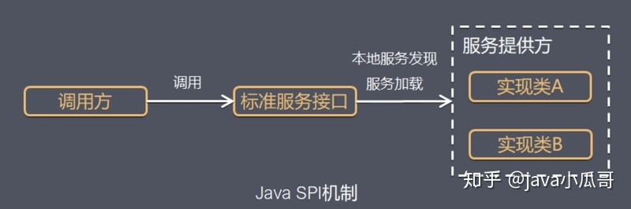

日期： 2022-10-23

标签： #学习笔记 #技术

学习资料： https://iww0abxi5u.feishu.cn/minutes/obcn6ex78wylm54xa39pr6wx


---
<br>

## 一、组件化
### 1、注解
1. `@Retention`
	- `RetentionPolicy.SOURCE`
	- `RetentionPolicy.CLASS // 编译期注解`
	- `RetentionPolicy.RUNTIME // 运行期注解，需要反射技术，耗损性能
		- `Class cls = Class.forName("com.demo.AnnotationDemo"); cls.getAnnotations(); cls.getAnnotation(MyAnnotation.class);`
2. `@Target、ElementType`
3. 自定义注解实现 value(); 方法时，类似于构造函数

5. 获取注解 --> 获取注解对应的元素数据 --> 处理元素数据
	- Processor
	- AbstraceProcessor
	- ProcessingEnvironment
	- RoundEnvironment
	- Filer
6. 在.gradle文件中，在dependencies下配置  `annotationProcessor project(":xxx-module")`
<br>


### 2、SPI
[知乎: 深入理解 Java 中 SPI 机制](https://zhuanlan.zhihu.com/p/84337883)


#### 实践示例：
**1. 定义一个接口HelloSPI。**
```java
package com.vivo.study.spidemo.spi;
public interface HelloSPI {
    void sayHello();
}
```

**2. 完成接口的多个实现。**
```java
package com.vivo.study.spidemo.spi.impl;
import com.vivo.study.spidemo.spi.HelloSPI;
public class ImageHello implements HelloSPI {
    public void sayHello() {
        System.out.println("Image Hello");
    }
}
package com.vivo.study.spidemo.spi.impl;
import com.vivo.study.spidemo.spi.HelloSPI;
public class TextHello implements HelloSPI {
    public void sayHello() {
        System.out.println("Text Hello");
    }
}
```

在META-INF/services/目录里创建一个以com.vivo.study.spidemo.spi.HelloSPI的文件，这个文件里的内容就是这个接口的具体的实现类。


具体内容如下：
```text
com.vivo.study.spidemo.spi.impl.ImageHello
com.vivo.study.spidemo.spi.impl.TextHello
```

**3. 使用 ServiceLoader 来加载配置文件中指定的实现**
```java
package com.vivo.study.spidemo.test
import java.util.ServiceLoader;
import com.vivo.study.spidemo.spi.HelloSPI;
public class SPIDemo {
    public static void main(String[] args) {
        ServiceLoader<HelloSPI> serviceLoader = ServiceLoader.load(HelloSPI.class);
        // 执行不同厂商的业务实现，具体根据业务需求配置
        for (HelloSPI helloSPI : serviceLoader) {
            helloSPI.sayHello();
        }
    }
}
```

输出结果如下：
```java
Image Hello
Text Hello
```

<br>


### 3、AutoService
[腾讯云: 使用Google开源库AutoService进行组件化开发](https://cloud.tencent.com/developer/article/1415083)

- 本质上，是对原生的Processor一个封装，自动生成 META-INF/services/ 下的文件
- [AutoServiceProcessor](https://github.com/google/auto/blob/master/service/processor/src/main/java/com/google/auto/service/processor/AutoServiceProcessor.java)源码片段：
```java
public class AutoServiceProcessor extends AbstractProcessor { 
	// 指定支持的java版本，一般来说我们都是支持到最新版本
	@Override 
	public SourceVersion getSupportedSourceVersion() { 
		return SourceVersion.latestSupported(); 
	} 
	
	// 返回了支持（或者说期望处理）的注解类型集合
	@Override 
	public Set<String> getSupportedAnnotationTypes() { 
		return ImmutableSet.of(AutoService.class.getName()); 
	} 
	
	@Override 
	public boolean process(Set<? extends TypeElement> set, RoundEnvironment roundEnvironment) { 
		try { 
			return processImpl(annotations, roundEnv); 
		} catch (Exception e) { 
			// We don't allow exceptions of any kind to propagate to the compiler 
			StringWriter writer = new StringWriter(); 
			e.printStackTrace(new PrintWriter(writer)); 
			fatalError(writer.toString()); 
			
			return true; 
		} 
	}

	private boolean processImpl(Set<? extends TypeElement> annotations, RoundEnvironment roundEnv) { 
		if (roundEnv.processingOver()) { 
			generateConfigFiles(); 
		} else { 
			processAnnotations(annotations, roundEnv); 
		} 
		
		return true; 
	}

	private void processAnnotations(Set<? extends TypeElement> annotations,  RoundEnvironment roundEnv) {  
  
	  Set<? extends Element> elements = roundEnv.getElementsAnnotatedWith(AutoService.class);  
  
	  log(annotations.toString());  
	  log(elements.toString());  
	  
	  for (Element e : elements) {  
	    // TODO(gak): check for error trees?  
	    TypeElement providerImplementer = (TypeElement) e;  
	    AnnotationMirror annotationMirror = getAnnotationMirror(e, AutoService.class).get();  
	    Set<DeclaredType> providerInterfaces = getValueFieldOfClasses(annotationMirror); 
	    
	    if (providerInterfaces.isEmpty()) {  
	      error(MISSING_SERVICES_ERROR, e, annotationMirror);  
	      continue;    
	    }
	    
	    for (DeclaredType providerInterface : providerInterfaces) {  
	      TypeElement providerType = MoreTypes.asTypeElement(providerInterface);  
	  
	      log("provider interface: " + providerType.getQualifiedName());  
	      log("provider implementer: " + providerImplementer.getQualifiedName());  
	  
	      if (checkImplementer(providerImplementer, providerType)) {  
	        providers.put(getBinaryName(providerType), getBinaryName(providerImplementer));  
	      } else {  
	        String message = "ServiceProviders must implement their service provider interface. "  
	            + providerImplementer.getQualifiedName() + " does not implement "  
	            + providerType.getQualifiedName();  
	            + 
	        error(message, e, annotationMirror);  
	      }  
	    }  
	  }  
	}  
  
	private void generateConfigFiles() {  
	  Filer filer = processingEnv.getFiler();  
	  
	  for (String providerInterface : providers.keySet()) {  
	    String resourceFile = "META-INF/services/" + providerInterface;  
	    log("Working on resource file: " + resourceFile);  
	    
	    try {  
	      SortedSet<String> allServices = Sets.newTreeSet();  
	      try {  
	        // would like to be able to print the full path  
	        // before we attempt to get the resource in case the behavior        
	        // of filer.getResource does change to match the spec, but there's        
	        // no good way to resolve CLASS_OUTPUT without first getting a resource.        
	        FileObject existingFile = filer.getResource(StandardLocation.CLASS_OUTPUT, "",  resourceFile);  
	        log("Looking for existing resource file at " + existingFile.toUri());  
	        
	        Set<String> oldServices = ServicesFiles.readServiceFile(existingFile.openInputStream());  
	        log("Existing service entries: " + oldServices);  
	        
	        allServices.addAll(oldServices);  
	      } catch (IOException e) {  
	        // According to the javadoc, Filer.getResource throws an exception  
	        // if the file doesn't already exist.  In practice this doesn't        
	        // appear to be the case.  Filer.getResource will happily return a        
	        // FileObject that refers to a non-existent file but will throw        
	        // IOException if you try to open an input stream for it.        
	        log("Resource file did not already exist.");  
	      }  
	  
	      Set<String> newServices = new HashSet<String>(providers.get(providerInterface));  
	      if (allServices.containsAll(newServices)) {  
	        log("No new service entries being added.");  
	        return;      
		  }  
	  
	      allServices.addAll(newServices);  
	      log("New service file contents: " + allServices);  
	      
	      FileObject fileObject = filer.createResource(StandardLocation.CLASS_OUTPUT, "",  resourceFile);  
	      OutputStream out = fileObject.openOutputStream();  
	      ServicesFiles.writeServiceFile(allServices, out);  
	      out.close();  
	      log("Wrote to: " + fileObject.toUri());  
	    } catch (IOException e) {  
	      fatalError("Unable to create " + resourceFile + ", " + e);  
	      return;    
	    }  
	  }  
	}
}

```

#### 实践示例：
- 引入
```groovy
compile 'com.google.auto.service:auto-service:1.0-rc4'
```

- 官方示例说明
```java
package foo.bar;

import javax.annotation.processing.Processor;

@AutoService(Processor.class)
final class MyProcessor implements Processor {
  // …
}
```

- AutoService会自动在build/classes输入目录下生成文件 META-INF/services/javax.annotation.processing.Processor，文件的内容如下
```text
foo.bar.MyProcessor
```

- 在 javax.annotation.processing.Processor 的情况下，如果一个jar中包含metadata文件，并且在javac的classpath下，javac会自动加载这个jar，同时包含它的普通注解编译环境。