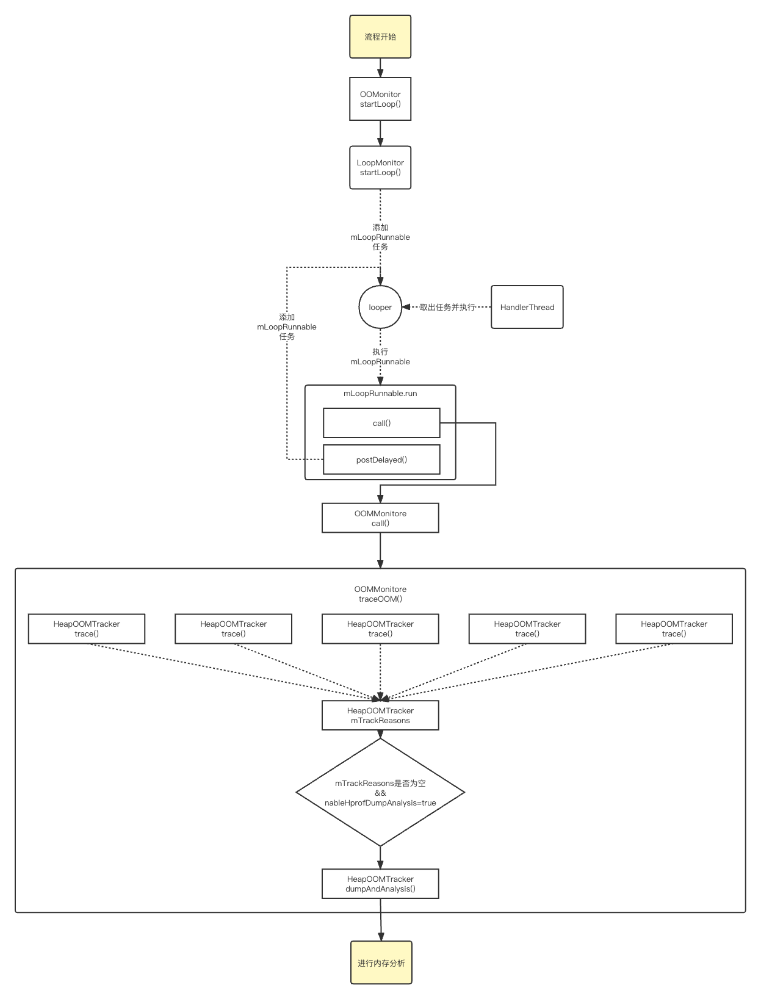

日期： 2023-01-05

标签： #学习笔记 #技术

学习资料： 

---
 

2月7日
leakcanary
ActivityManager.MemoryInfo()
Runtime.getRuntime() //java内存
Debug.MemoryInfo()、AppMemory() //native内存
Runtime.gc()、System.runFinalization() //双重gc，保证执行成功率
Malloc Debug
mm_struct 整个地址空间、vm_area_struct 虚拟地址空间
[android_os_Debug.cpp](http://aospxref.com/android-10.0.0_r47/xref/frameworks/base/core/jni/android_os_Debug.cpp)
PSS：实际使用的物理内存
RSS：，不准、偏高，Android.LowMemoryKiller根据RSS来计算
虚拟内存映射、mmap

2月13日
Koom
- unwind模块，栈回溯
- 利用Linux COW fork子进程，dump出内存镜像，fork后->parent process 恢复虚拟机运行

泄漏：
- C++(4个函数)Xhook
- Java的4大引用：执行GCRoot->通过SofrtRef、WeakRef->判断对象是否回收

1. 指标（采集瞬时的内存暴增、TotalMem的80%）
2. 监控方案
	 - 最大内存：javaHeap.max = Runtime.getRuntime().maxMemory()
	 - 总内存：javaHeap.total = Runtime.getRuntime().totalMemory()
	 - 空闲内存：javaHeap.free = Runtime.getRuntime().freeMemory()
	 - 使用内存 = 最大内存-空闲内存：javaHeap.used = javaHeap.total - javaHeap.free
	 - 使用占比=使用内存/最大内存：javaHeap.rate = 1.0f * javaHeap.used / javaHeap.max
	 - 线程数：/proc/self/status 
	 - fd：/proc/self/fd、连续3次检测，如果>1000 -> 有问题
	 - physicalMemory：/proc/meminfo、MemTotal、MemFree、MemAvailable、CmaTotal、ION_heap
3. Dump内存
	- Linux COW(写时复制，copy on write) fork子进程，使其与父进程共享了进程的内存空间
	- 需要做suspend vm（虚拟机终止操作）-> so库 -> 7.0

内存的监测策略：子进程内存的Dump（不阻塞主进程）->shark库->json

Linux内核——CMA 的理论

