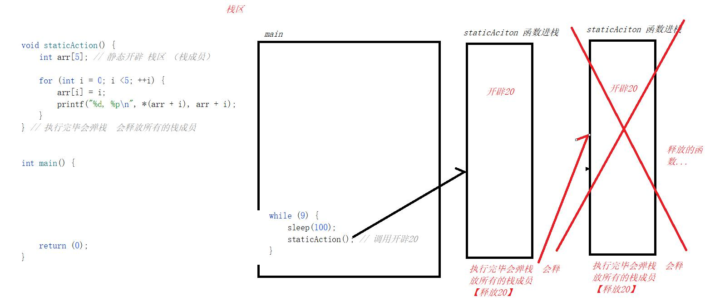
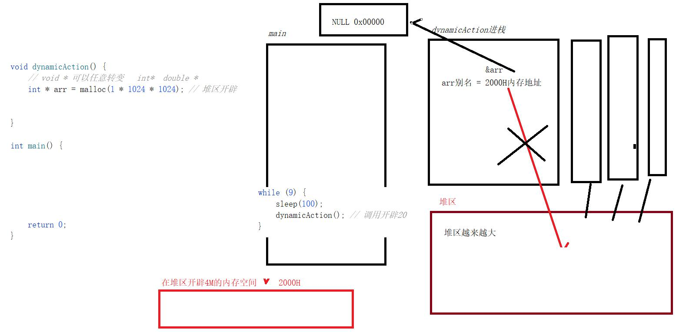
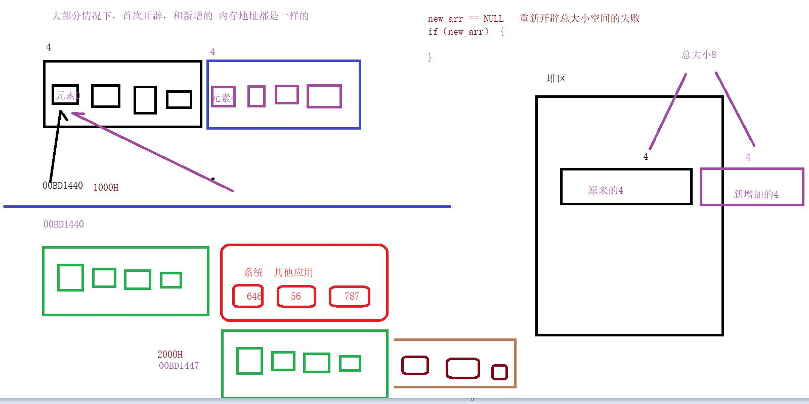
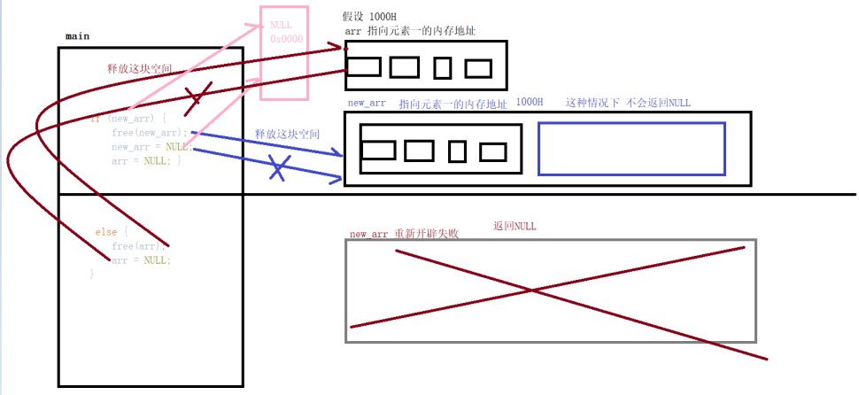

日期： 2022-04-16

标签： #学习笔记 #技术 #Android 

学习资料： 
腾讯课堂 - https://ke.qq.com/webcourse/3060320/105200059#taid=13820947063550560&vid=387702298740005737

百度网盘 - https://pan.baidu.com/disk/main?from=homeFlow#/index?category=all&path=%2F%E5%AD%A6%E4%B9%A0%2F%E4%BA%AB%E5%AD%A6VIP%E8%AF%BE%E7%A8%8B%2F2%E6%9C%9F%2F%E3%80%9007%E3%80%91NDK%2F%EF%BC%8803%EF%BC%892021.2.28%20%E9%9D%99%E6%80%81%E5%BC%80%E8%BE%9F%E5%86%85%E5%AD%98%E4%B8%8E%E5%8A%A8%E6%80%81%E5%BC%80%E8%BE%9F%E5%86%85%E5%AD%98%EF%BC%88NDK%E7%AC%AC%E4%B8%89%E8%8A%82%E8%AF%BE%EF%BC%89%20---derry%E8%80%81%E5%B8%88

---
<br>

> **C的开发中不允许出现，野指针、悬空指针：**
> **1. 野指针**：`int* p;` 这种声明后，还没有赋值的指针。
> **2. 悬空指针**：内存被执行 `free()` 释放之后，没有被复制给 `NULL` 的指针。

<br>


### 一、静态开辟
- 函数开始执行时，则该函数 **压入** 栈内存，函数执行结束时，则该函数 **弹出** 栈内存
- 每个函数 **压入** 栈内存后，都会被分配一个临时的栈空间，大小约 2M 左右（具体值与平台有关）
- 函数 **弹出** 栈内存后，系统会 **自动清空** 回收它的栈空间（栈成员占用的总大小）
- 在函数里声明局部变量的操作，属于 **静态开辟** 内存空间的行为，会占用所分配的临时栈空间大小。如果声明的局部变量总大小占用的内存空间超出了系统分配的2M，就会抛 **栈溢出** 错误

```C
#include <stdio.h>
#include <unistd.h> // 小写的sleep，大写的Sleep用<windows.h>

// 静态开辟的范畴：函数进栈后，在函数中声明定义一个局部变量，例如 int arr[5];、int i;

// staticAction()函数压栈
void staticAction() {
	int arr[5]; // 静态开辟 栈区（栈成员）

	for (int i = 0; i < 5; ++i) {
		arr[i] = i;
		printf("%d, %p\n", *(arr + i), arr + i);
	}
}
// staticAction()函数弹栈（隐式），并释放所有的栈成员

// 2.静态开辟。
int mainT3() {
	// int arr[10 * 1024 * 1024]; // 10M * 4 = 40M  会抛 栈溢出 错误
	int arr[(int)(1 * 1 * 1024)]; //  不会栈溢出

	// 栈区：占用内存大小 最大值： 大概 2M  大于2M会栈溢出  平台有关系的
	// 堆区：占用内存大小 最大值： 大概80%  40M没有任何问题，基本上不用担心 堆区很大的
							   // 大概80%： Windows系统 给我们的编译器给予的空间  的 百分之百八十

	while (9) {
		Sleep(100);
		staticAction(); // staticAction()每次调用会开辟20个字节栈内存
	}

	return (0);
}
```



<br>

### 二、动态开辟
##### 1、动态开辟之一：malloc
- `malloc()` 能够在**堆**区开辟一个连续的内存空间，并且返回空间的首地址。
- 使用完毕之后，必须调用 `free()` 进行内存空间释放，并把指针指向 `NULL` ，避免悬空指针。
- `malloc()` 返回值是 `void*`，而 `void*` 可以强转成任意指针类型，例如 `int*`、`double*` 。

```C
#include <stdio.h>
#include <stdlib.h>

// 动态开辟的范畴之一：malloc，在堆区开辟一个连续的内存空间

void dynamicAction() {

	// malloc()返回值是void*，而void*可以强转成任意指针类型，例如int*、double*
	int* arr = malloc(1 * 1024 * 1024); // 堆区开辟 4M

	printf("dynamicAction函数，arr自己的内存地址:%p，堆区开辟的内存地址（即arr指向的地址）:%p\n", &arr, arr);

	// 【C程序素养】: 堆区开辟的空间，必须释放
	free(arr);
	arr = NULL; // 重新指向一块内存地址00000，避免悬空指针


	/*
	 * 正确的释放内存
	 */
	 
	// 假设这里已经执行过释放 aar
	free(arr);
	arr = NULL;

	// 。。。
	// 假设中间隔了N行代码
	// 。。。

	// 1.[错误的写法]这样会导致重复释放(free)，VS中会崩溃，CLion会优化(不崩溃)   
	// free(new_arr);
	// new_arr = NULL;

	// 2.[正确的写法]先判断是否为NULL，再释放
	if (arr) {
		free(arr); // 释放指针指向地址的内存空间
		arr = NULL; // 将指针重新赋值并指向内存地址00000，避免悬空指针
	}
}

int mainT4() {

	while (9) {
		dynamicAction();
	}

	return 0;
}
```



<br>


##### 2、动态开辟之二：realloc
- 作用是修改扩容已经在堆上 **动态开辟** 的内存空间
- 入参：原内存空间的指针 + 最终扩容大小
- 正常情况下，是保持原内存地址不变，并在其基础上作扩容操作；但也可能会存在重新开辟一个全新的内存地址（大小是最终扩容大小）的情况，此时会将原内存区里所有的值copy过去，最后再 `free()` 原内存区
	- **注** ：目前经过实践，发现vs运行的结果是原内存不会被 `free()` 释放
- 执行扩容失败时，返回 `NULL` ，所以这个函数的返回值需要进行 `if` 容错判断

```C
#include <stdio.h>
#include <stdlib.h>

// 动态开辟之二：realloc
int mainT6() {

	// =================================【1】通过malloc()在堆区开辟分配一块新的内存空间
	int num;
	printf("请输入开辟内存空间的个数: ");
	// 获取用户输入的值
	scanf("%d", &num);

	int* arr = (int*)malloc(sizeof(int) * num);
	for (int i = 0; i < num; ++i) {
		arr[i] = (i + 10001); // arr[i] 的内部隐式转成 *(arr + i)
	}
	printf("\n原 开辟的内存指针: %p\n", arr);

	// 打印 原 内容
	for (int i = 0; i < num; ++i) {
		printf("原 元素的值:%d, 元素的地址:%p\n",
			*(arr + i)
			,
			(arr + i)
		);
	}


	// =================================【2】通过realloc()在堆区开辟新的空间，扩容原内存空间大小
	// C工程师的面试题：realloc 为什么一定要传入 arr指针，为什么要传总大小？

	int new_num;// 扩容增加的值
	printf("\n请输入扩容增加的内存空间个数: ");
	scanf("%d", &new_num);

	// 总大小 = 原来内存的大小 + 扩容的大小
	// void* realloc (void* 原数组的指针, size_t总大小);
	int* new_arr = (int*)realloc(arr, sizeof(int) * (num + new_num));
	arr = NULL;

	if (new_arr) { // 兼容判断：当 new_arr != NULL时，即扩容成功了，才会进if分支【非0即true】
		int j = num; // 轮询从原始内存的大小开始
		for (; j < (num + new_num); j++) { // 在原内存基础上继续扩容塞值
			new_arr[j] = (j + 10001);
		}

		printf("\n新 开辟的内存指针: %p\n", new_arr);

		// 打印 新 内容
		for (int i = 0; i < (num + new_num); ++i) {

			printf("新 元素的值:%d, 元素的地址:%p\n",
				*(new_arr + i),
				(new_arr + i)
			);
		}
	}

	// [正确的写法]先判断是否为NULL，再释放
	if (new_arr) {
		free(new_arr);
		new_arr = NULL;
		arr = NULL;
	}
	else if (arr) {
		free(arr);
		arr = NULL;
	}

	return 0;
}
```




