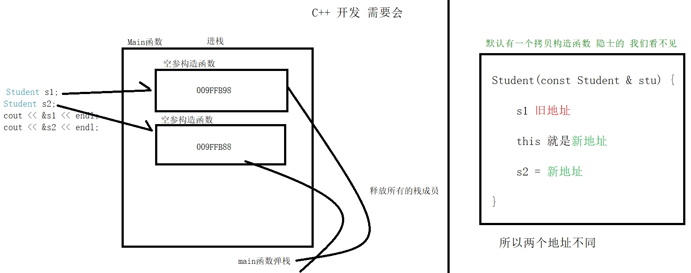

日期： 2022-04-30

标签： #学习笔记 #技术 #Android 

学习资料： 
腾讯课堂 - https://ke.qq.com/webcourse/3060320/105200059#taid=13821093092438624&vid=387702298740987865

百度网盘 - https://pan.baidu.com/disk/main?from=homeFlow#/index?category=all&path=%2F%E5%AD%A6%E4%B9%A0%2F%E4%BA%AB%E5%AD%A6VIP%E8%AF%BE%E7%A8%8B%2F2%E6%9C%9F%2F%E3%80%9007%E3%80%91NDK%2F%EF%BC%8808%EF%BC%892021.3.11%20C%2B%2B%E8%AF%AD%E8%A8%80%E7%B1%BB%E4%B8%AD%E5%90%84%E4%B8%AA%E9%87%8D%E8%A6%81%E5%87%BD%E6%95%B0%E5%8E%9F%E7%90%86%EF%BC%88NDK%E7%AC%AC%E5%85%AB%E8%8A%82%E8%AF%BE%EF%BC%89--derry%E8%80%81%E5%B8%88

---
<br>

### 一、构造函数、析构函数
- `new` 、`delete` 是一套，会分别调用C++对象的 **构造函数** 与 **析构函数**【C++标准规范】
- `malloc`、`free` 是一套，**不**会调用C++对象的 **构造函数** 与 **析构函数**【C的范畴，虽然不推荐，但也是可以运行的】
- **构造函数：**
	- 无参构造函数的触发调用场景
		1. `Student stu;` 
		2. `Student stu = new Student();`
	- 有参构造函数的触发调用场景
		1. `Student stu("雄霸");`
		2. `Student stu = new Student("雄霸");`
	- 构造函数嵌套调用，实例 `Student::Student(char* pName) :Student(pName, 87){ ... }`
	- 构造函数在函数签名上，直接编写给成员赋值的逻辑，示例 `Student::Student(int pAge) :age(pAge){ ... }`
- **析构函数：**
	- 析构函数在对象被回收时，执行内存释放工作。对象有两种情况会被回收：
		1. **栈**空间申请的对象，在函数弹栈时
		2. **堆**空间申请的对象，被调用 `delete` 释放时
	- 析构函数的声明，**不允许**有入参、返回值
	- 调用 `free()` 不会执行析构函数，所以不可用它来释放C++对象

##### 1、头文件
```cpp
#pragma once
#include <iostream>
#include <string.h>
using namespace std;

class Student {


	// 私有属性
private:
	char* name;
	int age;


	/*
	 * 【一、构造函数】
	 */
public:

	 // 1. 空参构造函数
	Student();

	// 2. 有参构造函数
	Student(char* name, int age);

	// 3. 构造函数嵌套调用
	// :Student(name, 87)的写法，等价于：1.先调用两个参数的构造函数 2.再调用当前函数
	Student(char* name);

	// 4. 构造函数签名处直接给成员变量赋值
	// :age(age) 等价于：this->age = age;
	Student(int age);


	/*
	 * 【二、析构函数】
	 */
	~Student();


	/*
	 * 【三、set\get 函数】
	 */
public:
	int getAge();

	char* getName();

	void setAge(int age);

	void setName(char* name);
};
```

##### 2、实现文件
```cpp
#include "Student.h"

/*
 * 【一、构造函数】
 */
 // 1. 空参构造函数
Student::Student() {
	cout << "空参数构造函数" << endl;
}

// 2. 有参构造函数
Student::Student(char* name, int age) {
	// this->name = name;

	// 堆区
	this->name = (char*)(malloc(sizeof(char*) * 10));
	strcpy(this->name, name);

	this->age = age;
	cout << "两个参数的构造函数" << endl;
}

// 3. 构造函数嵌套调用
// :Student(pName, 87)的写法，等价于：1.先调用两个参数的构造函数 2.再调用当前函数
Student::Student(char* pName) :Student(pName, 87) {
	cout << "一个参数的构造函数" << endl;
	this->name = pName;
}

// 4. 构造函数签名处直接给成员变量赋值
// :age(pAge) 等价于：this->age = pAge;
Student::Student(int pAge) :age(pAge) {
	cout << "一个参数的构造函数" << endl;
}


/*
 * 【二、析构函数】
 */
Student::~Student() {
	cout << this->name << "析构函数" << endl;

	// 必须释放堆区开辟的成员
	if (this->name) {
		free(this->name); // 释放内存
		this->name = NULL; // 执行NULL的地址，避免出现悬空指针
	}
}


/*
 * 【三、公开的 set\get 函数】
 */
int Student::getAge() {
	return this->age;
}

char* Student::getName() {
	return this->name;
}

void Student::setAge(int age) {
	this->age = age;
}

void Student::setName(char* name) {
	this->name = name;
}
```

##### 3、调用示例
```cpp
#include <stdio.h>
#include "Student.h"

int main2() {
	//【1. 栈空间开辟】

	 // 1.1 调用空参构造函数
	Student stu1;
	
	stu1.setAge(34);
	stu1.setName("李元霸");
	cout << "name:" << stu1.getName() << ", age:" << stu1.getAge() << endl << endl;

	// 1.2 调用有参构造函数
	Student stu2("雄霸", 30);
	
	cout << "name:" << stu2.getName() << ", age:" << stu2.getAge() << endl << endl;


	// 【2. 堆空间开辟】

	// 使用new声明
	Student* stu3 = new Student("杜子腾");
	cout << "name:" << stu3->getName() << ", age:" << stu3->getAge() << endl << endl;

	// 使用delete释放
	delete stu3; // delete与new成对出现，释放对象空间
	// free(stu3); // 【！！！错误写法】这样调用不会执行析构函数


	// 【3. ！！！错误写法：malloc开辟】
	// malloc不会调用执行构造函数，即不会执行对象初始化
	Student* stu4 = (Student*)malloc(sizeof(Student));
	free(stu4);

	return 0;
}
```

<br><br>

### 二、拷贝构造函数
##### 1、
- **隐式的调用拷贝构造函数的场景**：
	1. 执行 `Class名 新对象 = 旧对象;` 赋值逻辑时
	2. 调用函数，将对象当作形参传入时
- **拷贝构造函数**是默认就存在的，可以通过 `Student(const Student& student){ ... }` 来覆写它：
	1. 默认逻辑，是先寻址到旧对象成员的值，然后再**浅拷贝**给新对象
	2. 覆写的时候，如果对象的成员中存在**堆成员**（例如对象、字符串），则要避免“**浅拷贝陷阱**”（内存重复释放），把拷贝改成**深拷贝**逻辑

```cpp
#include <iostream>
#include <string.h>

using namespace std;

class Student {

public:
	Student() {
	}

	Student(char* name, int age) : name(name), age(age) {
	}

	~Student() {
	}

	// 覆写拷贝构造函数
	// 自定义成员的赋值逻辑
	Student(const Student& student) { // 常量引用：只读、不可修改
		cout << "执行拷贝构造函数" << endl;

		// this指向的是新对象的地址
		// student是旧对象的地址
		
		// this->name = student.name; // 这是浅拷贝，而字符串属于堆成员，会有内存重复释放的风险
		this->name = (char *)malloc(sizeof(char *)* 10);//深拷贝
		strcpy(this->name, name);
		
		this->age = student.age - 10;

		cout << "自定义拷贝构造函数中 student 的内存地址: " << &student << endl;
	}

private:
	char* name;
	int age;

public:
	int getAge() {
		return this->age;
	}

	char* getName() {
		return this->name;
	}

	void setAge(int age) {
		this->age = age;
	}

	void setName(char* name) {
		this->name = name;
	}
};


/*
 * 【1. 结构体 = 号的底层逻辑：值拷贝（值传递）】
 */
struct Person {
	int age;
	char* name;
};

void structMain() {
	cout << endl << "【1. 结构体 = 号的底层逻辑：值拷贝（值传递）】" << endl << endl;

	Person person1 = { 100, "张三丰" };

	// 这里 = 号底层的逻辑，隐式的执行了 “把p1的各成员值赋值给p2各成员” 的逻辑
	Person person2 = person1;

	cout << "struct person1: " << person1.name << ", " << person1.age << ", " << &person1 << endl;
	cout << "struct person2: " << person2.name << ", " << person2.age << ", " << &person2 << endl;
}


/*
 * 【2. C++对象赋值 = 号的底层逻辑：调用拷贝构造函数】
 */
void objectMain() {
	cout << endl << endl << "【2. C++对象赋值 = 号的底层逻辑：调用拷贝构造函数】" << endl << endl;

	Student stu1("李鬼", 34);

	Student stu2 = stu1;  // 1. 【这样的赋值写法，会隐式的调用“拷贝构造函数”，如果是默认逻辑，则把对象stu1的成员值拷贝给stu2；如果我们覆写过拷贝构造函数，则按照自定义覆写的逻辑进行赋值。二者的地址始终是不一样的】
	cout << "main函数中 student 的内存地址: " << &stu1 << endl; // 打印的stu1地址与自定义拷贝函数中的是一样的

	Student stu3;
	stu3 = stu1; // 2. 【这样的赋值写法“不会”调用自定义拷贝构造函数，仅仅只是执行了成员的值拷贝逻辑】

	cout << "C++对象Student stu1: " << stu1.getName() << ", " << stu1.getAge() << ", " << &stu1 << endl;
	cout << "C++对象Student stu2: " << stu2.getName() << ", " << stu2.getAge() << ", " << &stu2 << endl;
	cout << "C++对象Student stu3: " << stu3.getName() << ", " << stu3.getAge() << ", " << &stu3 << endl;
}


// 【3. 面试题：C++对象指针的 = 号写法，会不会调用拷贝构造函数？】
void pointerMain() {
	cout << endl << endl << "【3. 面试题：C++对象指针的 = 号写法，会不会调用拷贝构造函数？】" << endl << endl;

	Student* student1 = new Student("杜子腾", 39);

	Student* student2 = student1;  // 压根就不会执行拷贝构造函数，这里只是修改指针的指向地址（即student2指向的地址，改为student1指向的地址），与上面的 对象2=对象1 是两回事

	cout << "指针Student* student1: " << student1->getName() << ", " << student1->getAge() << ", " << student1 << endl;
	cout << "指针Student* student2: " << student2->getName() << ", " << student2->getAge() << ", " << student2 << endl;

	student2->setAge(99);

	cout << "通过 student2 修改 student1 ：" << student1->getName() << student1->getAge() << endl;
}


int main() {
	structMain();
	objectMain();
	pointerMain();

	return NULL;
}
```



<br><br>

### 三、几个各函数综合使用讲解
```cpp
#define _CRT_SECURE_NO_WARNINGS // strcpy运行会报错，支持

#include<iostream>
#include<string.h>
using namespace std;

class Student2
{
public:

	int age;
	char* name;

	Student2() { cout << "空参数构造函数" << endl; }

	Student2(char* name) :Student2(name, 99) {
		cout << "一个参数构造函数 this:" << this << endl;
	}

	Student2(char* name, int age) {
		cout << "二个参数构造函数 this:" << this << endl;

		this->name = (char*)malloc(sizeof(char*) * 10);
		strcpy(this->name, name);

		this->age = age;
	}

	~Student2() {
		cout << "析构函数执行 &this->name:" << &this->name << endl;

		free(this->name);
		this->name = NULL;
	}

	// 默认有一个拷贝构造函数 隐士的 我们看不见
	// 一旦复写了拷贝构造函数，默认的还在吗？ Java的构造函数一个思路
	Student2(const Student2& stu) {
		// stu 旧地址

		// this 新地址

		// stu2 = 新地址

		cout << "拷贝构造函数 &stu:" << &stu << " this:" << this << endl;

		// 新地址name = 旧地址 （浅拷贝）
		this->name = stu.name;

	} // 此拷贝构造函数执行完 旧会出现一个 this==新地址  给 main函数的 stu
};

Student2 getStudent(char* name) {
	Student2 stu(name); // 旧地址

	cout << "getStudent函数:" << &stu << endl; // 旧地址

	return stu; // stu 旧地址
} // 弹栈释放栈成员stu

void mainT3() {
	// 这里 =号 会执行拷贝构造函数，在没有执行完毕前，getStudent()不会弹栈
	Student2 stu = getStudent("截拳道");

	cout << "main函数:" << &stu << endl;

	/*
	  【执行流程】：
		1. getStudent()入栈
		2. 两个参数构造函数
		3. 一个参数构造函数
		4. 打印 “getStudent函数 : stu地址1000H地址”
		5. 拷贝构造函数（寻址getStudent()函数中构建的Student对象，将其成员值浅拷贝给main函数中的Student对象）
		6. 析构函数（getStudent()弹栈，析构函数过程中构建的 Student 对象）
		7. 打印 “main函数 : stu地址2000H”
	*/

} // main函数弹栈 stu 新地址 析构函数执行

// 伏笔一： main函数弹栈 stu 新地址 析构函数执行 会造成 重复释放空间的问题   深拷贝
// 伏笔二 xx
```

- 【执行流程】
	1. getStudent()入栈
	2. 两个参数构造函数
	3. 一个参数构造函数
	4. 打印 “getStudent函数 : stu地址1000H地址”
	5. 拷贝构造函数（寻址getStudent()函数中构建的Student对象，将其成员值浅拷贝给main函数中的Student对象）
	6. 析构函数（getStudent()弹栈，析构函数过程中构建的 Student 对象）
	7. 打印 “main函数 : stu地址2000H”

- 【日志记录】


- 【流程图】

