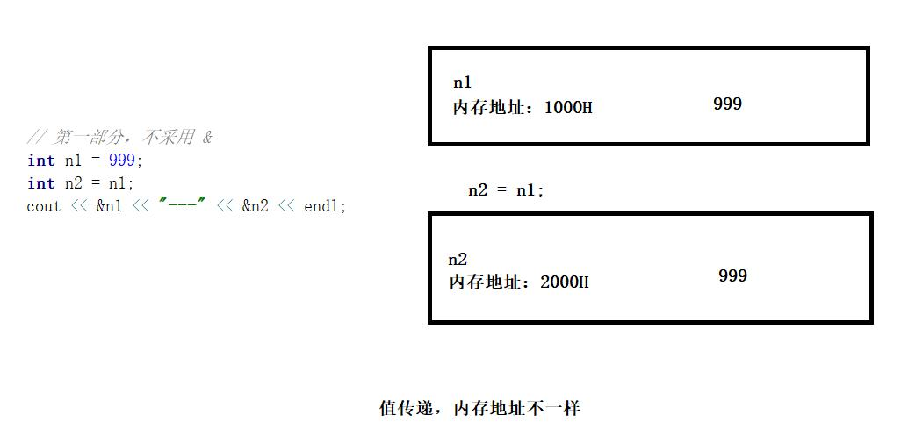
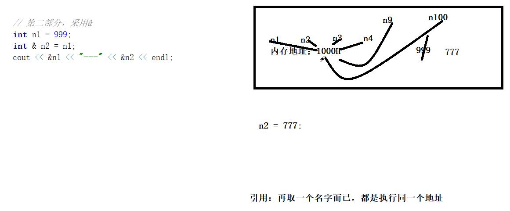

日期： 2022-04-27

标签： #学习笔记 #技术 #C语言 

学习资料： 
腾讯课堂 - https://ke.qq.com/webcourse/3060320/105200059#taid=13821067322634848&vid=387702298740968272

百度网盘 - https://pan.baidu.com/disk/main?from=homeFlow#/index?category=all&path=%2F%E5%AD%A6%E4%B9%A0%2F%E4%BA%AB%E5%AD%A6VIP%E8%AF%BE%E7%A8%8B%2F2%E6%9C%9F%2F%E3%80%9007%E3%80%91NDK%2F%EF%BC%8807%EF%BC%892021.3.9C%2B%2B%E8%AF%AD%E8%A8%80%E5%AD%A6%E4%B9%A0%E4%B9%8B%E9%9D%A2%E5%90%91%E5%AF%B9%E8%B1%A1%EF%BC%88NDK%E7%AC%AC%E4%B8%83%E8%8A%82%E8%AF%BE%EF%BC%89--derry%E8%80%81%E5%B8%88

---
<br>

### 一、C++基础，打印、命名空间
- C++语言面向对象 + 标准特性，导入 `#include <iostream>` C++的支持库
- C语言面向过程，函数 + 结构体
- C++里面可以运行C语言，可以调用C语言；反之则不行，C语言无法运行C++

##### 1、打印Hellow World
- 打印函数： `std::cout << "Hello World" << std::endl;` ，其中 `endl` = `\n` 换行符

```cpp
// #include <stdio.h> // C语言的标准支持

#include <iostream> // C++标准支持  C++的与众不同

using namespace std; // 命名空间 C++ 的特性 （Java语言的内部类）

int main() {

	// C++里面可以运行C语言，可以调用C语言，反之 就不行C语言无法运行C++
	printf("降龙十八掌(C版)\n");

	// std::cout << "C++语言的学习" << std::endl;
	cout << "C++语言的学习" << endl; // 因为你前面引入了命名空间，所以允许省略std::

	// endl == \n  都是换行的含义一样

	// << 不是属性里面的运算，操作符重载，后面会讲
	cout << "擒龙功" << endl;

	cout << "铁头功\n"
		<< "金刚腿\n"
		<< "铁布衫\n";

	return 0;
}
```

<br>

##### 2、命名空间
- 定义命名空间：`namespace abc { ... }` ，可以在命名空间里声明成员变量、函数
- 引入命名空间： `using namespace std;` ，这样允许不用额外写 `std::`
- 局部引入、全局引入
- 多个命名空间重复变量或者函数
- 嵌套命名空间定义和调用

```cpp
#include <iostream>

// 声明std，我们的main函数就可以直接使用里面的成员，不需要使用 std::
using namespace std; // C++自己的命名空间 (C# .net 命名空间)

// 1.1 自定义命名空间1
namespace derry1 {
	int age = 33;
	char* name = "Derry猛男1";

	void show() {
		cout << "name:" << name << ", age:" << age << endl;
	}

	void action() {
		cout << "derry1 action" << endl;
	}
}

// 1.2 自定义命名空间2
namespace derry2 {
	void action() {
		cout << "derry2 action" << endl;
	}
}

// 2. 自定义【嵌套】命名空间
namespace derry3 {
	namespace derry3Inner {
		namespace derry3Inner1 {
			namespace derry3Inner2 {
				namespace derry3Inner3 {
					void out() {
						cout << "爱恨情仇人消瘦，悲欢起落人寂寞" << endl;
					}
				}
			}
		}
	}
}

// 引入命名空间
using namespace derry1; // 【全局引入】

int main1() {
	cout << "命名空间" << endl;

	/*
	 * 一、命名空间引入（全局引用、局部引用）
	 */

	// 【方式1】 通过 :: 引用变量或者函数
	int ageValue = derry1::age;
	derry1::show();

	// 【方式2】 先引入命名空间，再直接引用变量或者函数
	using namespace derry1; // 【局部引用】
	ageValue = age; // 直接引用成员变量
	show(); // 直接引用函数


	/*
	 * 二、多个命名空间里面函数重复名称
	 */

	using namespace derry2;
	// action(); // 编译报错，derry1、derry2都定义了action()函数
	derry1::action(); // 通过 :: 指定调用函数
	derry2::action(); // 通过 :: 指定调用函数


	
	/*
	 * 三、嵌套命名空间
	 */

	// 【方式1】 通过 :: 引用变量或者函数
	derry3::derry3Inner::derry3Inner1::derry3Inner2::derry3Inner3::out();

	// 【方式2】 先引入命名空间，再直接引用变量或者函数
	using namespace derry3::derry3Inner::derry3Inner1::derry3Inner2::derry3Inner3;
	out();

	return 0;
}
```

<br><br>

### 二、C和C++的常量
**常量关键字**： **`const`**
<br>
##### 1、C的常量
- C语言中的常量是个“假”常量，属于伪命题，因为可以通过指针修改。

```C
#include <stdio.h>

int main() {
	const int number = 100;

	// number = 200; // 编译报错，const常量不能直接修改

	int* numP = &number;

	*numP = 10000; // 指针修改常量

	printf("%d\n", number);

	return 0;
}
```

##### 2、C++的常量
###### 基本概念
- C++的常量是真常量，无论直接修改还是指针修改，都不允许。

```cpp
#include <iostream>

int main() {
	const int number = 100;

	/*
		编译不通过，或者运行报错，C++不允许修改常量
	*/
	
	// 1. 直接修改
	// number = 200; 
	
	// 2. 指针修改
	// int * numP = &number;
	// *numP = 10000;

	printf("%d\n", number);

	return 0;
}
```

###### 3、常量指针、指针常量、常量指针常量
- **常量指针**：指向一个常量的指针，`const int* num`
- **指针常量**：一个指针类型的常量，地址对应的值能改，地址不可以修改。示例：`int* const num`
- **常量指针常量**：指向一个常量的指针，且该指针是个常量

```cpp
#include <iostream>
#include <string.h>
#include <string.h>

using namespace std;

int main() {
	// strcpy()系统函数示例：
	// *strcpy (char *__restrict, const char *__restrict);

	int number = 9;
	int number2 = 8;

	// 常量指针，指向一个常量的指针
	const int* numberP1 = &number;
	// *numberP1 = 100; // 报错，不允许去修改【常量指针】指向地址所对应的值，因为这个值是个常量
	numberP1 = &number2; // OK，允许【常量指针】重新指向新的地址

   //  指针常量，一个指针类型的常量
	int* const numberP2 = &number;
	*numberP2 = 100; // OK，允许去修改【指针常量】指向地址所对应的值
	// numberP2 = &number2; // 报错，不允许【指针常量】重新指向新的地址，因为这个指针是常量

	// 常量指针常量，指向一个常量的指针，且该指针是个常量
	const int* const numberP3 = &number;
	// *numberP3 = 100; // 报错，不允许去修改【常量指针】指向地址所对应的值，因为这个值是个常量
	// numberP3 = &number2; // 报错，不允许【指针常量】重新指向新的地址，因为这个指针是常量

	return 0;
}
```

<br><br>

### 三、引用的原理 与 常量引用
##### 1、例子：两数互换
- C语言方案：通过指针取地址互换
- C++方案：通过引用对象互换

```cpp
#include <iostream>

using namespace std;

// 【1.C语言方案：通过指针取地址互换】
// 接收number1、number2的地址，取该地址上的值，来完成的互换
void numberChange(int* number1, int* number2) {
	int temp = 0;
	temp = *number1;
	*number1 = *number2;
	*number2 = temp;
}

// 【2.C++方案：通过引用对象互换】
// &符是C++的引用语法
void numberChange2(int& number1, int& number2) {

	// 如果"不"采用引用语法，则 main() 与 numberChange2() 中，入参与形参的内存地址"不"一样
	// 如果采用引用语法，则 main() 与 numberChange2() 中，入参与形参的内存地址一样
	cout << "numberChange2()中：" << "number1地址：" << &number1 << " , number2地址：" << &number2 << endl;

	int temp = 0;
	temp = number1;
	number1 = number2;
	number2 = temp;
}

int main() {

	int number1 = 10;
	int number2 = 20;

	cout << "main()中：" << "number1地址：" << &number1 << " , number2地址：" << &number2 << endl;

	// numberChange(&number1, &number2);
	numberChange2(number1, number2);

	cout << "n1:" << number1 << " , n2:" << number2 << endl; // 两数互换成功

	return 0;
}
```

<br>

##### 2、C++引用语法的原理
- 引用语法符：`&`  ，示例：`int n1 = 999;  int& n2 = n1;`
- 当使用**引用传递**时，**原始变量** 与 **引用变量** 都指向同一个内存地址，所以二者的值是一样的，而且能够相互修改值
- 当不采用引用传递，变量之间赋值仅限于 **“值传递”** ，各自的地址仍然不 同，互相无法修改值

```cpp
int main() {

	// 1. 不采用 &，仅限于值传递
	int nn1 = 999;
	int nn2 = nn1;
	nn2 = 1000;
	cout << &nn1 << "---" << &nn2 << endl; // 0xffffcbb4、0xffffcbb0
	cout << nn1 << "---" << nn2 << endl; // nn1 = 999、nn2 = 1000

	// 2. 采用 &，地址相同
	int n1 = 999;
	int& n2 = n1;
	int& n9 = n1;
	n2 = 777;
	n9 = 9527;
	cout << "地址：" << &n1 << "---" << &n2 << endl; // 都是0xffffcbb4
	cout << "值：" << n1 << "---" << n2 << endl; // 都是9527

	return 0;
}

```

1. **值传递：**


2. **引用传递：**


<br>

##### 3、常量引用
- 借助于C++的 **“真”** 常量特性，实现引用对象不可被修改
- 常量引用不可被修改，包括：
	1. 不可修改引用变量的成员变量
	2. 不可直接修改引用变量指向的值

```cpp
#include <iostream>
#include <string.h>

using namespace std;

typedef struct {
	char name[20];
	int age;
}Student;

void insertStudent(const Student& student) {
	// strcpy(student.name, "李元霸"); // error，不可修改引用变量的成员变量

	Student student2 = { "刘奋", 43 };
	// student = student2; // error，不可直接修改引用变量指向的值

	cout << student.name << "," << student.age << endl;
}

int main() {

	Student student = { "张无忌", 30 };
	insertStudent(student);

	return 0;
}
```

<br><br>

### 四、函数重载、默认形参、无名形参
- **函数重载**：C++与Java一样，支持函数重载，即方法名相同，但方法签名不一样。
- **默认形参**：可以让在函数在声明形参时，赋予默认值，当调用层不传入参数时，保证该形参的值仍然可读取，类似Java中的 "构造者模式"。例如： `int add(double n1 = 100, int n2 = 200){ ... } ` 
- **无名形参**：参数没有名称，只是起到一个预留占位的作用，等到后续版本迭代再扩展实现。例如 `void method(double, int, int){ ... }`

```cpp
#include <iostream>

using namespace std;

/*
  1. 函数重载
*/
int add(int number1) {
	return number1;
}

int add(int number1, int number2) {
	return number1 + number2;
}

int add(int number1, int number2, int number3) {
	return number1 + number2 + number3;
}


/*
  2. 默认形参
*/
int add(long n1 = 100, int n2 = 200, int n3 = 300, int n4 = 400, bool isOK = 0) {
	return n1 + n2 + n3;
}


/*
  3. 无名形参
*/
void JNIMethod(double, int, int) {

}


int main() {
	add(999);

	add(999, 777);

	add(100, 200, 888);

	return 0;
}
```

<br><br>

### 五、C++对象
> 1. C++中的对象，规范的定义是包含 **头文件、实现文件** 两个部分
> 2. 正规的流程：将xxx.so（`.c`、`.cpp`的实现代码） 提供给用户，再把头文件给用户引入。so文件时加密过的，用户看不到实现细节

<br>


##### 1、头文件
- **`.h`** 、**`.hpp`** 的文件叫做**头文件**
- 头文件中只写声明，不写实现
- 在引入头文件（通过 `#include 'xxx.h'` 引入）后，该头文件中所有的 `#include`、`using` 都能够被间接引入

```cpp
/*
* Student.h 头文件
* 1. 头文件中只写声明，不写实现
* 2. 在引入头文件( 通过 #include 'Student.h' 引入 )后，该头文件中所有的 #include、using 都能够被间接引入
*/

#include <iostream> // 能够被间接引入
using namespace std; // 能够被间接引入

class Student {

private: // 下面的代码（成员和函数），都是私有
	char* name;
	int age;


public: // 下面的代码（成员和函数），都是公开
	void setAge(int age);
	void setName(char* age);
	int getAge();
	char* getName();
};
```

<br>

##### 2、实现文件
- **`.c`** 、**`.cpp`** 的文件叫做**实现文件**
- 实现函数时，函数名称必须加上对应的 class名 + `::` ，例如 `void Student::setAge(int age) `

```cpp
// 头文件 Student.h 的实现文件

#include "Student.h"

// 【错误】：这种写法，与头文件中声明的那个setAge()函数没有任何关系，相当于另外一个新函数
void setAge(int age) {

}

// Student的setAge()实现函数
void Student::setAge(int age) {
	// C++对象指向的是一个指针
	// -> 调用一级指针的成员，与C语言的结构体一致
	this->age = age;
}

// Student的setName()实现函数
void  Student::setName(char* name) {
	this->name = name;
}

// Student的getAge()实现函数
int Student::getAge() {
	return this->age;
}

// Student的getName()实现函数
char* Student::getName() {
	return this->name;
}
```

<br>

##### 3、对象的声明与使用
1. 先引入对象的头文件
2. 直接声明对象，静态申请栈内存空间。示例：`Student student1;`
3. **`new`** 关键字声明，动态申请堆内存空间，需要 **`delete`** 关键字手动释放。示例 `Student* student2 = new Student();  delete student2;`
4. 静态申请的对象，调用成员时用 **`.`** ；动态申请的对象，调用成员时用 **`->`** 。
5. 对象的**构造函数**参考： [[享学Vip - 2021年3月11日 【C++构造函数、析构函数、拷贝构造函数】(NDK第八节课)#一、构造函数、析构函数]]

```cpp
#include "Student.h"

int main10() {

	/*
	* 【1. 栈空间开辟】
	*/

	// 直接声明，栈区开辟的空间
	// main()函数弹栈后，会释放栈成员 student1
	Student student1;

	// 赋值
	student1.setAge(99);
	student1.setName("李连杰");

	cout << "name:" << student1.getName() << " ,age:" << student1.getAge() << endl;


	/*
	* 【2. 堆空间开辟】
	*/

	// 用new声明，动态申请内存空间
	// new/delete 必须成对使用，开辟/释放 内存空间
	Student* student2 = new Student();

	// 成员赋值
	student2->setAge(88);
	student2->setName("李元霸");

	// 因为这里是动态申请，属于指针，调用成员变量要用->
	cout << "name:" << student2->getName() << " ,age:" << student2->getAge() << endl;

	// 必须手动释放内存
	if (student2)
		// free(student2); // 不能这样写，不规范，会被鄙视的
		delete student2; // 必须用delete释放堆空间的对象student2

	student2 = NULL; // 指向NULL的地址区域，防止悬空指针

	return 0;
}
```

<br><br>

### C++的boolean类型
- **核心一句话："非0即true"、"非0即true"、"非0即true"**

```cpp
#include <iostream>

using namespace std;

int main11() {
	/*
	* C++的boolean类型核心一句话："非0即true"、"非0即true"、"非0即true"
	*/
	// bool  isOK = 1; // !0 即true
	// bool  isOK = -8891; // !0 即true
	// bool  isOK = 4359; // !0 即true
	bool  isOK = 0; // 0 则false

	// 只有两个类型：!0、0
	// 和前面的C一模一样

	if (isOK) {
		cout << "真" << endl;
	}
	else {
		cout << "假" << endl;
	}

	// ==========================
	bool isRun = true;
	isRun = false;
	cout << "isRun = " << isRun << endl; // true==1,   false=0

	return 0;
}
```
