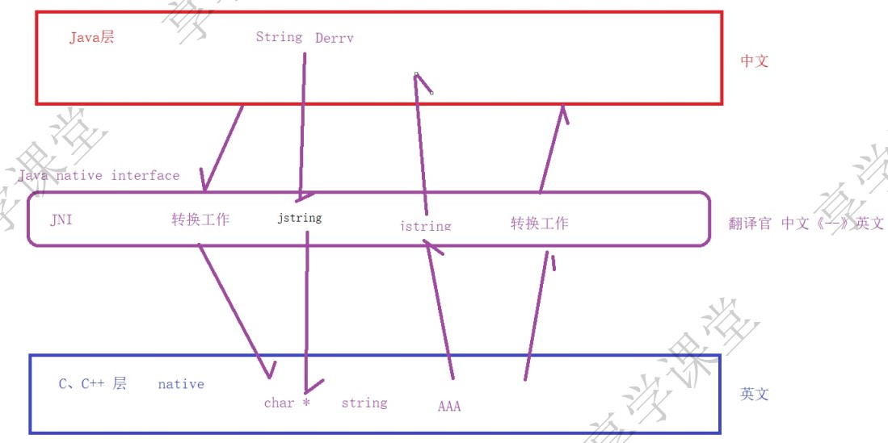

日期： 2022-05-08

标签： #学习笔记 #技术 #Android 

学习资料： 
腾讯课堂 - https://ke.qq.com/webcourse/3060320/105200059#taid=13821183286751840&vid=387702299872991795

百度网盘 - https://pan.baidu.com/s/1zjmJzrU-4kq0TJ7Yxu9tvA#list/path=%2Fsharelink1103492872705-314800681445689%2F%E3%80%9008%E3%80%91NDK%2F2022.4.26-JNI%E4%BB%8E%E5%85%A5%E9%97%A8%E5%88%B0%E5%9F%BA%E7%A1%80%E5%85%A8%E9%9D%A2%E6%8E%8C%E6%8F%A1---derry%E8%80%81%E5%B8%88&parentPath=%2Fsharelink1103492872705-314800681445689

---
<br>

### 一、JNI定位概览

JNI起到C、Java两层交互的桥梁作用，扮演着翻译官的角色，将两层各个类型转相互转换。
<br><br>


### 二、JNI 与 Java 的签名对应关系
boolean --> Z

byte --> B

char --> C

short --> S

int --> I

long --> J

float --> F

double --> D

void --> V

object（对象，引用类型）固定格式 ” L + 全限定名 + ; “，示例：**`String`** --> **`Ljava/lang/String;`**

数组 固定格式 “ [ + 元素的类型签名 ”，示例：**`int[]` --> `[I`**    、  **`String[][]`** --> **`[[Ljava/lang/String;`**

函数签名，固定格式 ” ( + 参数的类型签名 + ) + 返回值的类型签名 “ ，示例： **`void name(int a，double b)`** --> **`(ID)V`**

<br><br>


### 三、JNIEnv
1. Java层与C层之间的核心桥梁

2. 无论是C还是C++编译，JNIEnv都使用 `JNINativeInterface` 这个结构体

**jni.h文件**：
```cpp

#if defined(__cplusplus) // 如果是C++
typedef _JNIEnv JNIEnv;  
typedef _JavaVM JavaVM;  
#else // 如果是C
typedef const struct JNINativeInterface *JNIEnv;  
typedef const struct JNIInvokeInterface *JavaVM;  
#endif


struct _JNIEnv {  
    /* do not rename this; it does not seem to be entirely opaque */  
    const struct JNINativeInterface *functions;
    
	// ... ...
}

```

<br>

### 四、JNI层函数详解

##### 1、签名结构
```cpp
extern "C" // 表示下面的代码，都采用C的编译方式

JNIEXPORT // JNI重要标记关键字，不能少（VS编译能通过，运行会报错） / (AS 运行不会报错)，规则(标记为该方法可以导出被外部调用) Windows内部规则，与Linux内部规则不同

 // 【函数返回值】，这里代表返回 java 中的 String
jstring

JNICALL // （Linux非必选、Windows必选） jni call ，约束了函数入栈顺序，和堆栈内存清理的规则

// 【函数入参】
// 如果是 "实例" 方法，则这里入参的是jobject thiz，代表java层传递下来的 "调用对象"，例如本地即为 MainActivity 对象
// 如果是 "静态" 方法，则这里入参的是jclass clazz，代表java传递下来的 "class对象"，例如本地即为 MainActivity.class

// 【函数名称】
// 命名规范：Java_包名_类名_方法名
// 如果包名、类名、方法名中有下划线 _ ，则用数字1代替

Java_com_derry_jnidemo_MainActivity_getPwd(JNIEnv *env, jobject thiz) {
	
	jstring resultPwd = env->NewStringUTF("bianhao-9527");

	return resultPwd;
}
```

<br>


##### 2、调用JNIEnv函数
- 所有JNIEnv函数返回的对象，都不需要手动释放内存，其内部会自动完成释放工作

```cpp
extern "C"
JNIEXPORT
jstring
JNICALL
Java_com_derry_jnidemo_MainActivity_getPwd(JNIEnv *env, jobject thiz) {

	// 1.【如果是.c文件】这里需要调用 (*env)->NewStringUTF()，因为C编译下，JNIEnv *env 指向的是 JNINativeInterface *functions（自己就是指针） 的地址，所以是个二级指针，需要先取值，再用->调用函数
	jstring resultPwd = (*env)->NewStringUTF(env, "bianhao-9527"); // 需要把 env 入参传进去


	// 2.【如果是.cpp文件】这里可以直接调用 env->NewStringUTF，因为C++编译下，env是个一级指针，可直接->调用函数
	jstring resultPwd = env->NewStringUTF("bianhao-9527");

	return resultPwd;
}
```

<br>

##### 3、打印日志
- 调用系统函数
```cpp
#include <android/log.h> // 导入日志头文件

extern "C"  
JNIEXPORT
void
JNICALL  
Java_com_derry_as_1jni_1project_1cpp_MainActivity_log(JNIEnv *env, jobject mainActivitThis) {  

	const char *logTag = "logTag";
	    
    const char *logMsg = "log msg";
  
    __android_log_print(ANDROID_LOG_DEBUG, logTag, "*****jni log:%s\n", logMsg);  
}
```

- 宏定义
```cpp
#define TAG "logTag"  
// __VA_ARGS__ 代表 ...的可变参数  
#define LOGD(...) __android_log_print(ANDROID_LOG_DEBUG, TAG, __VA_ARGS__);  
#define LOGE(...) __android_log_print(ANDROID_LOG_ERROR, TAG, __VA_ARGS__);  
#define LOGI(...) __android_log_print(ANDROID_LOG_INFO, TAG, __VA_ARGS__);  

LOGD("JNI日志调用：%s", str_)
```

<br>

##### 4、JNI层调用Java层示例

**1. 修改Java的属性**（与反射调用规则一致）

==**【注意】**== ：**JNI可以暴力修改 `private` 、 `final` 的属性**

1）修改 “引用类型” 的 “实例” 属性
```cpp
extern "C"
JNIEXPORT
jstring
JNICALL
Java_com_derry_jnidemo_MainActivity_changeName(JNIEnv *env, jobject mainActivitThis) {

	/*
	 * 【先拿到Class对象】
	 */
	// 方式一
	jclass mainActivityCls = env->FindClass("com/derry/as_jni_project_cpp/MainActivity"); // 传入Class完整包路径
	// 方式二
	jclass mainActivityCls2 = env->GetObjectClass(mainActivitThis);

	 
	// 1. 拿到实例属性，这里是 String name
	jfieldID nameFid = env->GetFieldID(mainActivityCls, "name", "Ljava/lang/String;"); // 传入Class、属性名称、属性的类型签名

	// 2. 因为属性是 String 类型的，所以必须构建一个jstring对象
	jstring value = env->NewStringUTF("修改为Beyond");  

	// 3. 修改属性值
	env->SetObjectField(mainActivityThis, nameFid, value); // 因为修改的是 "实例" 属性，且是引用类型，用SetObjectField()，不需要static关键字

    // 4. 释放本地引用（这里只是为了让我们记得要有释放内存空间的好习惯）
    // 即使这里不手动释放，函数在执行完毕后也会自动释放（因为这里是一个局部变量，存在于栈空间里）
	// 因为这里释放了jclass引用，所以会把所有关联过的jmethodID、jfieldID引用也一起释放  
	env->DeleteLocalRef(mainActivityCls);
	
	return resultPwd;
}
```

2）修改 “基本类型” 的 “静态” 属性
```cpp
extern "C"
JNIEXPORT
jstring
JNICALL
Java_com_derry_jnidemo_MainActivity_changeAge(JNIEnv *env, jclass mainActivityCls) {

	// 【注意】因为是静态方法，所以这里入参是jclass

	// 1. 拿到静态属性，这里是 int age
	// 【注意】这里要用GetStaticFieldID，有static关键字
	jfieldID ageFid = env->GetStaticFieldID(mainActivityCls, "age", "I");  
  
	// 2. jint底层是int的别名而已，所以不需要先构建一个jint，而是可以直接用int声明（所有基本类型都是如此）
	int age = env->GetStaticIntField(mainActivityCls, ageFid); // 获取原age值

	// 3. 修改属性值
	// void SetStaticIntField(jclass clazz, jfieldID fieldID, jint value)  
	env->SetStaticIntField(mainActivityCls, ageFid, age + 1); // 因为修改的是 "静态" 属性，且是int类型，SetStaticIntField()，需要static关键字
	
	return resultPwd;
}
```

<br>

**2. 调用Java的方法**（与反射调用规则一致）

```cpp
extern "C"  
JNIEXPORT
void
JNICALL  
Java_com_derry_as_1jni_1project_1cpp_MainActivity_callAddMathod(JNIEnv *env, jobject mainActivitThis) {  
  
    // 获取Class对象  
    jclass mainActivitCls = env->GetObjectClass(mainActivitThis);  


    /**  
     * 1. 调用 public int add(int number1, int number2) 方法  
     */  
    // 获取方法对象  
    jmethodID addMeId = env->GetMethodID(mainActivitCls, "add", "(II)I"); // 传入对象、方法名、方法签名  
  
    // 调用方法，并获取返回值  
    // 因为Java方法返回值为int，所以调用CallIntMethod()  
    int result = env->CallIntMethod(mainActivitThis, addMeId, 1, 1);  
    __android_log_print(ANDROID_LOG_DEBUG, TAG, "result:%d\n", result);  
  
  
    /**  
     * 2. 调用 public String showString(String str,int value) 方法  
     */  
    jmethodID showStringMeId = env->GetMethodID(mainActivitCls, "showString", "(Ljava/lang/String;I)Ljava/lang/String;");  
  
    // 构建一个jstring作为入参  
    jstring param = env->NewStringUTF("李元霸");  
  
    // 调用方法，并获取返回值  
    // 因为Java方法返回值为String，属于引用类型，所以调用CallObjectMethod()  
    jstring resultStr = (jstring) env->CallObjectMethod(mainActivitThis, showStringMeId, param, 9527); // 因为jstring是公开继承jobject  
  
    // 将jstring转换成C的字符串  
    const char *resultCStr = env->GetStringUTFChars(resultStr, NULL);  
  
    __android_log_print(ANDROID_LOG_DEBUG, TAG, "*****jni==:%s\n", resultCStr);


    // 释放本地引用（这里只是为了让我们记得要有释放内存空间的好习惯）
    // 即使这里不手动释放，函数在执行完毕后也会自动释放（因为这里是一个局部变量，存在于栈空间里）
    // 因为这里释放了jclass引用，所以会把所有关联过的jmethodID引用也一起释放，不需要手动释放
	env->DeleteLocalRef(mainActivityCls);
}
```
