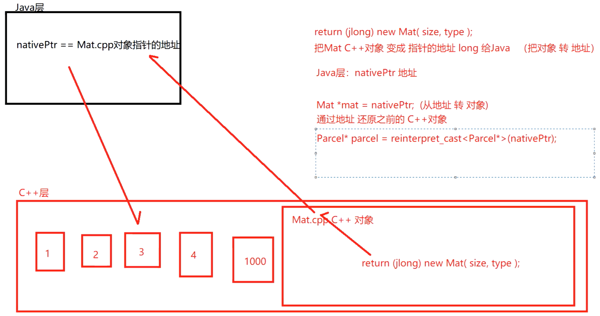
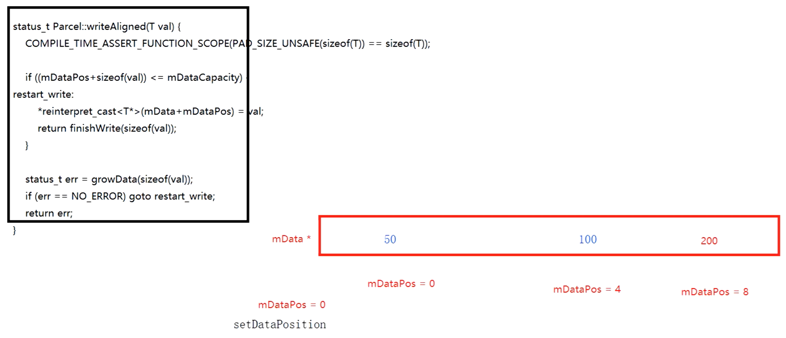
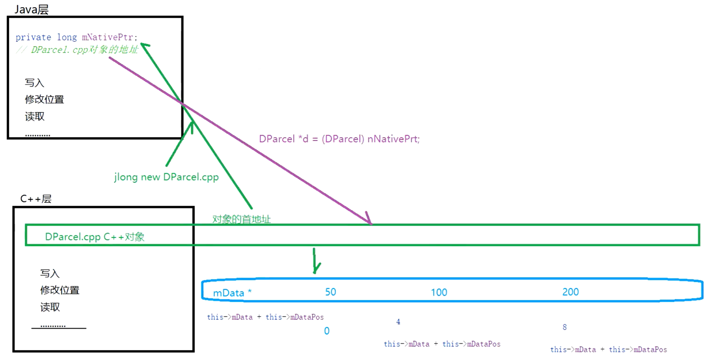

日期： 2022-05-29

标签： #学习笔记 #技术 #Android 

学习资料： 
腾讯课堂 - https://ke.qq.com/webcourse/3060320/105200059#taid=14015371643105888&vid=387702300685528749

百度网盘 - https://pan.baidu.com/s/1zjmJzrU-4kq0TJ7Yxu9tvA#list/path=%2Fsharelink1103492872705-314800681445689%2F%E3%80%9008%E3%80%91NDK%2F2022.5.12-JNI%E6%8A%80%E6%9C%AF%E4%B9%8B%E6%89%8B%E5%86%99Parcel%E7%9A%84C%2B%2B%E5%B1%82%E4%B8%8E%E5%8E%9F%E7%90%86(Kotion%E7%89%88)%EF%BC%88%E5%85%AD%EF%BC%89---derry%E8%80%81%E5%B8%88&parentPath=%2Fsharelink1103492872705-314800681445689

---
<br>

### 一、设计原理
1. Java层会缓存持有一个C++对象的指针，即 `long nativePtr`
2. C++层通过指针位移进行数据写入







<br>

### 二、源码
1. DParcel.h
```cpp
#include <malloc.h>  
#include <jni.h>  
  
#ifndef DERRYPARCEL_DPARCEL_H  
#define DERRYPARCEL_DPARCEL_H  
  
class DParcel {  
  
public:  
    DParcel();  
  
    virtual ~DParcel();  
  
    void writeInt(int val);  
  
    void setDataPosition(int mDataPos);  
  
    jint readInt();  
  
private:  
    char *mData = 0; // DParcel对象共享内存的首地址(内存地址)  
    int mDataPos = 0; // DParcel对象共享内存的首地址(内存地址)的指针偏移量  
    void changePos(int pos); // 修改mDataPos，用于指针挪动  
    long *stringObj = NULL; // StringObj对象的 首地址(内存地址)  
    // jint len = 0;};  
  
#endif //DERRYPARCEL_DPARCEL_H
```

2. DParcel.cpp
```cpp
#include "DParcel.h"  
  
DParcel::DParcel() {  
    this->mData = reinterpret_cast<char *>(malloc(1024)); // 1024 1kb  
}  
  
DParcel::~DParcel() {  
    if (this->mData) {  
        free(this->mData);  
    }  
    if (this->mDataPos) {  
        this->mDataPos = NULL;  
    }  
}  
  
void getLength(char *content, jint &len) {  
    char *contentTemp = const_cast<char *>(content);  
    int count = 0;  
    while (*contentTemp != '\0') {  
        contentTemp++;  
        count++;  
    }  
    len = count;  
}  
  
void DParcel::writeInt(int val) {  
    *reinterpret_cast<int *>(this->mData + this->mDataPos) = val; // DParcel对象首地址(内存地址)的挪动位置mDataPos 第一次：0位置  
    changePos(sizeof(val)); // DParcel对象首地址(内存地址)的挪动位置mDataPos 第二次：4位置  
}  
  
void DParcel::changePos(int val) {  
    this->mDataPos += val;  
}  
  
void DParcel::setDataPosition(int mDataPos) {  
    this->mDataPos = mDataPos;  
}  
  
jint DParcel::readInt() {  
    jint ret = *reinterpret_cast<int *>(this->mData + this->mDataPos);  
    changePos(sizeof(int));  
    return ret;  
}
```
