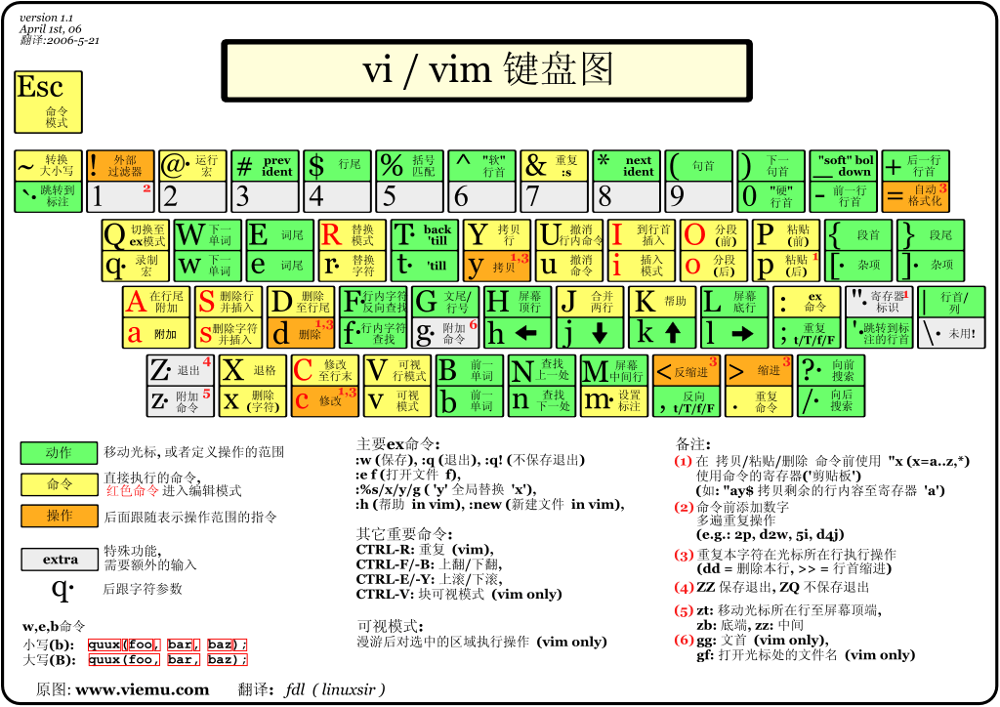

日期： 2022-05-29

标签： #学习笔记 #技术 #Android 

学习资料： 
腾讯课堂 - 

百度网盘 - https://pan.baidu.com/s/1zjmJzrU-4kq0TJ7Yxu9tvA#list/path=%2Fsharelink1103492872705-314800681445689%2F%E3%80%9008%E3%80%91NDK%2F2022.5.14-Linux%E5%AD%A6%E4%B9%A0%E4%B9%8B%E5%91%BD%E4%BB%A4%E6%89%A7%E8%A1%8C%E5%8E%9F%E7%90%86%E4%B8%8E%E6%96%87%E4%BB%B6%E7%94%A8%E6%88%B7%E7%BB%84%E7%AD%89%EF%BC%88%E4%B8%80%EF%BC%89---derry%E8%80%81%E5%B8%88&parentPath=%2Fsharelink1103492872705-314800681445689

---
<br>

### 一、Linux命令执行原理：
Linux系统中所见即文件（哪怕驱动也是文件本质） 
- bin 目录一些执行文件
- home 目录用户
- lib 目录常用的 so 
- opt 和 proc 是与进程相关的。


<br><br>


### 二、Linux常用命令
##### 远程连接
- 连接目标主机
```shell
ssh -p 22 ubuntu@49.232.151.223
```

<br>

##### 用户、用户组
【#】代表 root权限
【$】、【%】代表普通用户
sudo su root 【从普通用户 切换到 root用户，注意：要输入密码 是看不见的】
exit 【 退出 root 用户，到普通用户】
whoami 【查看当前用户】

<br>

##### 常用命令
cd DerryAll 【进入到DerryAll目录】
cd.. 【返回到上一个目录】
cd . 【啥也没有做 就在当前目录 .代表当前目录】
ls 【当前文件夹下面的所有文件/文件夹等】
ls -all 【当前文件夹下面的所有文件/文件夹等 的详细显示】
ls -lh 【当前文件夹下面的所有文件/文件夹等 的详细显示，包括文档大小的单位】
pwd 【打印当前所在的目录路径】
cd / 【回到根目录】
./date 【执行 date可执行文件】 注意是在 /bin目录下
mkdir New01 【创建 New10名称 的文件夹】
touch file01.txt 【创建 file01名称 的文件】
rm -rf file01.txt 【删除file01文件】
ls -R 【递归当前文件夹 到 文件，有点像 树形结构输出的效果】
rmdir 文件夹名   【只能清空空目录文件夹，如果文件夹里面有内容，就无法删除】
rm -r 文件夹名   【递归清空目录文件夹】
rm hello.c   【删除文件】
cp hello.c 目标文件夹名   【拷贝文件 到 目标文件夹】
mv 原文件名 新文件名   【修改文件名】
systemctl status xxx  查看服务状态
systemctl enable xxx  设置开机自动启动服务

<br>

##### 文件读取操作
cat file01.txt 【快速查看文件内容】
vim file01.txt 【使用vim编辑器查看文件内容】
tac file01.txt 【倒序快速查看文件内容】
more file01.txt 【每次只查看一页，回车查看下一页】

<br>

##### 文件信息详述：
-rw-r--r--            1              root        root          323        Mar 27 14:12      file01.txt
文件权限    硬链接计数    所有者    所属组    文件大小            时间              名称

<br>

##### 文件的用户权限释义说明
以 -rwxrwxrwx 为例：
“-”：文件，如果是d表示文件夹
r：可读
w：可写
x：可执行
第一个rwx：当前用户的文件权限
第二个rwx：同组用户的文件权限
第三个rwx：其他用户的文件权限

<br>

##### 修改文件的用户权限
修改之前，先去除权限：chmod 000 file05.txt

1. 通过权限数字修改权限【4可读，2可写，1可执行】
chmod 777 file01.txt --> 【执行完后 -rwxrwxrwx 1 root root 323 Mar 27 15:53 file01.txt】 --> 三组都 可读可写可执行
chmod 111 file01.txt --> 【执行完后 ---x--x--x 1 root root 323 Mar 27 15:53 file01.txt】 --> 三组都 可执行
chmod 412 file02.txt --> 【执行完后 -r----x-w- 1 root root 323 Mar 27 15:53 file01.txt】 --> 一组(可读)、二组(可执行)、三组(可写)

2. 通过权限名字修改权限【+x（加入可执行权限），+r（加入可读权限），+w（加入可写权限，只能给第一组加）】
chmod +w file05.txt --> 【执行完后 --w------- 1 root root 0 Mar 27 14:17 file05.txt】 --> 仅第一组 增加 可执行
chmod +x file05.txt --> 【执行完后 ---x--x--x 1 root root 0 Mar27 14:17 file05.txt】 --> 三组 都 增加 可执行
chmod +r file05.txt --> 【执行完后 -r--r--r-- 1 root root 0 Mar27 14:17 file05.txt】 --> 三组 都 增加 可执行

3. 通过用户标识修改权限 【u（user，当前用户)），g（group，同组用户），o（other，其他用户），a（all，所有用户）】
chmod u+rwx,g+rx,o=x file05.txt --> 【执行完后 -rwx-rx--x 1 root root0 Mar 27 14:17 file05.txt】 --> 一组 增加 可读可写可执行，二组 增加 可读可写，三组 改成 可执行

4. 创建修改用户和用户组
sudo adduser derryNew --> 【创建新用户 derryNew】
sudo chown derryNew file01.txt --> 【执行完后 ： ---x-w--wx 1 derryNew root 323 Mar 27 15:53 file01.txt】 --> 修改file01.txt文件 所属用户 
sudo chgrp derryNew file01.txt --> 【执行完后 ：-rw-r--r-- 1 root derryNew 323 Mar 27 14:16 file01.txt】 --> 修改file01.txt文件 所属组
sudo chown derryNew:derryNew file01.txt --> 【执行完后：-rw-r--r-- 1 derryNew derryNew 323 Mar 27 14:16 file01.txt】 --> 修改file01.txt文件 所属用户/所属组 

<br>

##### Linux文件类型：
1. 常用
“-” 【普通文件】
d 【文件夹】

2. 不常用
l 【软链接，硬链接软件接：相当于 windows 的快捷图标】
c 【字符设备文件】
b 【块设备文件】
p 【管道文件】
s 【套接字】


##### 临时环境变量：
只在当前会话窗口下生效，新开一个会话就失效了

export AAAA=1234567
echo $AAAA


##### 全局环境变量：
vim /etc/profile 修改好profile后 （export derry="Derry真牛逼"）
让其修改生效 source /etc/profile
echo $derry
echo $BBBB

<br><br>


### 三、vim操作
菜鸟教程： https://www.runoob.com/linux/linux-vim.html

##### 命令模式：
用户刚刚启动 vi/vim，默认进入到命令模式。
此状态下敲击键盘动作会被Vim识别为命令，而非输入字符。比如我们此时按下i，并不会输入一个字符，i被当作了一个命令。

常用的几个命令
-   i    切换到输入模式。
-   :   切换到底线命令模式。
-   x   删除当前光标出的字母
-   u   撤销
-   GG   格式化代码

移动和跳转命令
-   gg    移动到文件首
-   G    移动到文件尾（25G   移动到第25行）
-   $   跳转到行尾
-   0(数字)   跳转到行首
-   k    向上移动（5k   向上移动5次）
-   j   向下移动
-   h   向左移动
-   l   向右移动

复制粘贴命令
-   yy   复制
-   3yy   复制3行
-   dd   剪切当前行
-   3dd   剪切3行
-   dw   剪切整个单词（注意，需要将光标移动到单子的开始）
-   d0(数字)   剪切光标至首行
-   p   粘贴，到下一行
-   大写P   粘贴，到本行

查找替换命令
-   / + abc123 + 回车   查询字符abc123（按回车查找到目标之后，按n键，查找下一个；按N键，查找上一个）
-   r + abc123 + 回车   将光标处单子替换成abc123
-   :%s /abc123/xyz999   （底线命令模式下）将“首个”的abc123字符替换成xyz999字符
-   :%s /abc123/xyz999/g   （底线命令模式下）将“所有”的abc123字符替换成xyz999字符


##### 输入模式：
在命令模式下，按下 i 就进入了输入模式。

在输入模式中，可以使用以下按键：
-   **字符按键以及Shift组合**    输入字符
-   **ENTER**    回车键，换行
-   **BACK SPACE**    退格键，删除光标前一个字符
-   **DEL**    删除键，删除光标后一个字符
-   **方向键**    在文本中移动光标
-   **HOME**/**END**    移动光标到行首/行尾
-   **Page Up**/**Page Down**    上/下翻页
-   **Insert**    切换光标为输入/替换模式，光标将变成竖线/下划线
-   **ESC**键   退出输入模式，切换到命令模式


##### 底线命令模式
在命令模式下，按下 :（英文冒号）就进入了底线命令模式。
底线命令模式可以输入单个或多个字符的命令，可用的命令非常多。

在底线命令模式中，基本的命令有（已经省略了冒号）：
-  q    退出程序
-  w    保存文件
-  q!    强制退出。!代表强制退出，会丢失未保存的修改内容
-  wq!    保存文件，并强制退出
-  set number    显示行号
-  25    跳转到第25行
-  **ESC**键    退出输入模式，切换到命令模式


vim键盘图：

