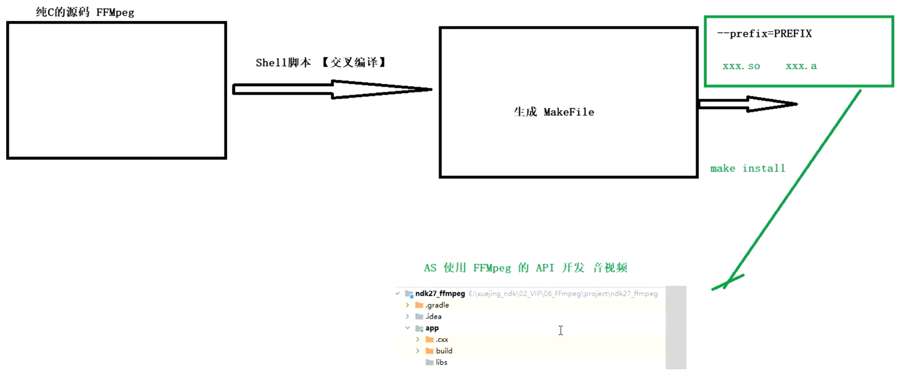
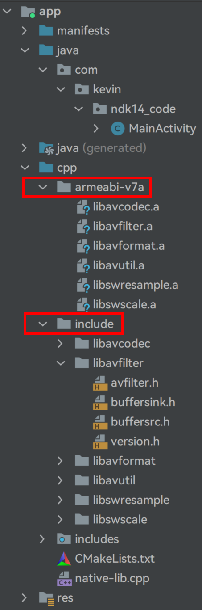

日期： 2022-06-05

标签： #学习笔记 #技术 #Android 

学习资料： 
腾讯课堂 - https://ke.qq.com/webcourse/3060320/105200059#taid=14015393117942368&vid=387702301287394256

百度网盘 - https://pan.baidu.com/s/1zjmJzrU-4kq0TJ7Yxu9tvA?_at_=1654176986294#list/path=%2Fsharelink1103492872705-314800681445689%2F%E3%80%9008%E3%80%91NDK%2F2022.5.26-Linux%E5%AD%A6%E4%B9%A0%E4%B9%8BNDK%E4%BA%A4%E5%8F%89%E7%BC%96%E8%AF%91FFmpeg%E4%B8%8E%E9%9B%86%E6%88%90FFmpeg---derry%E8%80%81%E5%B8%88&parentPath=%2Fsharelink1103492872705-314800681445689

---
<br>

### FFMpeg交叉编译
##### 交叉编译的流程与目的


<br>


##### 1、准备工作
1. 下载ndk17
- wget 下载操作：`wget https://dl.google.com/android/repository/android-ndk-r17c-linux-x86_64.zip?hl=zh_cn`
- 修改名称：`mv android-ndk-r17c-linux-x86_64.zip\?hl\=zh_cn android-ndk-r17c-linux-x86_64.zip`
- 解压：`unzip android-ndk-r17c-linux-x86_64.zip`

2. 下载ffmpeg
-  http://www.ffmpeg.org/releases/ （ffmpeg历史版本下载）
-  `wget http://www.ffmpeg.org/releases/ffmpeg-4.0.2.tar.bz2`
-  解压：`tar -xjf ffmpeg-4.0.2.tar.bz2`
-  查看帮助文档：`./configure --help`


##### 2、交叉编译
1. 手动创建存放编译产物的目录：`mkdir /android/arm`

2. 获取root权限：`sudo su root`

3. 进入到ffmpeg下根目录：`cd ffmpeg-4.0.2/`

4. `./configure` 【会提示报错，需要关闭 asm 汇编相关】

5. `./configure --disable-x86asm` 【更新 Makefile 文件，关闭 asm 汇编相关】

6. 执行 build.sh 编译脚本：
```shell
#!/bin/bash

#一、定义NDK目录的变量 NDK_ROOT
NDK_ROOT=/home/norven/MyNDK/android-ndk-r17c


#二、TOOLCHAIN变量 指向NDK中的交叉编译gcc所在的目录
#注意1: arm-linux-androideabi-4.9需要根据目标Android设备的cpu架构而定，这里是32位
#注意2: linux-x86_64是Linux版本的ndk包下的配置路径，如果Mac下需要下载darwin版本的ndk包，并修改配置为darwin-x86_64
TOOLCHAIN=$NDK_ROOT/toolchains/arm-linux-androideabi-4.9/prebuilt/linux-x86_64


#三、FLAGS与INCLUDES变量 可以从 AS ndk工程的 externalnaticveBuild/camake/debug/armeabi-v7a/build.ninja 中拷贝出来，并做调试修改。注意的是**地址**
FLAGS="-isysroot $NDK_ROOT/sysroot -isystem $NDK_ROOT/sysroot/usr/include/arm-linux-androideabi -D__ANDROID_API__=17 -U_FILE_OFFSET_BITS  -DANDROID -ffunction-sections -funwind-tables -fstack-protector-strong -no-canonical-prefixes -march=armv7-a -mfloat-abi=softfp -mfpu=vfpv3-d16 -mthumb -Wa,--noexecstack -Wformat -Werror=format-security  -O0 -fPIC"

INCLUDES="-isystem $NDK_ROOT/sources/cxx-stl/llvm-libc++/include -isystem $NDK_ROOT/sources/android/surpport/include -isystem $NDK_ROOT/sources/cxx-stl/llvm-libc++abi/include"


#四、ffmpeg编译开关
PREFIX=./android/arm # 1.定义编译完成后，存放最终产物的文件路径

# 2.--enable-small          优化大小 非常重要，必须优化才行的哦
# 3.--disable-programs      不编译ffmpeg执行程序（即bin目录下面的3个.exe文件），我们只需要获取静态、动态库
# 4.--disable-avdevice      关闭avdevice模块（在mac、windows下打开摄像头），此模块在android中无用
# 5.--disable-encoders      关闭所有编码器（播放不需要编码）
# 6.--disable-muxers        关闭所有复用器（封装器），不需要生成mp4这样的文件，所有关闭
# 7.--disable-filters       关闭所有滤镜（后期用OpenGL）
# 8.--enable-cross-compile  开启交叉编译（ffmpeg是跨平台的，注意: 并不是所有库都有这么happy的选项）
# 9.--cross-prefix=xxx      指定ndk的gcc路径
# 10.disable-shared / enable-static 这一组开关不写也可以，默认就是这样的，（代表关闭动态库，开启静态库）
# 11.--sysroot              寻找NDK所有的库文件
# 12.--extra-cflags         会传给gcc的参数（不同版本、不同平台的写法都不同，非常坑）
# 13.--arch
# 14.--target-os            目标，这里是android

./configure \
--prefix=$PREFIX \
--enable-small \
--disable-programs \
--disable-avdevice \
--disable-encoders \
--disable-muxers \
--disable-filters \
--enable-cross-compile \
--cross-prefix=$TOOLCHAIN/bin/arm-linux-androideabi- \
--disable-shared \
--enable-static \
--sysroot=$NDK_ROOT/platforms/android-21/arch-arm \
--extra-cflags="$FLAGS $INCLUDES" \
--extra-cflags="-isysroot $NDK_ROOT/sysroot/" \
--arch=arm \
--target-os=android

make clean
make install
```

- 纯净文件
```shell
#!/bin/bash
NDK_ROOT=/home/norven/MyNDK/android-ndk-r17c
TOOLCHAIN=$NDK_ROOT/toolchains/arm-linux-androideabi-4.9/prebuilt/linux-x86_64
FLAGS="-isysroot $NDK_ROOT/sysroot -isystem $NDK_ROOT/sysroot/usr/include/arm-linux-androideabi -D__ANDROID_API__=17 -U_FILE_OFFSET_BITS  -DANDROID -ffunction-sections -funwind-tables -fstack-protector-strong -no-canonical-prefixes -march=armv7-a -mfloat-abi=softfp -mfpu=vfpv3-d16 -mthumb -Wa,--noexecstack -Wformat -Werror=format-security  -O0 -fPIC"
INCLUDES="-isystem $NDK_ROOT/sources/cxx-stl/llvm-libc++/include -isystem $NDK_ROOT/sources/android/surpport/include -isystem $NDK_ROOT/sources/cxx-stl/llvm-libc++abi/include"
PREFIX=./android/arm
./configure \
--prefix=$PREFIX \
--enable-small \
--disable-programs \
--disable-avdevice \
--disable-encoders \
--disable-muxers \
--disable-filters \
--enable-cross-compile \
--cross-prefix=$TOOLCHAIN/bin/arm-linux-androideabi- \
--disable-shared \
--enable-static \
--sysroot=$NDK_ROOT/platforms/android-17/arch-arm \
--extra-cflags="$FLAGS $INCLUDES" \
--arch=arm \
--target-os=android
make clean
make install
```


7. 编译完成之后，进入产物存放文件夹，会有 include、lib、share 三个文件夹

8. 把所有产物打一个zip包，方便统一导出：`zip -r myfile.zip ./*` 


##### 3、Android集成
1. 将产物中的，include下的 .h、.a 文件分别导入到项目中（.a文件随便起一个目录即可，后续编译过程会copy到总so中）



2. CMakeList.txt配置
```cmake
cmake_minimum_required(VERSION 3.4.1)  
add_library(  
        native-lib  
        SHARED  
        native-lib.cpp)  
  
# 1.引入头文件 FFmpeginclude_directories(${CMAKE_SOURCE_DIR}/include)  
  
# 2.引入库文件 FFmpegset(CMAKE_CXX_FLAGS "${CMAKE_CXX_FLAGS} -L${CMAKE_SOURCE_DIR}/${CMAKE_ANDROID_ARCH_ABI}")  
  
find_library(  
        log-lib  
        log)  
  
target_link_libraries(  
        native-lib  

		#导入ffmpeg
		
        # 顺序问题，先后依赖问题，导致编译失败  
        # avcodec avfilter avformat avutil swresample swscale  
        # OK 但是注意了顺序才行  
        #avformat avcodec avfilter avutil swresample swscale  
  
        # 依赖顺序最终解决方案：link时，自动分析依赖关系，选择先导入谁，后导入谁  
        -Wl,--start-groupd
        avcodec avfilter avformat avutil swresample swscale
		-Wl,--end-group
		
        ${log-lib}  
)
```
sudo apt-get update
sudo apt-get install  gcc automake autoconf libtool make