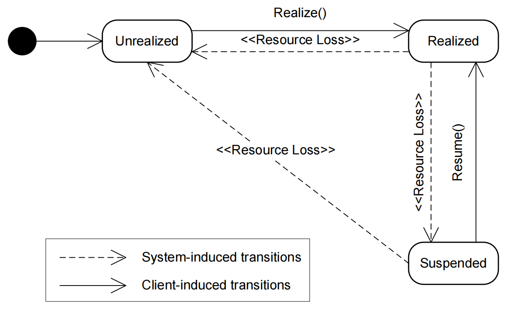

日期： 2022-06-11

标签： #学习笔记 #技术 #Android 

学习资料： 
腾讯课堂 - https://ke.qq.com/webcourse/3060320/105200059#taid=14015397412909664&vid=387702301410831980

百度网盘 - https://pan.baidu.com/s/1zjmJzrU-4kq0TJ7Yxu9tvA#list/path=%2Fsharelink1103492872705-314800681445689%2F%E3%80%9008%E3%80%91NDK%2F2022.5.29Android%E9%9F%B3%E8%A7%86%E9%A2%91%E5%9F%BA%E7%A1%80%E7%90%86%E8%AE%BA-%E9%9F%B3%E9%A2%91&parentPath=%2Fsharelink1103492872705-314800681445689

---
<br>

### 一、音视频基础
> **==看pdf课件==**

- Nyquist，频率的2倍
- 采样率：一秒钟采样的次数。代表音频的质量
- 采样位数：采样范围，精度，越高越逼真
- 声道：Channel，左声道、双通道等等
- 码率：比特数，指每秒传送的⽐特(bit)数。码率=采样率X采样位数X声道数
- 音频编码过程

- 傅里叶变化 https://www.bilibili.com/video/BV1kX4y1u7GJ/?spm_id_from=333.788.recommend_more_video.1
- Android音频架构


<br>

### 二、OpenSL ES
##### 基础背景
- 核心作用：处理、播放PCM数据。
> **OpenSL ES** 全称为 **Open Sound Library for Embedded Systems**，即 **嵌⼊式⾳频加速标准**。OpenSL ES是⽆授权费、跨平台、针对嵌⼊式系统精⼼优化的硬件⾳频加速 API。它为嵌⼊式移动多媒体设备上的本地 应⽤程序开发者提供了标准化、⾼性能、低响应时间的⾳频功能实现⽅法，同时还实现了软/硬件⾳频性能的直接跨平台部署，不仅降低了执⾏难度，⽽且促进了⾼级⾳频市场的发展。简单来说OpenSL ES是⼀个嵌⼊式跨平台免费的⾳频处理库。 所以它不是Android特有的。

- 官方文档： https://developer.android.google.cn/ndk/guides/audio/opensl
- pdf文档： https://kdocs.cn/l/csTk96yji5wD
- 文档怎么读：
	- 重点看 **播放、录音** 两个板块
	- 第二章：Features and Profiles，Effects and controls（用ffmpeg）、3D Audio（支持太弱） 跳过不看
	- 第三章：Design Overview，**3.1小节**有大量设计原理、代码示例，认真看。
	- 第四章：Functional Overview，核心功能点介绍
	- 第六章：Functions，API文档，后续当字典查即可
	- 第七章：Object Definitions，对象定义，7.2~7.4要看

<br>

##### 1、Objects 和 Interfaces
Android为了更⽅便的使⽤ OpenSL ES，把 OpenSL ES 的API设计成了类似⾯向对象的Java使⽤⽅式。Object 可以理解成 Java 的 Object 类，Interface 可以理解成 Java 的 Interface，但它们并不完全相同。

它们的关系：
1. 每个 Object 可能会存在⼀个或者多个 Interface，官⽅为每⼀种 Object 都定义了⼀系列的 Interface
2. 每个 Object 对象都提供了⼀些最基础的操作，⽐如：`Realize()`、`Resume()`、`GetState()`、`Destroy()` 等等，如果希望使⽤该对象⽀持的功能函数，则必须通过其 GetInterface 函数拿到 Interface 接⼝，然后通过 Interface 来访问功能函数
3. 并不是每个系统上都实现了 OpenSL ES 为 Object 定义的所有 Interface，所以在获取 Interface 的时候需要 做⼀些选择和判断 所有的 Object 在 OpenSL ⾥⾯我们拿到的都是⼀个 `SLObjectItf` ：

```cpp
typedef const struct SLObjectItf_ * const * SLObjectItf;

struct SLObjectItf_ {
	SLresult (*Realize) (
		SLObjectItf self,
		SLboolean async
	);
	
	SLresult (*Resume) (
		SLObjectItf self,
		SLboolean async
	);
	
	SLresult (*GetState) (
		SLObjectItf self,
		SLuint32 *pState
	);
	
	SLresult (*GetInterface) (
		SLObjectItf self,
		const SLInterfaceID iid,
		void *pInterface
	);
	
	SLresult (*RegisterCallback) (
		SLObjectItf self,
		slObjectCallback callback,
		void *pContext
	);
	
	void (*AbortAsyncOperation) (
		SLObjectItf self
	);
	
	void (*Destroy) (
		SLObjectItf self
	);
	
	SLresult (*SetPriority) (
		SLObjectItf self,
		SLint32 priority,
		SLboolean preemptable
	);

	SLresult (*GetPriority) (
		SLObjectItf self,
		SLint32 *pPriority,
		SLboolean *pPreemptable
	);

	SLresult (*SetLossOfControlInterfaces) (
		SLObjectItf self,
		SLint16 numInterfaces,
		SLInterfaceID *pInterfaceIDs,
		SLboolean enabled
	);
};
```

<br>

##### 2、GetInterface 接口
GetInterface可以说是OpenSL⾥使⽤频率最⾼的⽅法,通过它我们可以获取Object⾥⾯的Interface。
由于⼀个 Object ⾥⾯可能包含了多个 Interface ，所以 `GetInterface()` ⽅法有个 `SLInterfaceID` 参数来指定到的需要获取 Object ⾥⾯的哪个 Interface。
⽐如我们通过 `EngineObject` 去获取 `SL_IID_ENGINE` 这个id的 Interface ，⽽这个id对应的 Interface 就是 `SLEngineItf` :

```cpp
SLresult (*CreateAudioPlayer) (  
        SLEngineItf self,  
        SLObjectItf *pPlayer,  
        SLDataSource *pAudioSrc,  
        SLDataSink *pAudioSnk,  
        SLuint32 numInterfaces,  
        const SLInterfaceID *pInterfaceIds,  
        const SLboolean *pInterfaceRequired  
);  

SLresult (*CreateAudioRecorder) (  
        SLEngineItf self,  
        SLObjectItf *pRecorder,  
        SLDataSource *pAudioSrc,  
        SLDataSink *pAudioSnk,  
        SLuint32 numInterfaces,  
        const SLInterfaceID *pInterfaceIds,  
        const SLboolean *pInterfaceRequired  
);
```


<br>

##### 3、Object 的生命周期
###### 3.1、官方资料

> When the application destroys an object, that object implicitly transitions through the Unrealized state. Thus it frees its resources and makes them available to other objects.

###### 3.2、总结
1. OpenSL ES 的 Object ⼀般有三种状态，分别是：
- `UNREALIZED （不可⽤）`
- `REALIZED（可⽤）`
- `SUSPENDED（挂起）`


2. 生命周期流转：
- Object 初始处于 `UNREALIZED（不可⽤）` 状态时，该状态下系统不会为其分配资源。
- 调⽤ `Realize()` ⽅法后便进⼊ `REALIZED（可⽤）` 状态，此时对象的各个功能和资源可以正常访问。
- 当系统⾳频相关的硬件设备被其他进程占⽤时，Object 便会进⼊ `SUSPENDED（挂起）` 状态，之后如果调⽤ `Resume()` ⽅法可使其再重回 `REALIZED（可⽤）` 状态。
- 当 Object 使⽤结束后，调⽤ `Destroy()` ⽅法释放对象资源，此时重回 `UNREALIZED（不可⽤）` 状态。

<br>

##### 4、核心代码
###### 4.1、播放功能 Play
-  把 PCM 数据（char[]）发送给底层的es进行播放  
```C
extern "C"  
JNIEXPORT void JNICALL  
Java_com_opensource_openslesdemo_OpenSlEsPlayer_sendPcmData(JNIEnv *env,  
                                                            jobject thiz,  
                                                            jbyteArray data_,  
                                                            jint size) {  
    if (audio == NULL) {  
        audio = new Audio(dataQueue, 44100);  
        audio->play();  
    }  
    jbyte *data = env->GetByteArrayElements(data_, nullptr);  
  
    PcmData *pdata = new PcmData((char *) data, size);  
    dataQueue->putPcmData(pdata);  
    LOGE("size is %d queue size is %d", size, dataQueue->getPcmDataSize());  
    env->ReleaseByteArrayElements(data_, data, 0);  
}
```

- 初始化OpenSLES，看Demo中的 `Audio.cpp`
```C
void Audio::initOpenSLES() {  
    struct timeval t_start, t_end;  
    gettimeofday(&t_start, NULL);  
    LOGD("Start time: %ld us", t_start.tv_usec);  


    /***********    【1 创建引擎 获取SLEngineItf】    ***********/  
    SLresult result;  
    result = slCreateEngine(&engineObject, 0, 0, 0, 0, 0);  
    if (result != SL_RESULT_SUCCESS)  
        return;  
    result = (*engineObject)->Realize(engineObject, SL_BOOLEAN_FALSE);  
    if (result != SL_RESULT_SUCCESS)  
        return;  
    result = (*engineObject)->GetInterface(engineObject, SL_IID_ENGINE, &engineEngine);  
    if (result != SL_RESULT_SUCCESS)  
        return;  
    if (engineEngine) {  
        LOGD("get SLEngineItf success");  
    } else {  
        LOGE("get SLEngineItf failed");  
    }  
    /***********    【1 创建引擎】    ***********/  


    /***********    【2 创建混音器】    ***********/
	const SLInterfaceID mids[1] = {SL_IID_ENVIRONMENTALREVERB};  
    const SLboolean mreq[1] = {SL_BOOLEAN_FALSE};  
    result = (*engineEngine)->CreateOutputMix(engineEngine, &outputMixObject, 1, mids, mreq);  
    if (result != SL_RESULT_SUCCESS) {  
        LOGE("CreateOutputMix failed");  
        return;    } else {  
        LOGD("CreateOutputMix success");  
    }  
  
    //实例化混音器  
    result = (*outputMixObject)->Realize(outputMixObject, SL_BOOLEAN_FALSE);  
    if (result != SL_RESULT_SUCCESS) {  
        LOGE("mixer init failed");  
    } else {  
        LOGD("mixer init success");  
    }  
  
    result = (*outputMixObject)->GetInterface(outputMixObject, SL_IID_ENVIRONMENTALREVERB, &outputMixEnvironmentalReverb); 
                                               
    if (SL_RESULT_SUCCESS == result) {  
        SLEnvironmentalReverbSettings reverbSettings = SL_I3DL2_ENVIRONMENT_PRESET_STONECORRIDOR;  
        result = (*outputMixEnvironmentalReverb)->SetEnvironmentalReverbProperties(  
                outputMixEnvironmentalReverb, &reverbSettings);  
        (void) result;  
    }  
    /***********    【2 创建混音器】    ***********/  


    /***********    【3 配置音频信息，主要配置PCM格式】    ***********/
	SLDataLocator_OutputMix outputMix = {SL_DATALOCATOR_OUTPUTMIX, outputMixObject};  
    SLDataSink slDataSink = {&outputMix, 0};  
    //缓冲队列  
    SLDataLocator_AndroidSimpleBufferQueue android_queue = {SL_DATALOCATOR_ANDROIDSIMPLEBUFFERQUEUE, 2};  
    //音频格式  
    SLDataFormat_PCM pcmFormat = {  
            SL_DATAFORMAT_PCM, //播放pcm格式的数据  
            //声道数  
            static_cast<SLuint32>(getCurrentSampleRateForOpensles(sample_rate)),  
            SL_PCMSAMPLEFORMAT_FIXED_16, //位数 16位  
            SL_PCMSAMPLEFORMAT_FIXED_16, //和位数一致就行  
            SL_SPEAKER_FRONT_LEFT | SL_SPEAKER_FRONT_RIGHT, //立体声（前左前右）  
            //字节序，小端  
            SL_BYTEORDER_LITTLEENDIAN  
    };  
    SLDataSource slDataSource = {&android_queue, &pcmFormat};  
    /***********    【3 配置音频信息】    ***********/  


    /***********    【4 创建播放器】    ***********/
	const SLInterfaceID ids[] = {SL_IID_BUFFERQUEUE, SL_IID_VOLUME, SL_IID_MUTESOLO};  
    const SLboolean req[] = {SL_BOOLEAN_TRUE, SL_BOOLEAN_TRUE, SL_BOOLEAN_TRUE};  
  
  
    result = (*engineEngine)->CreateAudioPlayer(engineEngine, 
											    &pcmPlayerObject, 
												&slDataSource,  
                                                &slDataSink, 
                                                sizeof(ids) / sizeof(SLInterfaceID),  
                                                ids, 
                                                req);  
                                                
    if (result != SL_RESULT_SUCCESS) {  
        LOGE("create audio player failed");  
    } else {  
        LOGE("create audio player success");  
    }  
    //初始化播放器  
    result = (*pcmPlayerObject)->Realize(pcmPlayerObject, SL_BOOLEAN_FALSE);  
    if (result != SL_RESULT_SUCCESS) {  
        LOGE("audio player init failed");  
    } else {  
        LOGE("audio player init success");  
    }  
    //获取player接口  
    result = (*pcmPlayerObject)->GetInterface(pcmPlayerObject, SL_IID_PLAY, &pcmPlayerPlay);  
    if (result != SL_RESULT_SUCCESS) {  
        LOGE("player get SL_IID_PLAY failed");  
    } else {  
        LOGD("player get SL_IID_PLAY success");  
    }  
    //获取声道操作接口  
    (*pcmPlayerObject)->GetInterface(pcmPlayerObject, SL_IID_MUTESOLO, &pcmMutePlay);  
    // 音量  
    (*pcmPlayerObject)->GetInterface(pcmPlayerObject, SL_IID_VOLUME, &pcmVolumePlay);  
  
    //获取播放队列接口  
    result = (*pcmPlayerObject)->GetInterface(pcmPlayerObject, SL_IID_BUFFERQUEUE, &pcmBufferQueue);  
    if (result != SL_RESULT_SUCCESS) {  
        LOGE("player get SL_IID_BUFFERQUEUE failed");  
    } else {  
        LOGD("player get SL_IID_BUFFERQUEUE success");  
    }  
    /***********    【4 创建播放器】    ***********/  


    //设置回调函数  
    (*pcmBufferQueue)->RegisterCallback(pcmBufferQueue, pcmBufferCallBack, this);  
    
    //设置播放状态  
    (*pcmPlayerPlay)->SetPlayState(pcmPlayerPlay, SL_PLAYSTATE_PLAYING);  
    
    // 启动
    // 先手动调用一次回调函数
    pcmBufferCallBack(pcmBufferQueue, this);  

    // 启动  
    // (*pcmBufferQueue)->Enqueue(pcmBufferQueue,"",1);  
  
    gettimeofday(&t_end, NULL);  
    LOGD("End time: %ld us", t_end.tv_usec);  
  
    long cost_time = t_end.tv_usec - t_start.tv_usec;  
    LOGD("opensled create cost:%ld ms", cost_time / 1000);  
}

//回调函数 
//OpenSLES 会自动回调  
//作用是不停的把pcm数据放入到队列中处理
void pcmBufferCallBack(SLAndroidSimpleBufferQueueItf bf, void *context) {  
    LOGD("pcmBufferCallBack ok");  
  
    Audio *audio = (Audio *) context;  
    if (audio != NULL) {  
        PcmData *data = audio->dataQueue->getPcmData();  
        if (NULL != data) {  
            LOGD("Enqueue ok");  
            (*audio->pcmBufferQueue)->Enqueue(audio->pcmBufferQueue,  
                                              data->getData(),  
                                              data->getSize());  
        }  
    }  
}
```

###### 4.2、录音功能 Recoder
- 结合文档第6章，看Demo中的 `AudioRecoreder.cpp` 的API解释
- 逻辑线索：`startRecord()` --> `createEngine()` --> `fopen()` --> 构建 `SLDataSource`、`SLDataSink` 对象 --> `CreateAudioRecorder()` --> `AudioRecorderCallback` --> `Enqueue()` 

AudioRecoreder.cpp
```cpp
//  
// Created by Jesson on 2022/5/26.  
//  
  
#include "AudioRecorder.h"  
  
AudioRecorder::AudioRecorder() {  
  
}  
  
AudioRecorder::~AudioRecorder() {  
  
}  
  
void AudioRecorder::createEngine() {  
    SLEngineOption pEngineOptions[] = {(SLuint32) SL_ENGINEOPTION_THREADSAFE,  
                                       (SLuint32) SL_BOOLEAN_TRUE};  
    // 创建引擎对象,//调用全局方法创建一个引擎对象（OpenSL ES唯一入口）  
    SLresult result;  
    result = slCreateEngine(  
            &engineObject, //对象地址，用于传出对象  
            1, //配置参数数量  
            pEngineOptions, //配置参数，为枚举数组  
            0,  //支持的接口数量  
            nullptr, //具体的要支持的接口，是枚举的数组  
            nullptr//具体的要支持的接口是开放的还是关闭的，也是一个数组，这三个参数长度是一致的  
    );  
    assert(SL_RESULT_SUCCESS == result);  
    /* Realizing the SL Engine in synchronous mode. */  
    //实例化这个对象  
    result = (*engineObject)->Realize(engineObject, SL_BOOLEAN_FALSE);  
    assert(SL_RESULT_SUCCESS == result);  
    // get the engine interface, which is needed in order to create other objects  
    //从这个对象里面获取引擎接口  
    (*engineObject)->GetInterface(engineObject, SL_IID_ENGINE, &engineEngine);  
    assert(SL_RESULT_SUCCESS == result);  
}  
  
// 录制音频时的回调  
void AudioRecorderCallback(SLAndroidSimpleBufferQueueItf bufferQueueItf, void *context) {  
    //注意这个是另外一条采集线程回调  
    AudioRecorder *recorderContext = (AudioRecorder *) context;  
    assert(recorderContext != NULL);  
    if (recorderContext->buffer != NULL) {  
        fwrite(recorderContext->buffer, recorderContext->bufferSize, 1, recorderContext->pfile);  
        LOGD("save a frame audio data,pid=%ld", syscall(SYS_gettid));  
        SLresult result;  
        SLuint32 state;  
        result = (*(recorderContext->recorderRecord))->GetRecordState(recorderContext->recorderRecord, &state);  
        assert(SL_RESULT_SUCCESS == result);  
        (void) result;  
        LOGD("state=%d", state);  
        if (state == SL_RECORDSTATE_RECORDING) {  
            //取完数据，需要调用Enqueue触发下一次数据回调  
            result = (*bufferQueueItf)->Enqueue(bufferQueueItf, recorderContext->buffer,  
                                                recorderContext->bufferSize);  
            assert(SL_RESULT_SUCCESS == result);  
            (void) result;  
        }  
    }  
}  
  
// 开始采集音频数据，并保存到本地  
void AudioRecorder::startRecord() {  
    if (engineEngine == nullptr) {  
        /**  
		 * 【一、创建引擎对象】  
		 */
        createEngine();  
    }  
    if (recorderObject != nullptr) {  
        LOGE("Audio recorder already has been created.");  
    }  
  
    pfile = fopen(AUDIO_SRC_PATH, "w");  
    if (pfile == NULL) {  
        LOGE("Fail to open file.");  
        return;    }  
  
    /**  
     * OpenSL ES 中的 【SLDataSource】 和 【SLDataSink】 结构体，主要用于构建 audio player 和 recorder 对象，  
     * 其中 SLDataSource 表示音频数据来源的信息；SLDataSink 表示音频数据输出信息。  
     */    
     SLresult result;  
  
    /**  
     * 【二、设置IO设备(麦克风) 输入输出，我们需要设置采集设备的一些输入输出配置】  
     */    
     /* setup the data source*/    
     SLDataLocator_IODevice ioDevice = {  
            SL_DATALOCATOR_IODEVICE,  //类型 这里只能是SL_DATALOCATOR_IODEVICE  
            SL_IODEVICE_AUDIOINPUT,//device类型  选择了音频输入类型  
            SL_DEFAULTDEVICEID_AUDIOINPUT, //deviceID 对应的是SL_DEFAULTDEVICEID_AUDIOINPUT  
            NULL//device实例  
    };  
    // 数据源  
    SLDataSource recSource = {  
            &ioDevice,//SLDataLocator_IODevice配置输入  
            NULL//输入格式，采集的并不需要  
    };  
    // 数据源简单缓冲队列定位器,输出buffer队列  
    SLDataLocator_AndroidSimpleBufferQueue recBufferQueue = {  
            SL_DATALOCATOR_ANDROIDSIMPLEBUFFERQUEUE, //类型 这里只能是 SL_DATALOCATOR_ANDROIDSIMPLEBUFFERQUEUE  
            NUM_BUFFER_QUEUE //buffer的数量  
    };  
    // PCM 数据源格式 //设置输出数据的格式  
    SLDataFormat_PCM pcm = {  
            SL_DATAFORMAT_PCM, //输出PCM格式的数据  
            2,  //  //输出的声道数量2 个声道（立体声）  
            SL_SAMPLINGRATE_44_1, //输出的采样频率，这里是44100Hz  
            SL_PCMSAMPLEFORMAT_FIXED_16, //输出的采样格式，这里是16bit  
            SL_PCMSAMPLEFORMAT_FIXED_16,//一般来说，跟随上一个参数  
            SL_SPEAKER_FRONT_LEFT | SL_SPEAKER_FRONT_RIGHT,//双声道配置，如果单声道可以用 SL_SPEAKER_FRONT_CENTER            
            SL_BYTEORDER_LITTLEENDIAN //PCM数据的大小端排列  
    };  
    // 输出  
    SLDataSink dataSink = {  
            &recBufferQueue, //SLDataFormat_PCM配置输出  
            &pcm //输出数据格式  
    };  
  
    /**  
     * 【三、创建录制器 主要是创建录制对象和获取录制相关的接口】  
     */    
    //创建录制的对象，并且指定开放SL_IID_ANDROIDSIMPLEBUFFERQUEUE这个接口  
    SLInterfaceID iids[NUM_RECORDER_EXPLICIT_INTERFACES] = {SL_IID_ANDROIDSIMPLEBUFFERQUEUE,  
                                                            SL_IID_ANDROIDCONFIGURATION};
    SLboolean required[NUM_RECORDER_EXPLICIT_INTERFACES] = {SL_BOOLEAN_TRUE, SL_BOOLEAN_TRUE};  
  
    /**  
     * 四、创建 audio recorder 对象  
     */    
     /* Create the audio recorder */    
     result = (*engineEngine)->CreateAudioRecorder(engineEngine, //引擎接口  
                                                  &recorderObject, //录制对象地址，用于传出对象  
                                                  &recSource, //输入配置  
                                                  &dataSink, //输出配置  
                                                  NUM_RECORDER_EXPLICIT_INTERFACES,//支持的接口数量  
                                                  iids, //具体的要支持的接口  
                                                  required //具体的要支持的接口是开放的还是关闭的  
    );  
    assert(SL_RESULT_SUCCESS == result);  
  
    /* get the android configuration interface*/  
    (*recorderObject)->GetInterface(recorderObject, SL_IID_ANDROIDCONFIGURATION, &configItf);  
    assert(SL_RESULT_SUCCESS == result);  
    /* Realize the recorder in synchronous mode. */ 
    //实例化这个录制对象  
    result = (*recorderObject)->Realize(recorderObject, SL_BOOLEAN_FALSE);  
    assert(SL_RESULT_SUCCESS == result);  
    /* Get the buffer queue interface which was explicitly requested */
    //获取Buffer接口  
    result = (*recorderObject)->GetInterface(recorderObject, SL_IID_ANDROIDSIMPLEBUFFERQUEUE,  
                                             (void *) &recorderBuffQueueItf);  
    assert(SL_RESULT_SUCCESS == result);  
  
    /* get the record interface */ 
    //获取录制接口  
    (*recorderObject)->GetInterface(recorderObject, SL_IID_RECORD, &recorderRecord);  
    assert(SL_RESULT_SUCCESS == result);  
  
    /**  
     * 【五、设置数据回调并且开始录制，设置开始录制状态，并通过回调函数获取录制的音频 PCM 数据】  
     */    
    buffer = new uint8_t[BUFFER_SIZE]; //数据缓存区，  
    bufferSize = BUFFER_SIZE;  
    //设置数据回调接口AudioRecorderCallback，最后一个参数是可以传输自定义的上下文引用  
    (*recorderBuffQueueItf)->RegisterCallback(recorderBuffQueueItf, AudioRecorderCallback, this);  
    assert(SL_RESULT_SUCCESS == result);  
    /* Start recording */  
    // 开始录制音频    
    result = (*recorderRecord)->SetRecordState(recorderRecord, SL_RECORDSTATE_RECORDING); //设置录制器为录制状态 SL_RECORDSTATE_RECORDING
    assert(SL_RESULT_SUCCESS == result);  
  
    // 在设置完录制状态后一定需要先Enqueue一次，这样的话才会开始采集回调  
    /* Enqueue buffers to map the region of memory allocated to store the recorded data */  
    (*recorderBuffQueueItf)->Enqueue(recorderBuffQueueItf, buffer, BUFFER_SIZE);  
    assert(SL_RESULT_SUCCESS == result);  
    LOGD("Starting recording tid=%ld", syscall(SYS_gettid));//线程id  
}  
  
// 停止音频采集  
void AudioRecorder::stopRecord() {  
    // 停止录制  
    if (recorderRecord != nullptr) {  
        //设置录制器为停止状态 SL_RECORDSTATE_STOPPED        
        SLresult result = result = (*recorderRecord)->SetRecordState(recorderRecord,  
                                                                     SL_RECORDSTATE_STOPPED);  
        assert(SL_RESULT_SUCCESS == result);  
        fclose(pfile);  
        pfile = nullptr;  
        delete buffer;  
        buffer = nullptr;  
        LOGD("stopRecord done");  
    }  
}  
  
// 释放资源,释放OpenSL ES资源  
void AudioRecorder::release() {  
    //只需要销毁OpenSL ES对象，接口不需要做Destroy处理。  
    if (recorderObject != nullptr) {  
        (*recorderObject)->Destroy(recorderObject);  
        recorderObject = NULL;  
        recorderRecord = NULL;  
        recorderBuffQueueItf = NULL;  
        configItf = NULL;  
    }  
    // destroy engine object, and invalidate all associated interfaces  
    if (engineObject != NULL) {  
        // 释放引擎对象的资源  
        (*engineObject)->Destroy(engineObject);  
        engineObject = NULL;  
        engineEngine = NULL;  
    }  
    LOGD("release done");  
}
```

<br><br>

### 三、Audition
视频 03:06:26 开始讲