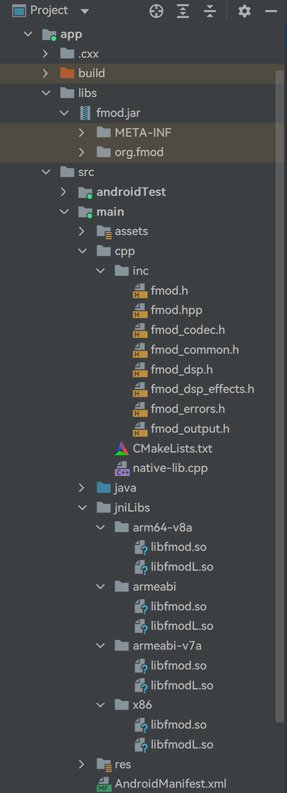
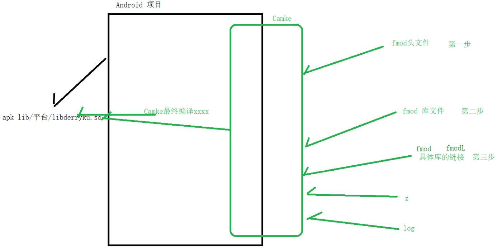

日期： 2022-05-16

标签： #学习笔记 #技术 #Android 

学习资料： 
腾讯课堂 - https://ke.qq.com/webcourse/3060320/105200059#taid=14015358758204000&vid=387702300257115186

百度网盘 - https://pan.baidu.com/s/1zjmJzrU-4kq0TJ7Yxu9tvA#list/path=%2Fsharelink1103492872705-314800681445689%2F%E3%80%9008%E3%80%91NDK%2F2022.5.5-JNI%E6%8A%80%E6%9C%AF%E4%B9%8BFMOD%E5%AE%9E%E7%8E%B0%E5%A3%B0%E9%9F%B3%E7%89%B9%E6%95%88---derry%E8%80%81%E5%B8%88&parentPath=%2Fsharelink1103492872705-314800681445689

---
<br>

### 一、导包、编译





##### 1、CMakeLists.txt 文件
```cmake
cmake_minimum_required(VERSION 3.4.1)  # 最低支持的CMake版本  
 
# <批量导入源文件> step1  
file(GLOB allCPP *.c *.h *.cpp)  
  
  
# TODO【第一步】：导入头文件  
# 相对路径（即CMakeList.txt文件当前所在目录下的inc文件夹。如果是父目录下，则用../inc）  
include_directories("inc") 
  
add_library(  
        native-lib  # 库的名字，最终文件名头部会自动拼接lib，即libnative-lib.so  
        SHARED      # 动态库，生成.so文件  
        native-lib.cpp  # 导入源文件  
  
        # <批量导入源文件> step2  
        ${allCPP}  
)  
  
  
# TODO【第二步】：设置CMAKE_CXX_FLAGS环境变量(即源文件、库文件的路径)  
  
# ${CMAKE_CXX_FLAGS}：本台设备C++的环境变量(例如%JAVA_HOME%;%ANDROID_HOME%;%C++HOME%;)、${CMAKE_C_FLAGS}：本台设备C语言的环境变量  
# ${CMAKE_SOURCE_DIR}：CMakeList.txt文件当前所在目录地址，例如本项目就是 xxx\xxx\src\main\cpp\# ${CMAKE_SOURCE_DIR}/../jniLibs：等价于CMakeList.txt文件当前所在目录的父目录地址  
# ${CMAKE_ANDROID_ARCH_ABI}：自动获取CPU abi架构  
set(CMAKE_CXX_FLAGS "${CMAKE_CXX_FLAGS} -L${CMAKE_SOURCE_DIR}/../jniLibs/${CMAKE_ANDROID_ARCH_ABI}")  
  
  
# TODO【第三步】：链接具体的库到 libnative-lib.so 里面去  
target_link_libraries(  
        native-lib  
        log   # 把 Android的log库 链接到 native-lib 里面去。如果没有链接，那么运行时c层调用log相关函数会崩溃：提示找不到 liblog.so 库  
        fmod  # 把 fmod库 链接到 native-lib 里面去，工具会自动拼接并最终得到libfmod.so文件名  
        fmodL # 把 fmodL库 链接到 native-lib 里面去，工具会自动拼接并最终得到libfmodL.so文件名  
)
```

##### 2、build.gradle 文件
```groovy
plugins {  
    id 'com.android.application'  
    id 'kotlin-android'  
}  
  
android {  
    compileSdkVersion 30  
    buildToolsVersion "30.0.3"  
  
    defaultConfig {  
        applicationId "com.derry.as_jni_projectkt"  
        minSdkVersion 16  
        targetSdkVersion 30  
        versionCode 1  
        versionName "1.0"  
  
        testInstrumentationRunner "androidx.test.runner.AndroidJUnitRunner"  
  
        // TODO【第四步】：指定CPU架构 Cmake中的本地库，例如：libnative-lib.so libderryku.so  
        externalNativeBuild {  
            cmake {  
                // cppFlags "" // 这样写，默认是四大CPU架构都支持  
  
                // 指定CPU架构是armeabi-v7a  
                // 【注意】：这里指定本地库到armeabi-v7a，仅影响CMakeLists.txt文件中的${CMAKE_ANDROID_ARCH_ABI}变量值（详情看【第二步】）  
                abiFilters "armeabi-v7a"  
            }  
        }  


        // TODO【第五步】：指定CPU的架构  apk/lib/平台  
        // 下面代码不写，默认是四大CPU架构平台  
        ndk {  
            // 指定CPU架构是armeabi-v7a  
            // 【注意】：这里指定所有库"编译打包"到armeabi-v7a进apk，即apk里只有armeabi-v7a文件夹  
            abiFilters("armeabi-v7a")  
        }  
    }  
    
    buildTypes {  
        release {  
            minifyEnabled false  
            proguardFiles getDefaultProguardFile('proguard-android-optimize.txt'), 'proguard-rules.pro'  
        }  
    }
	
	externalNativeBuild {  
        cmake {  
            path "src/main/cpp/CMakeLists.txt"  
            version "3.10.2"  
        }  
    }
	
	compileOptions {  
        sourceCompatibility JavaVersion.VERSION_1_8  
        targetCompatibility JavaVersion.VERSION_1_8  
    }  
    
    kotlinOptions {  
        jvmTarget = '1.8'  
    }  
}  
  
dependencies {  
    // TODO【第六步】：主要是 有没有提供 java的 jar包  
    implementation files("libs\\fmod.jar")  
}
```

<br><br>

### 二、逻辑实现
```cpp
#include <jni.h> // 用尖括号<>代表从动态库文件里查找指定的头文件  
  
#include "fmod.hpp" // 用双引号""代表直接在工程项目里查找指定的头文件  
#include <unistd.h>  
#include <string>  
  
using namespace std;  
  
// 此处代码是，上层六个常量所对应的，六个宏  
#undef com_derry_derry_voicechange_MainActivity_MODE_NORMAL  
#define com_derry_derry_voicechange_MainActivity_MODE_NORMAL 0L  
  
#undef com_derry_derry_voicechange_MainActivity_MODE_LUOLI  
#define com_derry_derry_voicechange_MainActivity_MODE_LUOLI 1L  
  
#undef com_derry_derry_voicechange_MainActivity_MODE_DASHU  
#define com_derry_derry_voicechange_MainActivity_MODE_DASHU 2L  
  
#undef com_derry_derry_voicechange_MainActivity_MODE_JINGSONG  
#define com_derry_derry_voicechange_MainActivity_MODE_JINGSONG 3L  
  
#undef com_derry_derry_voicechange_MainActivity_MODE_GAOGUAI  
#define com_derry_derry_voicechange_MainActivity_MODE_GAOGUAI 4L  
  
#undef com_derry_derry_voicechange_MainActivity_MODE_KONGLING  
#define com_derry_derry_voicechange_MainActivity_MODE_KONGLING 5L  
  
#include <android/log.h>  
  
using namespace FMOD;
 
extern "C" JNIEXPORT void JNICALL  
Java_com_derry_as_1jni_1projectkt_MainActivity_voiceChangeNative(JNIEnv *env, jobject thiz,  
                                                                 jint mode, jstring path) {  
    // 回调Java层的提示文案  
    char *content_ = "默认：播放完毕";  
  
    // C认识 char *    const char *path_ = env->GetStringUTFChars(path, NULL);  
  
    // Java 万物皆对象  
    // C 万物皆指针  
    // Linux 万物皆文件  
  
    System *system = 0; // fmod 音效引擎系统  
    Sound *sound = 0;   // fmod 声音  
    Channel *channel = 0; // 通道，音轨，声音在上面跑 跑道 指针  
    DSP *dsp = 0; // DSP：digital signal process -> 数字信号处理 指针  
  
    // Java思想初始化，构建并返回对象  
    // System system = xxxx();  
  
    // C的思想初始化，传入指针，给你赋值  
    // System system;  
    // xxxxx(&system);  
    
    // TODO 第一步 创建系统  
    System_Create(&system); // & 取出该指针所对应的地址  
  
    // TODO 第二步 系统的初始化  
    // 参数1：最大音轨数， 参数2：系统初始化标记， 参数3：额外数据  
    system->init(32, FMOD_INIT_NORMAL, 0);  
  
    // TODO 第三步 创建声音  
    // 参数1：路径， 参数2：声音初始化标记， 参数3：额外数据， 参数4：声 音指针  
    system->createSound(path_, FMOD_DEFAULT, 0, &sound);  
  
    // TODO 第四步：播放声音 音轨 声音  
    // 参数1：声音， 参数2：分组音轨， 参数3：控制， 参数4：通道  
    system->playSound(sound, 0, false, &channel);  
  
    // TODO 第五步：给播放的声音添加特性  
    // 判断六个宏  
    switch (mode) {  
        case com_derry_derry_voicechange_MainActivity_MODE_NORMAL:  
            content_ = "原生：播放完毕";  
            
            break;
		case com_derry_derry_voicechange_MainActivity_MODE_LUOLI:  
            content_ = "萝莉：播放完毕";  
  
            // 目标：音调高 萝莉  
            // 1.创建DSP类型是Pitch 音调调节 默认正常：1.0    0.5 ~ 2.0  
            system->createDSPByType(FMOD_DSP_TYPE_PITCHSHIFT, &dsp);  
  
            // 2.设置Pitch音调调节为：2.0，音调很高就是萝莉了  
            dsp->setParameterFloat(FMOD_DSP_PITCHSHIFT_PITCH, 2.0f);  
  
            // 3.添加音效进去 参数一：0 是因为只有一个dsp  
            channel->addDSP(0, dsp);  
  
            break;  
        case com_derry_derry_voicechange_MainActivity_MODE_DASHU:  
            content_ = "大叔：播放完毕";  
  
            // 目标：音调低 大叔  
  
            // 1.创建DSP类型是Pitch 音调调节 默认正常：1.0  0.5 ~ 2.0  
            system->createDSPByType(FMOD_DSP_TYPE_PITCHSHIFT, &dsp);  
  
            // 2.设置Pitch音调调节为：2.0，音调很高就是萝莉了  
            dsp->setParameterFloat(FMOD_DSP_PITCHSHIFT_PITCH, 0.7f);  
  
            // 3.添加音效进去 参数一：0 是因为只有一个dsp  
            channel->addDSP(0, dsp);  
            
            break;  
        case com_derry_derry_voicechange_MainActivity_MODE_GAOGUAI:  
            content_ = "搞怪 小黄人：播放完毕"; // 频率快  
  
            // 目标：频率快，小黄人  
  
            // 1. 从通道里面拿频率，原始频率  
            float frequency;  
            channel->getFrequency(&frequency);  
  
            // 2. 在原来的频率上修改频率（加速1.5倍）  
            channel->setFrequency(frequency * 1.5f);  
  
            break;  
        case com_derry_derry_voicechange_MainActivity_MODE_JINGSONG:  
            content_ = "惊悚音 播放完毕";  
  
            // 目标：惊悚音效，很多声音的组合拼接就会有惊悚效果  
  
            // TODO 音调很低，  
            // 大叔音效：特点：音调低  
            // 大叔的声音： 特点：音调低 低沉  
            system->createDSPByType(FMOD_DSP_TYPE_PITCHSHIFT, &dsp);  
            dsp->setParameterFloat(FMOD_DSP_PITCHSHIFT_PITCH, 0.7f);  
            channel->addDSP(0, dsp);  
  
            // TODO 搞点回声  
            system->createDSPByType(FMOD_DSP_TYPE_ECHO, &dsp);  
            dsp->setParameterFloat(FMOD_DSP_ECHO_DELAY, 400); // 延时的回音  
            dsp->setParameterFloat(FMOD_DSP_ECHO_FEEDBACK, 40); // 默认：50  0完全衰减了  
            channel->addDSP(1, dsp);  
  
            // TODO 颤抖 Tremolo            system->createDSPByType(FMOD_DSP_TYPE_TREMOLO, &dsp);  
            dsp->setParameterFloat(FMOD_DSP_TREMOLO_FREQUENCY, 0.8f);  
            dsp->setParameterFloat(FMOD_DSP_TREMOLO_SKEW, 0.8f);  
            channel->addDSP(2, dsp);  
  
            break;  
        case com_derry_derry_voicechange_MainActivity_MODE_KONGLING:  
            content_ = "空灵：播放完毕";  
  
            // 回音 ECHO  
            system->createDSPByType(FMOD_DSP_TYPE_ECHO, &dsp);  
            dsp->setParameterFloat(FMOD_DSP_ECHO_DELAY, 200); // 延时的回音  
            dsp->setParameterFloat(FMOD_DSP_ECHO_FEEDBACK, 10); // 默认：50  0完全衰减了  
            channel->addDSP(0, dsp);  
            
            break;
	}  
  
    // 监听音轨播放完毕的时机，再回收  
    bool isPlaying = true;  
    while (isPlaying) {  
        channel->isPlaying(&isPlaying); // C语言刀法：传入一级指针来接收结果值  
        usleep(1000 * 1000); // 微秒，每隔一秒监听判断一次  
    }  
  
    /**  
     * C语言心法：时时刻刻 记得回收！  
     */
	// TODO 第六步：释放内存  
    sound->release();  
    system->close();  
    system->release();  
    env->ReleaseStringUTFChars(path, path_);  
  
    // TODO 第七步：回调Java层播放完毕 [注意：需要放置回收的后面]  
    // C 调用到 Java    // char* ---> jstring  ---> String(Java)    jstring value = env->NewStringUTF(content_);  
    jclass mainCls = env->GetObjectClass(thiz); // MainActivity 对象 ---> Class    jmethodID playerEndMethod = env->GetMethodID(mainCls, "playerEnd", "(Ljava/lang/String;)V");  
    env->CallVoidMethod(thiz, playerEndMethod, value); // 反射 完整     Java的发射  
}
```