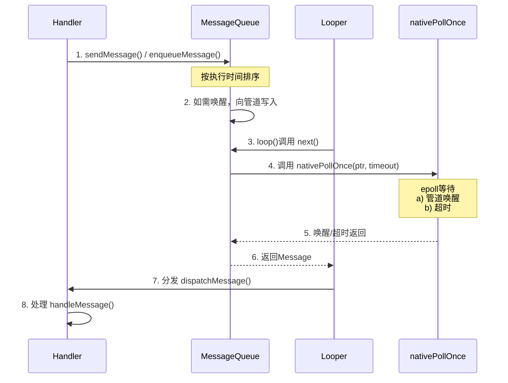

### Handler流程机制

![[Pasted image 20251016233905.png]]



**核心角色：**
- **Message:** 需要处理的消息，包含目标和处理者    
- **MessageQueue:** 消息队列，本质是一个按执行时间排序的优先级队列    
- **Looper:** 消息循环发动机，负责从队列中取出消息并分发    
- **Handler:** 消息处理工具，负责发送和处理消息
    
**流程机制：**
1. **发送消息**
    - `Handler` 通过 `sendMessage()` 或 `post()` 系列方法发送 `Message`        
    - 最终会调用 `MessageQueue.enqueueMessage()`，将 `Message` 根据其 **执行时间（`when`）** 插入到队列的合适位置，以维持队列的时间顺序        
2. **写入管道，唤醒循环**
    - 在将 `Message` 加入队列后，如果该消息需要**立即执行**，或者新消息被插到了队列头部（即下一个要处理的消息），`enqueueMessage()` 会向一个 **Linux 管道（pipe）** 或 **eventfd** 写入一个字节        
    - **目的：** 唤醒可能正处于休眠状态的 `Looper` 线程 (下面提到的`nativePollOnce()`在epoll机制时的等待)
3. **提取消息与 `nativePollOnce()`**    
    - `Looper.loop()` 是一个死循环，其核心是调用 `MessageQueue.next()` 来获取下一条要处理的消息        
    - **`nativePollOnce()` 正是在 `MessageQueue.next()` 中被调用的**        
    - **`nativePollOnce(ptr, timeoutMillis)` 的工作机制：**        
        - **检查队列头：** 首先查看队列头部的消息是否“到期”（`when <= now`）。如果到期，则立即返回该消息            
        - **计算超时：** 如果消息未到期，则计算出需要等待的时间（`timeout = when - now`）            
        - **进入休眠：** 调用 `nativePollOnce()`，其底层使用 **epoll** 机制在之前提到的管道/eventfd 上等待            
            - **如果有新消息加入并被唤醒，** 线程立即恢复，重新检查队列                
            - **如果超时时间到，** 线程也会恢复，此时队首消息通常已到期，可被取出
            - **如果 `timeout` 为负数（队列为空），** 线程将无限期休眠，直到下次被写入操作唤醒                
4. **分发与处理**
    - 从 `MessageQueue.next()` 取到 `Message` 后，`Looper` 会调用 `Message.target.dispatchMessage(Message)`，这里的 `target` 就是发送该消息的 `Handler`        
    - `Handler.dispatchMessage()` 内部按优先级处理：
        1. 最高：`Message` 自带 `Runnable callback`，则执行 `Runnable.run()`。
        2. 其次：`Handler` 设置了全局 `mCallback`，则执行 `mCallback.handleMessage(msg)`。
        3. 最低：才回调Handler子类重写的 `handleMessage()` 方法。
5. 重新循环
	当执行完毕Message后，重新进入loop()的循环，等待下一条满足时间的消息来唤醒线程并执行，loop()源码如下：	
```java
public static void loop() { 
	final Looper me = myLooper(); 
	final MessageQueue queue = me.mQueue; 
	
	for (;;) { 
		// 无限循环，底层调用nativePollOnce()
		Message msg = queue.next(); 
		
		// 阻塞式地获取下一个 Message 
		if (msg == null) { 
			// 只有在 quit 时才会返回 null，正常情况下不会退出 
			return; 
		} 
		
		try { 
			msg.target.dispatchMessage(msg); // 调用 Handler 的 dispatchMessage 
		} finally { 
			msg.recycleUnchecked(); // 回收 Message 对象 
		} 
	} 
}
```
		
6. **空闲处理（Idle Handler）**
    - 当 `MessageQueue.next()` 方法即将调用 `nativePollOnce()` 进入阻塞**之前**，如果发现当前队列为空或队首消息是延迟消息（即当前没有立即要处理的任务），就会遍历并执行所有已注册的 `IdleHandler` 的 `queueIdle()` 方法。
    - 这是一个处理轻量级、非紧急任务的好时机。


### 屏障消息Barrier
执行Traversals时，即重新布局时
![[Pasted image 20251015222223.png]]
这里屏障消息，是为了给FrameDisplayEventReceiver在onVsync()回调时，给UI线程发送执行doFrame()函数的消息能够尽快被执行用的，代码如下
```java
private final class FrameDisplayEventReceiver extends DisplayEventReceiver implements Runnable { 
	private boolean mHavePendingVsync; 
	private long mTimestampNanos; 
	private int mFrame; 
	
	@Override 
	public void onVsync(long timestampNanos, int builtInDisplayId, int frame) { 
		... 
		Message msg = Message.obtain(mHandler, this); 
		msg.setAsynchronous(true); // 此处设置异步消息，就可以防止被屏障消息阻拦
		mHandler.sendMessageAtTime(msg, timestampNanos / TimeUtils.NANOS_PER_MS); 
	} 
	
	... 
}
```