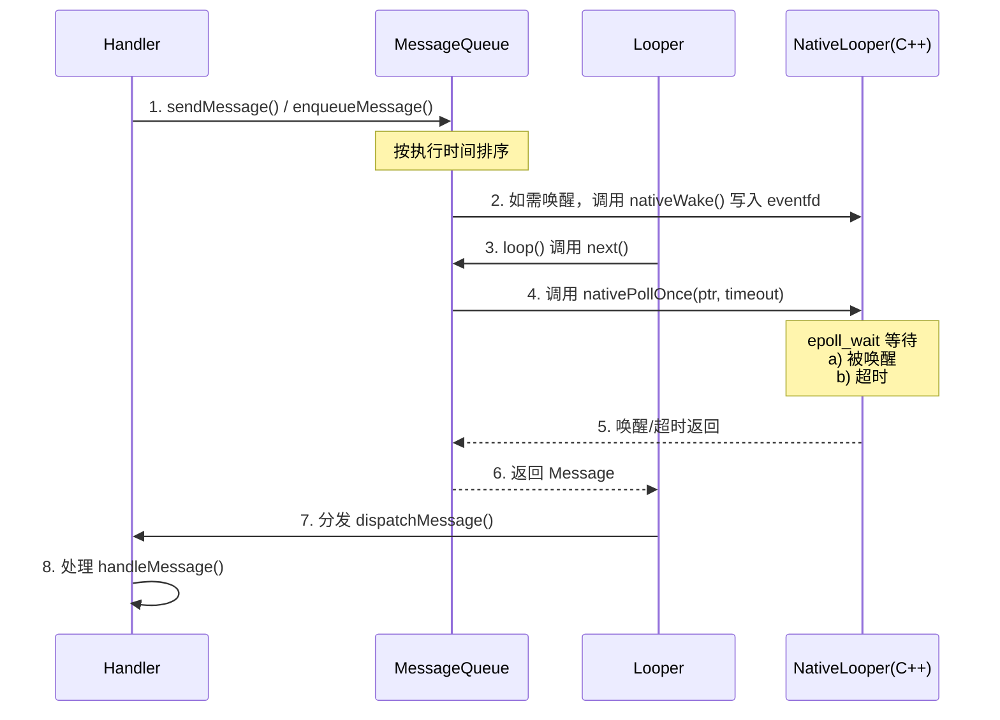

## 一、Looper构建流程

### 1. 核心机制：ThreadLocal 的数据隔离

`Looper` 类内部维护了一个静态的 `ThreadLocal` 对象。

- **名词解释 - ThreadLocal**：线程局部变量。它提供了一种机制，使得每个访问该变量的线程都有自己独立的一份数据副本，互不干扰。在这里，它被用来存储每个线程专属的 `Looper` 实例。
    
```Java
static final ThreadLocal<Looper> sThreadLocal = new ThreadLocal<Looper>();
```

### 2. 构建流程详解（普通线程）

对于普通的后台线程，构建 `Looper` 必须依次经历**初始化**和**构造**两个阶段：

#### A. 触发初始化：`Looper.prepare()`

这是开发者必须手动调用的第一步。该方法的作用是为当前线程“绑定”一个新的 `Looper`。

```Java
public static void prepare() {
    prepare(true); // 默认允许退出 (quitAllowed = true)
}

private static void prepare(boolean quitAllowed) {
    // 1. 唯一性校验：如果当前线程已经有 Looper，直接抛出异常
    if (sThreadLocal.get() != null) {
        throw new RuntimeException("Only one Looper may be created per thread");
    }
    // 2. 实例化并绑定：创建 Looper 对象，并存入当前线程的 ThreadLocal 中
    sThreadLocal.set(new Looper(quitAllowed));
}
```

#### B. 核心构造器：`private Looper(boolean quitAllowed)`

`Looper` 的构造方法是**私有 (private)** 的，只能通过 `prepare()` 内部触发。这里完成了消息队列的伴生创建。

```Java
private Looper(boolean quitAllowed) {
    // 1. 创建绑定的消息队列
    mQueue = new MessageQueue(quitAllowed); 
    // 2. 记录当前 Looper 所属的线程
    mThread = Thread.currentThread(); 
}
```

- **名词解释 - quitAllowed**：退出标识。决定了该 `MessageQueue` 是否允许被销毁。普通的后台线程执行完任务后通常需要回收，所以默认传 `true`；如果设为 `false`，调用 `quit()` 方法时会抛出异常。
    

### 3. 主线程的特例：`prepareMainLooper()`

Android 的主线程（UI 线程）也需要 `Looper`，但它的构建过程有两点极其特殊，由 `ActivityThread.main()` 在应用启动时自动调用：

```Java
public static void prepareMainLooper() {
    // 1. 传入 false，意味着主线程的 Looper 绝对不允许退出（退出即代表 App 崩溃或进程结束）
    prepare(false);
    
    synchronized (Looper.class) {
        // 2. 唯一性校验：主线程 Looper 只能被初始化一次
        if (sMainLooper != null) {
            throw new IllegalStateException("The main Looper has already been prepared.");
        }
        // 3. 全局记录：将其提升为全局静态变量，方便任意线程通过 Looper.getMainLooper() 获取
        sMainLooper = myLooper();
    }
}
```

### 4. 总结：构建过程的“三位一体”

当你成功构建一个 `Looper` 时，底层实际上完成了以下“三位一体”的绑定关系，这是 Handler 机制能够稳定运转的物理基础：

1. **线程 (Thread)** 获得了属于自己的全局入口（通过 `ThreadLocal` 索引）。
    
2. **引擎 (Looper)** 被创建，并死死记住了自己属于哪个线程（`mThread`）。
    
3. **仓库 (MessageQueue)** 被同步初始化，成为该 `Looper` 唯一的数据来源，并在 C++ 层同步建立了 `NativeMessageQueue` 和 `epoll` 监听机制。


## 二、Handler 机制

![[Pasted image 20251016233905.png]]




**核心角色：**

- **Message:** 需要处理的消息实体，包含目标 (`target`) 和处理数据。底层基于**享元模式**实现对象池复用，避免频繁创建。
    
- **MessageQueue:** 消息队列，本质是一个按执行时间 (`when`) 排序的**单向链表**。
    
- **Looper:** 消息循环发动机，负责从队列中不断取出消息并分发。利用 `ThreadLocal` 机制保证**每个线程最多只有一个实例**。
    
- **Handler:** 消息处理工具，负责向 MessageQueue 插入消息以及最终执行消息回调。
    

**流程机制：**

1. **发送消息**
    
    - `Handler` 通过 `sendMessage()` 或 `post()` 系列方法发送 `Message`。
        
    - 最终会调用 `MessageQueue.enqueueMessage()`，将 `Message` 根据其 **执行时间（`when`）** 插入到链表的合适位置，以维持时间顺序优先级的正确性。
        
2. **底层唤醒机制（跨层级通信）**
    
    - 在将 `Message` 加入队列后，如果该消息需要**立即执行**，或者新消息被插到了队列的最头部（即插队成为下一个要处理的消息），`enqueueMessage()` 会向一个底层的 **Linux 管道（pipe）** 或 **eventfd**（Android 6.0及以后主要使用eventfd）写入一个字节（通常是 `'W'`）。
        
    - **目的：** 利用 Linux 层机制，主动唤醒可能正处于 `epoll_wait` 休眠状态的 `Looper` 线程。
        
3. **提取消息与休眠策略 (`nativePollOnce`)** - `Looper.loop()` 是一个死循环，其核心是调用 `MessageQueue.next()` 来获取下一条要处理的消息。
    
    - **`nativePollOnce(ptr, timeoutMillis)` 是整个机制实现“线程阻塞但不消耗CPU”的核心：** - **检查队列头：** 首先查看队列头部的消息是否“到期”（`when <= now`）。如果到期，则立即返回该消息。
        
        - **计算超时：** 如果消息未到期，则计算出需要等待的时间（`timeout = when - now`）。
            
        - **进入休眠：** 调用 `nativePollOnce()`，其底层使用 **epoll** 机制在 `eventfd` 上进行等待让出 CPU 时间片。
            
            - **情况 A (被动唤醒)：** 有新消息加入并触发了上述的“写入 eventfd”，线程立即被内核唤醒，重新检查队列。
                
            - **情况 B (超时唤醒)：** `timeout` 时间到，线程恢复，此时队首的延时消息已到期，可被取出。
                
            - **情况 C (无限休眠)：** 如果队列为空，`timeout` 被置为 `-1`，线程将无限期休眠，直到被新消息写入唤醒。
                
4. **分发与处理（优先级拦截机制）**
    
    - 从 `MessageQueue.next()` 取到有效 `Message` 后，`Looper` 会调用 `msg.target.dispatchMessage(msg)`，这里的 `target` 就是最初发送该消息的 `Handler`。
        
    - `Handler.dispatchMessage()` 内部按固定优先级向下传递处理：
        
        1. **最高级 (Message 级别)：** 若 `Message` 自带 `Runnable callback`（通常由 `post(Runnable)` 产生），则直接执行 `Runnable.run()`。
            
        2. **次高级 (Handler 级别)：** 若初始化 `Handler` 时设置了全局 `mCallback`，则执行 `mCallback.handleMessage(msg)`。如果返回 `true` 则拦截拦截中断。
            
        3. **最低级 (子类重写)：** 最终才回调 Handler 子类重写的 `handleMessage(msg)` 方法。
            
5. **重新循环与对象回收**
    
    当分发执行完毕后，重新进入 `loop()` 的循环，并回收 Message 供下次复用。`loop()` 核心源码逻辑如下：
    
```Java
public static void loop() { 
	final Looper me = myLooper(); 
	final MessageQueue queue = me.mQueue; 
	
	for (;;) { 
		// 无限循环，底层调用nativePollOnce()，可能会阻塞挂起
		Message msg = queue.next(); 
		
		if (msg == null) { 
			// 只有在调用 quit() / quitSafely() 且队列清理完毕时才会返回 null，正常情况不会退出
			return; 
		} 
		
		try { 
			msg.target.dispatchMessage(msg); // 调用 Handler 的 dispatchMessage 分发任务
		} finally { 
			msg.recycleUnchecked(); // 【核心】清空状态并回收 Message 对象至全局池 (享元模式)，避免内存抖动
		} 
	} 
}
```

6. **空闲处理（Idle Handler）**
    
    - 当 `MessageQueue.next()` 方法即将调用 `nativePollOnce()` 进入休眠阻塞**之前**，如果发现当前队列为空，或队首消息是未到期的延迟消息（即主线程当前真正处于“空闲”状态），就会遍历并执行所有已注册的 `IdleHandler.queueIdle()` 方法。
        
    - **场景应用：** 这是一个处理轻量级、非紧急任务的极佳时机（例如：预加载布局、触发垃圾回收、统计耗时等）。
        
    - **返回值控制：** `queueIdle()` 返回 `true` 表示执行后保留，下次空闲时继续触发；返回 `false` 表示执行一次后即从注册列表中自动移除。
        

---

### 同步屏障机制 (Sync Barrier)

**核心概念：**

同步屏障本质上是一个插入到队列中的**特殊的 `Message`**，其唯一的识别标志是 **`target == null`**（普通的 Message 必须有 target）。当 MessageQueue 遍历到 `target == null` 的屏障消息时，会**拦截其后所有的同步消息**，专门放行被标记为**异步（Asynchronous）的消息**。

**核心应用场景：UI 渲染保障 (ViewRootImpl.scheduleTraversals)**

执行 Traversals（即重新布局绘制）时：

![[Pasted image 20251015222223.png]]

为了保证 UI 的绝对流畅，当触发绘制请求时，系统会向主线程消息队列的最前端手动插入一个**同步屏障**。

这是为了确保随后 `FrameDisplayEventReceiver` 在底层的硬件 `onVsync()` 回调到达时，向 UI 线程发送的执行 `doFrame()` 的绘制消息能够无视队列中原本堆积的其它普通同步操作，被最高优先级提取并执行，从而避免掉帧。代码示意如下：

```Java
private final class FrameDisplayEventReceiver extends DisplayEventReceiver implements Runnable { 
	private boolean mHavePendingVsync; 
	private long mTimestampNanos; 
	private int mFrame; 
	
	@Override 
	public void onVsync(long timestampNanos, int builtInDisplayId, int frame) { 
		... 
		Message msg = Message.obtain(mHandler, this); 
		msg.setAsynchronous(true); // 【关键】设置异步消息标志，使得它能够穿透前面设置的同步屏障被立即取出
		mHandler.sendMessageAtTime(msg, timestampNanos / TimeUtils.NANOS_PER_MS); 
	} 
	
	... 
}
```