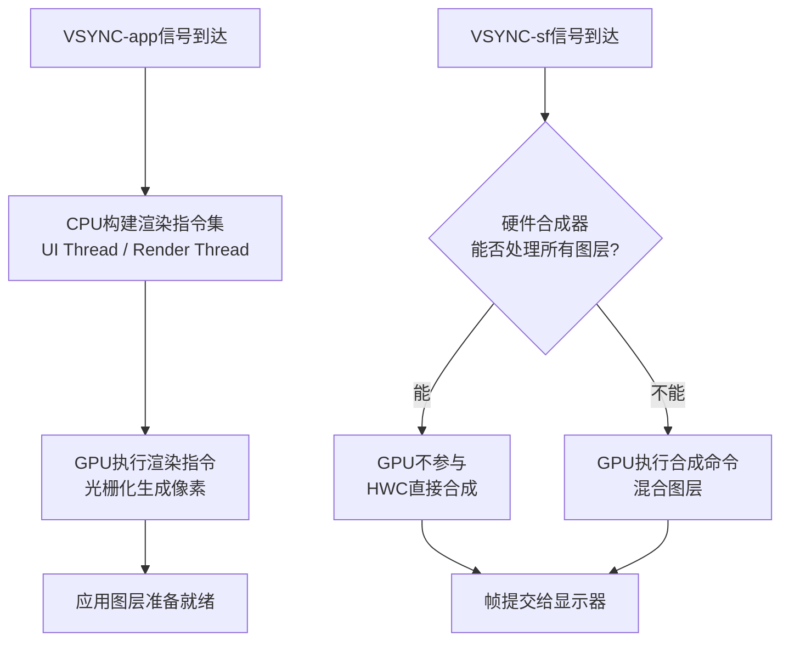
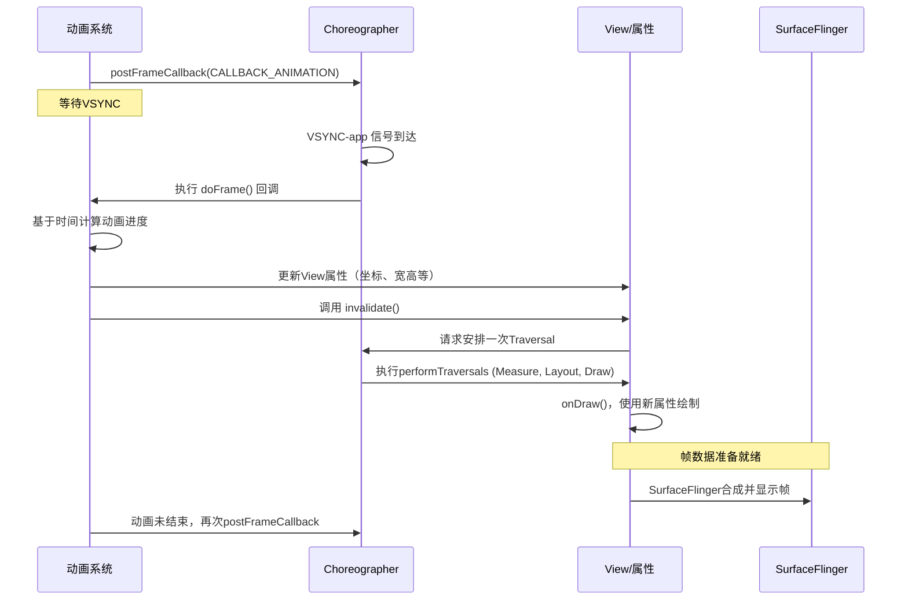

### 整体渲染流程
![[Pasted image 20251015223822.png]]

![[Pasted image 20251016230935.png]]

### SurfaceFlinger
![[Pasted image 20251016015222.png]]

1. **【触发与缓冲区收集】** 当 `VSYNC-sf` 信号到达时，SurfaceFlinger 被唤醒。它会遍历所有可见图层，从每个图层对应的 `BufferQueue` 中获取（acquire）最新的、已准备就绪的缓冲区。如果没有新缓冲区提交，则继续使用之前获取的缓冲区，以确保系统始终有内容可显示。
    
2. **【合成策略决策】** 在收集到所有图层的缓冲区后，SurfaceFlinger 会将它们提交给 **Hardware Composer** 进行“咨询”。HWC 根据自身能力返回一个**合成计划**，明确哪些图层可以直接由 HWC 以 Overlay 方式处理，哪些需要 SurfaceFlinger 先使用 GPU 进行混合。
	- **关于合成规则**：
		- **Z-order 排序**：按照窗口的 Z-order 层级进行排序，确保高层级的窗口（如对话框、状态栏）覆盖在低层级的窗口之上。
		- **Alpha 混合**：处理半透明图层。如果一个图层是半透明的，SurfaceFlinger 会计算其与下层图层的颜色混合，这通常是一个耗费 GPU 资源的计算。
		- **硬件加速**：SurfaceFlinger 会将合成任务交给 **GPU**。对于复杂的混合效果（如透明度、阴影、旋转），GPU 能提供比 CPU 快得多的计算速度。而对于不需要复杂混合的图层则直接交给HWC，减轻GPU负担。
    
3. **【上游生产者流程】** App作为生产者，通过 `dequeueBuffer` 从其 `Surface`（连接着 SurfaceFlinger 侧的 `BufferQueue`）申请一个缓冲区。然后通过 Canvas 或 OpenGL/Vulkan 在其中绘制内容，最终通过GPU执行完毕后，通过 `queueBuffer`（其核心实现之一是 `eglSwapBuffers`）将填充好的缓冲区提交回队列，并通知 SurfaceFlinger。
    
4. **【执行与提交】** SurfaceFlinger 根据 HWC 的合成计划，执行 GPU 合成（如果需要），然后调用 HWC 的 `present` 接口提交最终方案。HWC 执行实际的叠加合成，并将结果写入显示器的帧缓冲区。

整个过程通过 **Fence 机制** 确保生产者、消费者和显示器之间的同步，避免内容被过早读取或覆盖。

### Choreographer
![[Pasted image 20251016220556.png]]

**第一阶段：初始化与通信建立**
1. **初始化**：创建 `FrameHandler`（绑定主线程Looper）和 `FrameDisplayEventReceiver`（用于接收VSync信号）。    
2. **通信**：`FrameDisplayEventReceiver` 通过 `EventThread` 与 SurfaceFlinger 建立通信，请求并等待 Vsync 信号。

**第二阶段：VSync信号触发与任务调度**  
1. **信号到达**：SurfaceFlinger 的 `appEventThread` 发送 Vsync-app 信号，触发 `FrameDisplayEventReceiver.onVsync()`，最终进入核心方法 `doFrame()`。  
2. **帧周期开始**：`doFrame()` 首先进行**掉帧逻辑计算**。如果当前时间超过预期执行时间过多，则跳过本次帧回调，直接请求下一次VSync，以避免“掉帧追赶”导致的卡顿。  
3. **按优先级处理回调队列**：  
	* **INPUT**：处理与输入事件相关的回调（最高优先级）
		- **触发条件**:
		    - **有 Input 回调**：手指按压屏幕并滑动时（如列表滑动、页面拖拽）
		    - **无 Input 回调**：手指抬起后的惯性滑动阶段、静止状态  
	* **ANIMATION**：**执行动画**。这里是 `ValueAnimator` 等计算新属性值的地方
		- **触发条件**:
		    - **有 Animation 回调**：惯性滑动阶段、属性动画运行时、列表 item 创建和内容变化、页面转场动画等
		    - **无 Animation 回调** ：界面静止状态、纯 Input 交互阶段（无动画效果时）
	* **INSETS_ANIMATION**：处理系统UI（如状态栏）的插入动画
		- **触发条件**:
		    - **有 Insets Animation 回调**：键盘弹出/收起、状态栏显示/隐藏、导航栏变化等
		    - **无 Insets Animation 回调**：窗口边界稳定状态，大部分普通交互场景
	* **TRAVERSAL**：**执行视图树的 measure/layout/draw 操作**。由`View.invalidate()` 触发的 `ViewRootImpl.performTraversals()` 在此阶段被执行。  
	* **COMMIT**：在UI线程中提交帧的渲染信息给渲染线程。

**第三阶段：渲染与提交**  
6. **同步与渲染**：在 **TRAVERSAL** 的 draw 阶段，UI线程将录制好的绘制命令同步给 `RenderThread`，即通过Canvas调用drawXXX()方法。  
7. **GPU执行**：`RenderThread` 驱动GPU执行这些同步过来的绘制命令（即硬件加速）。
8. **交换缓冲区**：`RenderThread` 通过 `eglSwapBuffers` 将已绘制的缓冲区提交给 SurfaceFlinger 进行合成。
9. **同步等待**：通过 **Fence机制**（如 `GPU Completion Fence` 和 `Present Fence`）来同步CPU、GPU和SurfaceFlinger。SurfaceFlinger 必须等待GPU的Fence发出信号（表示绘制真正完成），才会使用该缓冲区进行合成，最终显示到屏幕上。

#### Choreographer注册vsync信号的时机
1. 构建自己的时候，在初始化FrameDisplayEventReceiver时会调用监听
2. 执行`postCallbackDelayedInternal()`时会调用监听，而该方法会被`postCallback()`、`postFrameCallback()`间接调用，而这2个方法又会被`invalidate()`、`requestLayout()`、Animator动画 调用

### 三级缓存
![[Pasted image 20251015232106.png]]
- 三级缓存对比一级、二级缓存的优势，主要是“给cpu/gup、SurfaceFlinger、屏幕显示硬件”三方各一个Buffer区轮转，尽量降低冲突瓶颈

### 关于GPU工作
1. 在**VSYNC-app**时机：在CPU 完成 **构建渲染指令集** 工作后（例如，遍历 View 树，生成 “画一个矩形、写一段文字” 等，`UI Thread` 和 `RenderThread`线程内），GPU 的工作则是 **执行这些渲染指令**，进行顶点变换、片元着色等大规模并行计算，最终生成像素。
2. 在**VSYNC-sf**时机：当硬件合成器能力不足无法满足**SurfaceFlinger**调度时，GPU会使用 OpenGL ES 将多个应用图层混合成一个最终图像。

#### 软件绘制 vs 硬件加速
所谓硬件加速，即Android 5.0 引入了 **RenderThread**开始双线程渲染
**UI线程职责**：
- 处理用户输入和业务逻辑
- 执行 View 的 measure、layout、draw
- 构建 DisplayList（绘制指令列表）
- 与RenderThread线程同步数据

**RenderThread线程职责**：
- 接收并处理 DisplayList
- 执行 OpenGL/Vulkan 渲染命令
- 管理纹理和渲染资源
- 与 SurfaceFlinger 交互

| 方面              | 软件绘制               | 硬件加速                      |
| --------------- | ------------------ | ------------------------- |
| **绘制线程**        | 主线程                | RenderThread              |
| **绘制引擎**        | Skia (CPU)         | OpenGL/Vulkan (GPU)       |
| **Perfetto 特征** | 主线程有大块 `draw` 事件时长 | 主线程快速完成，RenderThread 处理绘制 |
| **性能影响**        | 可能阻塞主线程            | 异步渲染，性能更好                 |

### Android实现动画的机制
- 粗略的解释，通过不停的给 **Choreographer. postFrameCallback** ANIMATION消息，并在回调中计算和更新坐标、宽高等，然后再由Choreographer执行TRAVERSAL消息来进行刷新(invalidate())
