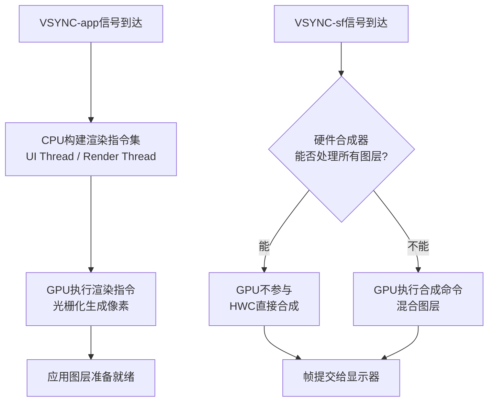
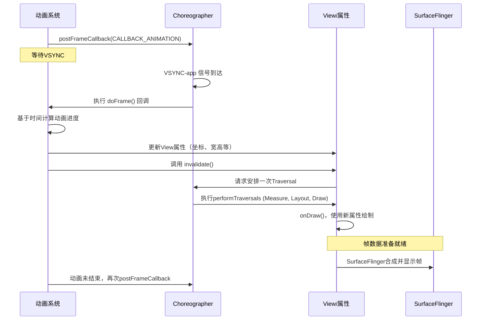

### 整体渲染流程
![[Pasted image 20251015223822.png]]


### Choreographer
![[Pasted image 20251015215447.png]]
**第一阶段：初始化与通信建立**
1. **初始化**：创建 `FrameHandler`（绑定主线程Looper）和 `FrameDisplayEventReceiver`（用于接收VSync信号）。    
2. **通信**：`FrameDisplayEventReceiver` 通过 `EventThread` 与 SurfaceFlinger 建立通信，请求并等待 Vsync 信号。

**第二阶段：VSync信号触发与任务调度**  
1. **信号到达**：SurfaceFlinger 的 `appEventThread` 发送 Vsync-app 信号，触发 `FrameDisplayEventReceiver.onVsync()`，最终进入核心方法 `doFrame()`。  
2. **帧周期开始**：`doFrame()` 首先进行**掉帧逻辑计算**。如果当前时间超过预期执行时间过多，则跳过本次帧回调，直接请求下一次VSync，以避免“掉帧追赶”导致的卡顿。  
3. **按优先级处理回调队列**：  
	* **INPUT**：处理与输入事件相关的回调。（最高优先级）  
	* **ANIMATION**：**执行动画**。这里是 `ValueAnimator` 等计算新属性值的地方。  
	* **INSETS_ANIMATION**：处理系统UI（如状态栏）的插入动画。  
	* **TRAVERSAL**：**执行视图树的 measure/layout/draw 操作**。由`View.invalidate()` 触发的 `ViewRootImpl.performTraversals()` 在此阶段被执行。  
	* **COMMIT**：在UI线程中提交帧的渲染信息给渲染线程。

**第三阶段：渲染与提交**  
6. **同步与渲染**：在 **TRAVERSAL** 的 draw 阶段，UI线程将录制好的绘制命令同步给 `RenderThread`，即通过Canvas调用drawXXX()方法。  
7. **GPU执行**：`RenderThread` 驱动GPU执行这些绘制命令。**关键补充**：此时GPU开始工作，但**并未立即完成**。  
8. **交换缓冲区**：`RenderThread` 通过 `eglSwapBuffers` 将已绘制的缓冲区提交给 SurfaceFlinger 进行合成。
9. **同步等待**：**关键补充**：通过 **Fence机制**（如 `GPU Completion Fence` 和 `Present Fence`）来同步CPU、GPU和SurfaceFlinger。SurfaceFlinger 必须等待GPU的Fence发出信号（表示绘制真正完成），才会使用该缓冲区进行合成，最终显示到屏幕上。

**第四阶段：重新注册Vsync监听**  
在执行所有doFrame()逻辑后，重新注册Vsync监听
```java
private void scheduleFrameLocked(long delay) {
    if (!mFrameScheduled) {
        mFrameScheduled = true;
        if (USE_VSYNC) { // 系统默认使用VSync
            if (isRunningOnLooperThreadLocked()) {
                // 如果当前就在UI线程（Looper线程），则立即安排VSync
                scheduleVsyncLocked();
            } else {
                // 如果不在UI线程，发送一个异步消息到UI线程，最终也会调用到scheduleVsyncLocked()
                Message msg = mHandler.obtainMessage(MSG_DO_SCHEDULE_VSYNC);
                msg.setAsynchronous(true); // 设置为异步消息，避免被输入事件阻塞
                mHandler.sendMessageAtFrontOfQueue(msg); // 插入消息队列头部，尽快处理
            }
        } else {
            // 如果不使用VSync，则简单地发送一个延迟消息来模拟帧率
            ...
        }
    }
}
```


### 三级缓存
![[Pasted image 20251015232106.png]]
- 三级缓存对比一级、二级缓存的优势，主要是“给cpu/gup、SurfaceFlinger、屏幕显示硬件”三方各一个Buffer区轮转，尽量降低冲突瓶颈


### 关于GPU工作
1. 在**VSYNC-app**时机：在CPU 完成 **构建渲染指令集** 工作后（例如，遍历 View 树，生成 “画一个矩形、写一段文字” 等，`UI Thread` 和 `RenderThread`线程内），GPU 的工作则是 **执行这些渲染指令**，进行顶点变换、片元着色等大规模并行计算，最终生成像素。
2. 在**VSYNC-sf**时机：当硬件合成器能力不足无法满足**SurfaceFlinger**调度时，GPU会使用 OpenGL ES 将多个应用图层混合成一个最终图像。



### Android实现动画的机制
- 粗略的解释，通过不停的给 **Choreographer. postFrameCallback** ANIMATION消息，并在回调中计算和更新坐标、宽高等，然后再由Choreographer执行TRAVERSAL消息来进行刷新(invalidate())
