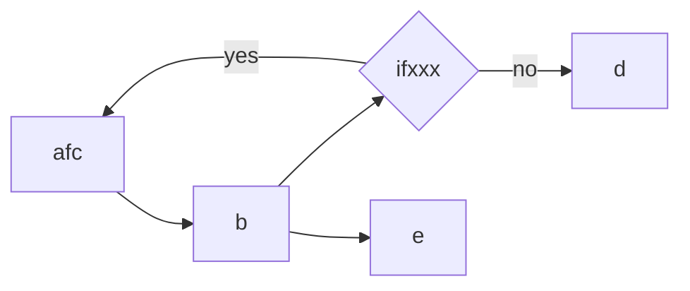
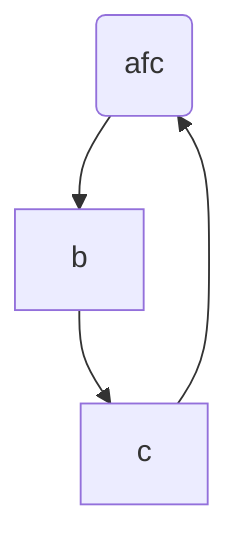
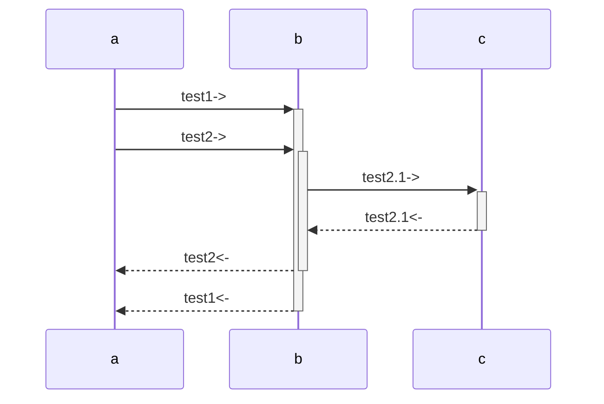

#学习
# MarkDown绘图示例

## 一、mermaid 流程图
官方文档： https://mermaid-js.github.io/mermaid/#/

### 流程图
#### 左右布局

### 上下布局


### 时序图


## 二、markdownd 流程图
### 流程图1

```flow

//定义类型和描述

st=>start: 开始
ed=>end: 结束
op=>operation: 我的操作
op2=>operation: link 百度:>http://www.baidu.com
cond=>condition: 判断确认？

//流程

st->op->cond
cond(yes)->ed
cond(no)->op2->op

```

### 流程图2

```flow
st=>start: 页面加载
e=>end: End:>http://www.google.com
op1=>operation: get_hotel_ids|past
op2=>operation: get_proxy|current
sub1=>subroutine: get_proxy|current
op3=>operation: save_comment|current
op4=>operation: set_sentiment|current
op5=>operation: set_record|current
 
cond1=>condition: ids_remain空?
cond2=>condition: proxy_list空?
cond3=>condition: ids_got空?
cond4=>condition: 爬取成功??
cond5=>condition: ids_remain空?
 
io1=>inputoutput: ids-remain
io2=>inputoutput: proxy_list
io3=>inputoutput: ids-got
 
st->op1(right)->io1->cond1
cond1(yes)->sub1->io2->cond2
cond2(no)->op3
cond2(yes)->sub1
cond1(no)->op3->cond4
cond4(yes)->io3->cond3
cond4(no)->io1
cond3(no)->op4
cond3(yes, right)->cond5
cond5(yes)->op5
cond5(no)->cond3
op5->e
 
```

## 二、时序图

### 基本语法

```text

- 代表实线，主动发送消息，比如 request请求
> 代表实心箭头，同步消息，比如 AJAX 的同步请求
-- 代表虚线，表示返回消息，spring Controller return
>> 代表非实心箭头，异步消息，比如AJAX请求

```

### 时序图1

```sequence

title:简单示例

chaochao-> yuyu: good morning

yuyu -> yuyu: should ask

note right of yuyu: woman

yuyu --> chaochao: eat something

note left of chaochao: man

note over chaochao: lucky

```

### 时序图2

```sequence

title:微信

微信用户-> 微信服务器:1、微信消息/事件

微信服务器-> 开发者服务器:2、推送消息/事件

开发者服务器-> WxBase:3、消息/事件处理准备

WxBase->WxHandler:4、分析并处理消息/事件

WxHandler->XmlMsgBuilder:5、传递回复消息实体

XmlMsgBuilder->WxBase:6、生成XML格式消息

WxBase->开发者服务器:7、输出回复消息

开发者服务器->微信服务器:8、响应推送

微信服务器->微信用户:9、用户接收回复

```
