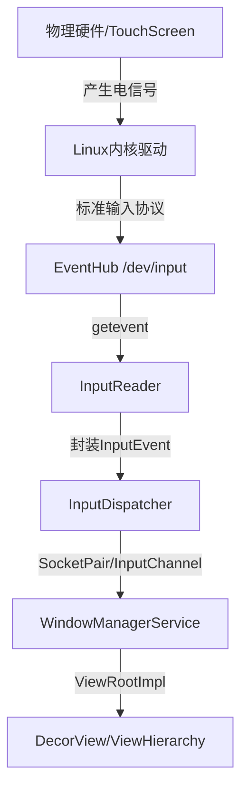

# 资深Android架构师面试核心考点深度复盘与解析

作为资深架构师或性能优化顾问，对系统的认知不应停留在 API 调用层面，而必须深入到 Linux 内核、ART 虚拟机底层机制以及计算机科学算法的本质。本指南旨在深度解析 Android 性能优化的底层逻辑，并结合工业级实践（如 XTrace 与 Shark 引擎）提供最具深度的面试考点复盘。

--------------------------------------------------------------------------------

## 1. 输入系统（IMS）与事件分发全链路分析

Android 输入系统是从物理底层驱动到应用层 View 树的复杂传递链路。理解这一过程是优化触摸响应时延（Touch Latency）和解决多窗口事件竞争的核心。

### 1.1 事件传递全链路流程

### 1.2 核心组件深度解析

- **InputManagerService (IMS) 初始化：** IMS 由 `SystemServer` 启动，其核心逻辑位于 Native 层。系统通过两个独立的高优先级线程驱动：
    - **InputReaderThread：** 运行 `InputReader`。它通过 `EventHub` 使用 `inotify` 和 `epoll` 机制监听设备节点。从底层读取原始的元数据（meta-events），并根据 `.idc`（设备配置）、`.kl`（按键布局）等文件将 Linux 事件码转换为 Android 识别的 `KeyEvent` 或 `MotionEvent`。
    - **InputDispatcherThread：** 负责将封装好的事件派发至目标窗口。
- **分发机制：** `InputReader` 读取事件后，通过 `QueuedInputListener` 异步传递给 `InputDispatcher`。后者负责寻找当前焦点窗口，并利用 `InputChannel`（基于 Unix Domain Socket）实现跨进程的事件通信。

**架构师小结：** 掌握 IMS 必须理解其“双线程运行机制”与 Native 层 `EventHub` 的阻塞监听原理。这是处理滑动冲突、无响应（ANR）以及跨进程事件注入的基础。

--------------------------------------------------------------------------------

## 2. 渲染机制深度调优：硬件加速与 LayerType 应用

硬件加速（GPU Acceleration）自 Android 4.0 以来默认开启，但其底层的“黑盒”操作是导致 99th 百分位掉帧的主要诱因。

### 2.1 硬件加速与软件加速对比

|   |   |   |
|---|---|---|
|维度|软件加速 (Software Rendering)|硬件加速 (Hardware Acceleration)|
|**执行线程**|仅 MainThread|MainThread + RenderThread 协作|
|**绘制库**|CPU / Skia|GPU / OpenGL / Vulkan|
|**核心机制**|直接在 Bitmap 像素上绘制|生成 DisplayList 并在 RenderThread 进行 GPU 指令录制|
|**性能极限**|复杂 View 树下 CPU 负载极高|充分利用 GPU 浮点运算与并行能力|

### 2.2 View LayerType 的深度应用与“陷阱”

1. **LAYER_TYPE_NONE：** 默认管线，不产生额外缓存。
2. **LAYER_TYPE_SOFTWARE：** 基于 Bitmap 缓存。即便开启了硬件加速，该 View 及其子类仍会被强制回退到软件管线。
3. **LAYER_TYPE_HARDWARE：** 基于 GPU FBO（帧缓冲对象）或纹理缓存。

**关键性能准则与“硬伤”分析：**

- **缓存失效（Cache Invalidation）：** 在动画过程中，若频繁修改 View 内容（如在 `onAnimationUpdate` 中调用 `setText`），会导致 FBO 每一帧都被销毁并重建。**严禁在动画循环中触发内容更新**。在这种情况下，不使用 Layer 的性能反而优于使用 Layer，因为重建 FBO 的开销（`buildLayer`）巨大。
- **透明度优化：** 源码显示，`setAlpha()`、`AlphaAnimation` 等默认会走离屏缓冲。对于大面积 View 的透明度变换，建议手动开启 `LAYER_TYPE_HARDWARE` 以获得更好的 GPU 缓存复用。
- **回退机制：** 这是一个常见面试陷阱：**当 Window 或应用层级关闭硬件加速时，**`**LAYER_TYPE_HARDWARE**` **的行为将完全等同于** `**LAYER_TYPE_SOFTWARE**`。

**架构师小结：** 在动画开始前开启 Hardware Layer，动画结束后必须**手动恢复为 NONE** 以立即回收显存（Video Memory）。根据 GFXInfo 数据，不当的缓存更新可能导致 Janky Frame 比例飙升至 46% 以上。

--------------------------------------------------------------------------------

## 3. 内存管理与泄漏分析：MAT 与 LeakCanary 2.0 底层原理

资深架构师需精通引用关系分析，将堆转储（Hprof）文件转化为可直观定位的“支配树”。

### 3.1 内存分析核心算法：Dominator Tree

- **Shallow Heap：** 对象自身大小。
- **Retained Heap：** 该对象被回收后能释放的总内存。**Retained Heap 的计算本质上是物理内存图中 SEMI-NCA 算法结果的体现**。
- **支配关系（Dominance）：** 在引用图中，如果所有到达对象 Y 的路径都必须经过 X，则称 X 支配 Y。支配树的根节点即为 GC Root，其直观展示了谁在物理上持有了大量内存。

### 3.2 LeakCanary 2.0（Shark 引擎）架构演进

LeakCanary 2.0 弃用 HAHA，自研 **Shark** 分析器，实现了性能的量级飞跃：

- **零代码接入：** 利用 `ContentProvider` 的 `onCreate` 优先于 `Application.onCreate` 执行的特性，在 `AppWatcherInstaller` 中完成自动初始化。
- **Shark Hprof 索引机制：**Shark 不再将整个 Hprof 加载到内存，而是通过顺序读取建立四种轻量级索引：**字符串索引、类名索引、实例对象索引、对象数组索引**。通过文件随机访问（Random Access）减少内存占用。
- **泄漏查找逻辑：** 使用 `KeyedWeakReference` 配合 `ReferenceQueue` 检测对象存活。通过 **广度优先搜索 (BFS)** 在对象图中寻找从 GC Root 到泄漏对象的最短路径。

**架构师小结：** 内存优化的终点是“Retained Heap”分析。理解 Shark 如何在内存不足的手机端通过二进制索引高效解析 Hprof，是线上内存监控的关键。

--------------------------------------------------------------------------------

## 4. 线上动态追踪：XTrace 框架与 ART 插桩优化

线上“幽灵 Bug（Ghost Bug）”由于环境不可复现，动态方法追踪成为非侵入式排查的终极方案。

### 4.1 原生 Debug Tracing 的性能崩塌

原生 `Debug.startMethodTracing` 在生产环境中无法使用的原因有二：

1. **全局插桩（Indiscriminate Injection）：** 强制对所有类、所有方法进行入口替换，导致 CPU 负载飙升。
2. **解释器降级（Interpreter Mode）：** 强制代码回退到解释执行模式，彻底无视 JIT/AOT 编译优化，性能损耗高达 10 倍以上。

### 4.2 XTrace 的核心优化策略

XTrace 实现了 <7ms 的极低启动延迟与极高性能的方法拦截：

- **定向注入（Targeted Injection）：** 通过 Hook `EnableMethodTracing` 为空操作，禁用系统全量插桩。仅针对目标方法的 `ArtMethod` 结构进行**原子性入口点（entry_point）更新**。
- **自适应执行模式（Adaptive Execution）：**
    - **快路径（Fast-Path）：** 针对已编译方法，使用汇编桩 `art_quick_instrumentation_entry`。通过内部接口 `GetCodeForInvoke` 获取原机器码入口并直接跳转（Tail-call），保持机器码执行效率。
    - **慢路径（Slow-Path）：** 针对未编译方法使用解释器桥接桩。
- **实战：** 在 `ContextWrap#getDisplay` 抛出 `UnsupportedOperationException` 的案例中，XTrace 通过拦截 `addWindowLayoutInfoListener` 捕获了完整的业务层堆栈，定位到 `SparkFragment` 传入了非法 Context，将 MTTD（平均定位时间）从数周缩短至 3 小时。

--------------------------------------------------------------------------------

## 5. 计算机科学基础：Dominator 算法实践

支配者算法是编译器优化（SSA 构建）与性能工具的基石。

- **复杂度分析：** 经典 Lengauer-Tarjan (LT) 算法在简单版下为 O(m \log n)，几乎线性版本利用路径压缩可达 O(m \alpha(m, n))。
- **SEMI-NCA 混合算法：** 结合半支配者（Semidominators）与最近公共祖先（NCA）查询。
- **架构师视野：** 研究表明，在复杂的 App 引用图谱中，**简单 LT 与 SEMI-NCA 算法比复杂的纯线性版本更具鲁棒性（Robustness）**，这是构建工业级内存工具时的算法首选。

--------------------------------------------------------------------------------

## 6. 面试实战：核心考点总结与 QA

**Q1：为何在动画中使用 Hardware Layer 反而可能导致更严重的卡顿？**

- **底层现象：** FPS 骤降，Systrace 中出现大量 `buildLayer`。
- **原理剖析：** 动画期间若频繁调用 `invalidate()` 或修改内容，会导致 GPU 端的 FBO 缓存失效。每一帧都要重新录制 DisplayList、重绘纹理并上传（Texture Upload），这增加了主线程录制与 RenderThread 渲染的沉重负担。
- **方案：** 确保动画期间 View 内容静止，仅修改变换属性；结束后立即设为 `NONE` 以回收显存。

**Q2：MAT 中的 Retained Heap 计算与算法理论有何联系？**

- **底层现象：** 一个微小的对象可能关联巨大的 Retained Heap。
- **原理剖析：** 它是支配树理论的物理应用。Retained Heap 等于该节点及其在支配树中所有子节点的 Shallow Heap 之和。计算过程本质上是基于引用图运行 SEMI-NCA 算法寻找支配者节点。
- **方案：** 优先处理支配树顶层的对象，它们是内存“泄洪口”。

**Q3：XTrace 是如何解决“性能崩塌”问题的？**

- **底层现象：** 拦截方法时 App 运行依然流畅。
- **原理剖析：** 核心在于“自适应入口点补丁”。它不改变虚拟机的全局运行状态，而是原子性修改 `ArtMethod` 的入口。针对 AOT 机器码，利用汇编桩通过 `GetCodeForInvoke` 恢复原执行路径，避免回退到解释器。
- **数据：** XTrace 启动延迟 <7ms，而 Frida 等工具常需 130ms+。

**Q4：LeakCanary 2.0 的 Shark 引擎为何能实现“零代码”初始化？**

- **底层现象：** 引入依赖即生效。
- **原理剖析：** 利用 Android 系统中 `ContentProvider` 的生命周期机制。在 `AppWatcherInstaller` 这一 CP 实例的 `onCreate` 中注入监听代码，它先于 `Application.onCreate` 执行。

**Q5：InputReader 和 InputDispatcher 为什么要分成两个线程？**

- **底层现象：** 触摸反馈不因应用逻辑卡顿而完全丧失。
- **原理剖析：** 职责解耦。`InputReader` 运行在内核与 EventHub 之间，必须及时响应硬件中断避免丢失事件；`InputDispatcher` 负责复杂的窗口查找与 Socket 通信，且需要处理 ANR 监测。
- **方案：** 这种双线程结构确保了系统在极端负载下仍能维持基本的输入感知能力。

**Q6：在复杂流图中，为什么不推荐使用“最先进”的线性 Dominator 算法？**

- **底层现象：** 某些高性能编译器工具仍在使用 LT 算法。
- **原理剖析：** 虽然存在 O(m) 算法，但其实现常数极大且极端复杂。实验证明，简单版 LT 和 SEMI-NCA 在应用层级的控制流图（CFG）上表现更稳定，性能差异微乎其微但维护成本更低。

**Q7：Hardware Layer 在什么情况下会失效？**

- **底层现象：** 设置了 Layer 但性能未提升。
- **原理剖析：** 若硬件加速在 Window 级别被 `setFlags` 禁用，或在 AndroidManifest 中关闭，`LAYER_TYPE_HARDWARE` 会静默回退（Fallback）至软件缓存方案，此时通过主线程 CPU 进行渲染，完全丧失 GPU 加速优势。