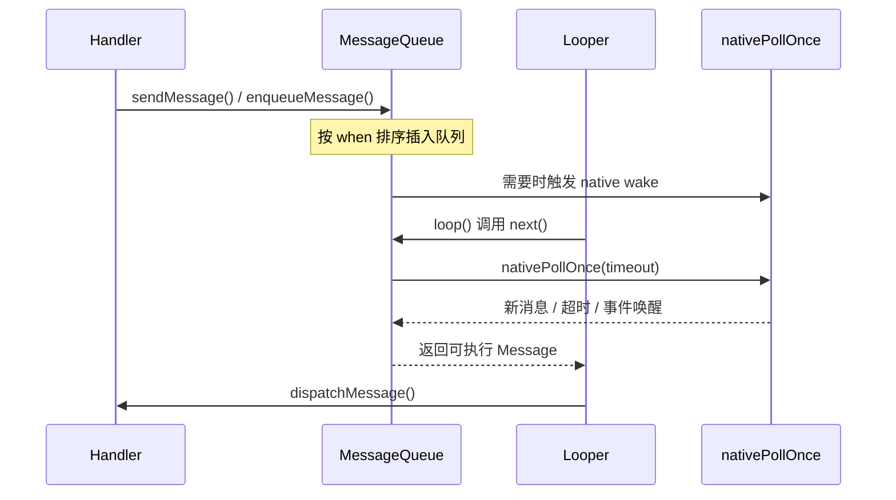

# Handler 消息机制

## Handler 真正要解决的，是线程如何有序地等、被精准地叫醒
### 先用一张认知骨架把 Handler 放进脑子里
- **对象**：Handler 是某个 Looper 线程上的调度协议，不是“随便切线程”的工具类。
- **目的**：它解决的是线程亲和任务如何排队、等待、被唤醒并按顺序执行。
- **组成**：表面是 Handler，骨架是 Looper、MessageQueue、`nativePollOnce()`、同步屏障和异步消息资格。
- **主线**：`enqueueMessage() -> next() / nativePollOnce() -> dispatchMessage() -> doFrame()`。
- **变体**：没有 Looper、Looper 已 quit、队首未到期、同步屏障存在、消息是否异步，这些都会改写执行结果。
- **用法**：它最适合解释主线程为什么会休眠、为什么某条消息没有立刻执行、以及一帧 UI 为什么会错位或掉帧。
- 如果只用一句话说清，Handler 不是“切线程工具”，而是让某个 Looper 线程按时序接住任务、在合适时点醒来并继续执行的调度协议。
- 你最容易把它和线程池、普通回调接口混为一谈；但 Handler 额外回答的是“任务该落在哪个线程、排在谁前面、什么时候轮到它执行”。
- 一旦你开始追主线程为什么会休眠、为什么 `nativePollOnce()` 长时间停住却不一定卡死、为什么 `doFrame()` 能先于普通消息跑，就已经进入 Handler 这门知识真正该看的范围。
如果只从 `post()` / `sendMessage()` 看 Handler，它只是一个 API 表；但把视野拉到 Looper、MessageQueue、native wake 和 Choreographer 以后，你会发现 Handler 实际上是 Android 主线程节奏暴露出来的一层调度接口。它把“排队、等待、唤醒、分发、回收”这几件原本分散的事，收敛成了一条能稳定服务 UI、Binder 回调和定时任务的主链。

## 为什么 Android 宁可用这套消息循环，也不让主线程自己忙等
Android 要解决的不是“怎么把一个 Runnable 执行掉”，而是：**线程亲和的任务怎样既保持串行顺序，又在没有活时主动让出 CPU；同时在输入、Binder、VSync 或定时消息到来时，又能被精准唤醒。**
如果忽略这一层，你会把大量现象误读成“某个方法很慢”：实际上消息可能还没到执行时机、被 barrier 挡住、落在没有 Looper 的线程，或者已经到了队列里但渲染帧节奏优先级更高。
Android 没把 UI 线程调度做成到处 `wait/notify`，也没有在每个回调点各写一套唤醒协议，而是选择了 **ThreadLocal 绑定 Looper + MessageQueue 按 `when` 排序 + `nativePollOnce()` 阻塞唤醒** 这条统一主链。它换来的好处是时序可预测、空闲时不空转、系统事件和业务任务都能落回同一节奏线；代价是“发出去就立刻执行”的错觉必须被放弃，所有任务都要服从队列、时间点、屏障和 Looper 生命周期。

## 真正决定 Handler 行为的，不是 `post()`，而是 `loop / next / poll / dispatch` 这条链
先看这张流程图：它不是装饰，而是最适合拿来建立“消息从发送到执行到底经历了什么”的第一眼模型。



1. 线程先通过 `Looper.prepare()` 把当前 Looper 放进 `ThreadLocal`，于是“一个线程对应一个当前 Looper”；这个 Looper 再绑定自己的 `MessageQueue`。
2. `Handler.post()` / `sendMessage()` 最终都会进入 `MessageQueue.enqueueMessage()`：消息不是简单 FIFO，而是按 `when` 插入单链表优先级队列，并把 `msg.target` 绑定到发送它的 `Handler`。
3. 如果新消息需要立刻执行，或者被插到了队首，`enqueueMessage()` 会走 native wake 路径，把可能正在 `nativePollOnce()` 里睡眠的 Looper 线程叫醒。
4. `Looper.loop()` 持续调用 `MessageQueue.next()`：如果队首消息已到期，就直接返回；如果还没到时机，就算出 timeout；如果队列为空，则进入无限期休眠。
5. 真正取到消息以后，执行权进入 `dispatchMessage()`：优先级是 `Runnable callback` → `mCallback.handleMessage()` → 子类 `handleMessage()`；执行完后 `Message` 会回收到池里。
6. 一旦进入 UI 帧节奏，同步屏障和异步消息还会继续改写“谁此刻有资格先跑”：这也是 `doFrame()` 能抢在普通同步消息前面的底层原因。
这里最容易被压平的，不是“最顺的一条主线”，而是几个会让整条机制换轨的条件。第一，线程没有 Looper，Handler 根本无处落脚；第二，子线程 Looper 可以通过 `quit()` / `quitSafely()` 结束循环，而主线程 Looper 不允许这么做；第三，消息是否需要立即唤醒线程，取决于它是不是插到了队首、是不是已经到期；第四，`IdleHandler` 不是“线程一闲就执行”，而是队列准备阻塞且当前没有立刻可跑消息时才有机会；第五，同步屏障存在时，只有显式 `setAsynchronous(true)` 的消息才能继续向前推进。
- 真正决定 Handler 行为的是 `Looper.loop() -> MessageQueue.next() -> nativePollOnce()` 这条链，而不是表面的 `post()` API。只盯发送端，你会看不见“线程为什么在等、何时会醒、醒来以后凭什么轮到这条消息”。
- `enqueueMessage()` 把消息按 `when` 排进单链表，并通过 `msg.target` 把它绑定回具体 Handler；这决定了 Handler 本质上是“把工作挂回某个 Looper 线程后续的 dispatch 阶段”，不是“随便切到某个线程去执行”。
- `queue.next()` 里对队首、timeout 和 `nativePollOnce()` 的配合，决定了主线程为什么可以长期停在 native 层等待，却不等于系统卡死；它等的往往是“下一条该轮到的消息”或“外部事件把它唤醒”。
- 同步屏障本质上是 `msg.target = null` 的 barrier 节点；而 `FrameDisplayEventReceiver.onVsync()` 里 `msg.setAsynchronous(true)` 让 `doFrame()` 消息越过屏障，这才解释了为什么渲染帧回调能压过普通同步消息。
- 如果忽略这层，你几乎一定会把 Handler 学成“回调容器”或“切线程工具”，看丢 `nativePollOnce()`、`IdleHandler`、屏障和 Choreographer 之间的关系，排障时也会一直盯错入口。
```java
for (;;) {
    Message msg = queue.next();
    if (msg == null) return;
    msg.target.dispatchMessage(msg);
    msg.recycleUnchecked();
}
```
- 真正排障时，先看目标线程有没有 Looper、Looper 生命周期是不是已经结束，而不是先怀疑“消息被系统吞了”。
- 如果主线程长时间停在 `nativePollOnce()`，先问队列是空的、队首还没到时机，还是 barrier 把同步消息拦住了；这三个含义完全不同。
- 如果现象和帧节奏相关，再补看 Choreographer 的 `doFrame()`、同步屏障是否悬挂过久、异步消息是否持续抢占，而不是只在 Java 层找一个“最慢方法”。

## Handler 最值得看的，不是一条 API，而是一条把 UI 帧托起来的调度主线
一次典型场景是：输入事件来到主线程，业务代码更新状态并触发 `invalidate()`，`ViewRootImpl` 会顺手向 Choreographer 申请一次 `TRAVERSAL`；随后 Choreographer 等到 `VSync-app` 信号，在 `FrameDisplayEventReceiver.onVsync()` 里投递异步 `doFrame()` 消息。
真正执行 `doFrame()` 时，主线程也不是“直接去 draw”就结束了，而是按 `INPUT -> ANIMATION -> INSETS_ANIMATION -> TRAVERSAL -> COMMIT` 这条顺序依次清回调队列：`TRAVERSAL` 才真正推进 measure / layout / draw，draw 阶段录制出的内容再同步给 RenderThread，`COMMIT` 则把这一帧的提交动作推向后续渲染链。
这时真正决定顺序的不是“谁先调了方法”，而是 `enqueueMessage()` 的插入位置、`nativePollOnce()` 的唤醒时机，以及 barrier 是否允许这条异步帧消息优先通过。用户最终看到的是一帧是否及时跟手，而不是一条消息是否“理论上已经发送”。
- `Executor` 关心的是把任务交给线程池；Handler 关心的是**落在某个 Looper 线程后，按什么时序继续执行**。
- `Thread.sleep()` 只是粗暴休眠；Handler / Looper 是根据队首消息、超时和外部事件被精准唤醒。
- 普通回调接口只回答“发生后做什么”；Handler 还必须回答“在哪个线程、排在谁后面、什么时候轮到它”。

## 真正把 Handler 学歪的，往往不是不会用，而是看错了它的责任边界
最常见的误解有两个：一是把 Handler 当成线程切换工具，仿佛 `post()` 之后系统就会替你并行干活；二是把发送消息等同于执行完成，忽略了它还要经过排队、等待、屏障和分发优先级。
如果你看到 `IdleHandler` 长期没有机会运行、明明有输入 / 动画回调却总感觉时序飘、或者主线程 stack 反复落在 `nativePollOnce()` 与 `dispatchMessage()` 之间切换，这通常说明问题不在单个 API，而在整条消息节奏已经失衡。
如果瓶颈是 CPU 重计算本身过重，Handler 只能帮你排队，不能替你把重活做快；如果你要解释的是 system_server 到 app 之间的跨进程调用等待，应该优先回到 Binder 或 AMS 调度链，而不是把所有问题都收敛成 Handler。

## Handler 几乎总要和这些东西一起看，才能真正看懂
- [[Concepts/RenderThread|RenderThread]] `(timing[强])`：主线程靠 Handler / Choreographer 组织帧节奏，RenderThread 接手真正的 GPU 渲染与提交。
- [[Concepts/InputManagerService|InputManagerService]] `(handoff[中])`：输入事件进入 app 后，最终仍要回到主线程的消息循环与 InputStage。
- [[Concepts/ActivityManagerService|ActivityManagerService]] `(callback[中])`：系统把生命周期和进程调度结果回传给 app 时，最终也离不开主线程消息接力。

## 读到这里，如果你还答不出这三个问题，就说明还没真正吃透
### 记忆锚点
一句话记住：**Handler = 线程绑定 + 消息按时序排队 + `nativePollOnce()` 精准休眠 / 唤醒 + `dispatchMessage()` 分发 + barrier / async 改写执行资格。**
一旦看到“主线程为什么会等”“消息为什么发了却没立刻跑”“`doFrame()` 为什么能抢先”，就该回到这条链上。

### 自测问题
1. 为什么说 Handler 真正该看的不是 `post()`，而是 `loop() -> next() -> nativePollOnce() -> dispatchMessage()` 这条链？
2. `IdleHandler` 和 `quit()` 分别说明了消息循环的哪两种边界状态？
3. 同步屏障的 `msg.target = null` 和 `setAsynchronous(true)` 各自改写了什么，为什么这会直接影响一帧 UI 的先后顺序？
